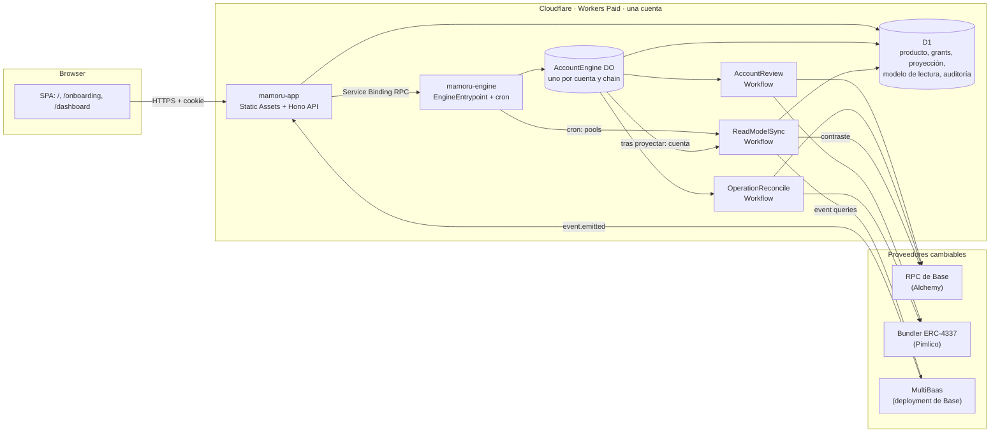
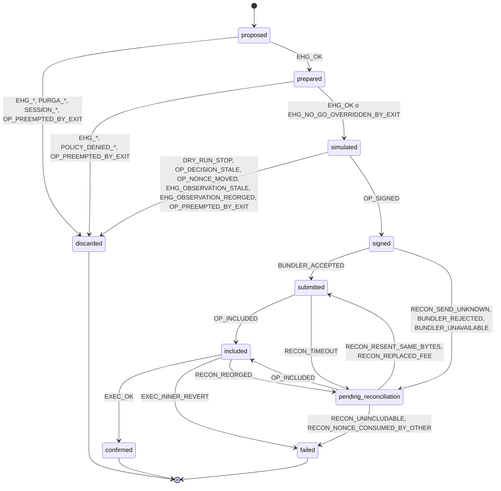
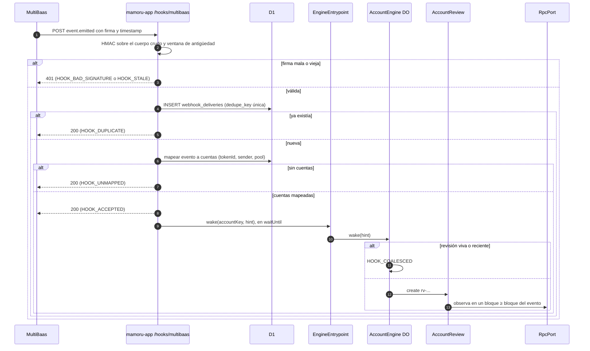
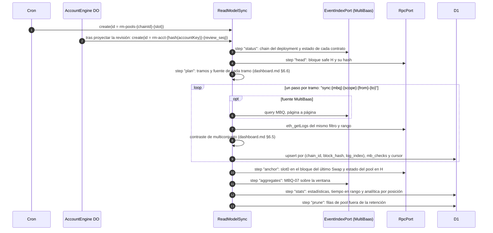

# Plan 001 · Mamoru v1

- Spec: `specs/001-mamoru-v1/spec.md`
- Constitución: `.specify/memory/constitution.md` v1.0.0
- Fecha: 2026-09-26

Este plan dice cómo se construye v1, a profundidad de implementación. No es código. La siguiente sesión crea los archivos del mapa del final, en el orden de `tasks.md`.

## 1. Resumen técnico

Dos Workers en una cuenta de Workers Paid:

- **`mamoru-app`.** Sirve la SPA con Static Assets. Su API Hono lleva sesión de producto, grants de vista, lectura de la proyección, intenciones y el receptor del webhook de MultiBaas.
- **`mamoru-engine`.** Sin rutas públicas. Lleva el cron, un Durable Object `AccountEngine` por cuenta y chain, y tres Workflows: `AccountReview` para una revisión completa, `OperationReconcile` para resolver una operación atascada y `ReadModelSync` para traer de MultiBaas, contrastar con la RPC y guardar en D1 la historia y la analítica del dashboard.

La app habla con el motor solo por Service Binding RPC. D1 es compartida: la app escribe identidad, grants, intenciones y entregas; el motor escribe la proyección y el modelo de lectura. La API sirve el dashboard solo desde D1. `decide` es una función pura en un paquete. Los adaptadores de Uniswap V3, RPC, cuenta y 4337 son paquetes que el runner de escenarios usa tal cual contra anvil.

## 2. Contexto técnico

| Tema | Decisión |
|---|---|
| Lenguaje | TypeScript en todo el repo |
| Paquetes | Workspaces de bun, versiones exactas, `bun.lock` en el repo |
| Panel | Vite, React, Tailwind, TanStack Query y TanStack Router. Pines de partida: Vite 8.1.4, React 19.2.7, TanStack Query 5.101.2 |
| API | Hono en el Worker `mamoru-app` |
| Motor | Workers con Cron Triggers, Durable Objects sobre SQLite, Workflows y Service Binding RPC |
| Datos | D1 para proyección y producto; SQLite del Durable Object para el diario |
| Cadena | viem para ABI, lecturas, `eth_simulateV1` y cliente de bundler. Sin SDK de cuenta |
| Modelo de lectura | API REST de MultiBaas (`/api/v0`) desde el motor, con `fetch` y tipos propios del catálogo MBQ. Sin el SDK de MultiBaas, que depende de axios |
| Login | `ProductAuthPort`, con Better Auth como candidato (línea abierta 1) |
| Pruebas | bun test para los escenarios de fork; Vitest con el pool de Workers para el Durable Object y los Workflows; un runner de navegador con autenticador WebAuthn virtual para onboarding y UI. Los tres se fijan con los pines |
| Laboratorio | anvil y Alto con versión fijada; proxy de RPC en loopback |

## 3. Comprobación contra la constitución

| Principio | Cómo lo cumple el plan |
|---|---|
| I. No custodia | Las reglas de destinatario de las sesiones (§12) y el invariante `INV-RECIPIENT` |
| II. Dry-run | Doble guarda en `sign` y en el envío 4337 (§10, §18). Producción sin chains de firma |
| III. Chain | Guardas de chain en el runner, el motor y la API (§18, §20) |
| IV. Solo V3 | Registro cerrado (§7), `INV-TARGETS` y auditoría estática OPS-03 |
| V. Puertas | Algoritmo de `decide` (§9) |
| VI. Shadow | Anotaciones sin efecto en `decide`. Parámetros de ingeniería versionados en la política (§8) |
| VII. Autoridad | Tabla de persistencia (§14). `decide` solo recibe la observación RPC |
| VIII. Vista | `ViewGrant` con 1271 o 6492 y middleware de grant (§6) |
| IX. Sesión | Forma de la política y tres grants (§12). Pre-chequeo en el motor |
| X. Walkaway | Transacciones del owner sin servicios (§12.5) y WALK-01, WALK-02 |
| XI. Un nonce | Máquina de estados y diario (§10, §11) |
| XII. MultiBaas | Puerto de índice, llamado solo desde `ReadModelSync`, con contraste por RPC y respaldo rotulado (§23). El webhook solo produce un wake hint (§13.2) |
| XIII. Escenarios | Runner y manifiesto (§20) |
| XIV. Cloudflare | Dos Workers en Workers Paid, sin zona Pro (§19) |
| XV. Panel | SPA con Static Assets y modo single-page-application, sin SSR (§19) |
| XVI. Verdad | Procedencia con chain en cada cifra y contraste antes de enseñar (`dashboard.md` §5 y §6, §23) |
| XVII. Secretos | Lista de nombres de secreto (§18). Proxy de loopback |
| XVIII. Método | `tasks.md` |

## 4. Topología



La clave API de MultiBaas vive solo en el motor y solo la usa `ReadModelSync`. El secreto del webhook vive solo en la app. El navegador nunca habla con MultiBaas, con la RPC ni con el bundler.

## 5. Módulos y su único deber

| Módulo | Ruta | Deber |
|---|---|---|
| SPA | `apps/mamoru-app/src/web` | Mostrar la vista y recoger intenciones |
| API | `apps/mamoru-app/src/api` | Autenticar, autorizar por grant, leer la proyección y reenviar intenciones al motor |
| Receptor de webhook | `apps/mamoru-app/src/api/hooks` | Verificar y deduplicar entregas de MultiBaas y convertirlas en wake hints |
| `EngineEntrypoint` | `apps/mamoru-engine/src/entrypoint` | Exponer la RPC interna del motor a la app y alojar el cron |
| Cron | `apps/mamoru-engine/src/cron` | Pedir revisión a cada cuenta activa |
| `AccountEngine` | `apps/mamoru-engine/src/do` | Ser el único escritor del ciclo de operación de una cuenta en una chain |
| `AccountReview` | `apps/mamoru-engine/src/workflows/account-review` | Ejecutar una revisión con pasos durables |
| `OperationReconcile` | `apps/mamoru-engine/src/workflows/operation-reconcile` | Llevar una operación no terminal a un estado terminal sin abrir nonce |
| `ReadModelSync` | `apps/mamoru-engine/src/workflows/read-model-sync` | Traer, contrastar y guardar en D1 la historia y la analítica que enseña el dashboard |
| Puente del proyector | `apps/mamoru-engine/src/projection` | Escribir en D1 lo que el diario ya registró |
| `@mamoru/domain` | `packages/domain` | Tipos, estados, `ReasonCode` y `Provenance` |
| `@mamoru/journal` | `packages/journal` | Definir y validar las transiciones de una operación |
| `@mamoru/runtime-config` | `packages/runtime-config` | Validar el modo y las guardas al arrancar |
| `@mamoru/registry` | `packages/registry` | Direcciones y code hashes por chain y bloque |
| `@mamoru/policy` | `packages/policy` | Políticas versionadas como datos: preset, curados, grants e ingeniería |
| `@mamoru/decide` | `packages/decide` | Convertir una observación y una política en una decisión |
| `@mamoru/uniswap-v3` | `packages/uniswap-v3` | Cotizar y armar calldata V3 |
| `@mamoru/rpc` | `packages/rpc` | Leer a bloque fijo, simular y traer logs |
| `@mamoru/account` | `packages/account` | Safe, Safe7579 y Smart Sessions: direcciones, lotes, sesiones, pre-chequeo, pruebas 1271 y 6492, transacciones del owner |
| `@mamoru/erc4337` | `packages/erc4337` | Llevar userOps y leer recibos |
| `@mamoru/multibaas` | `packages/multibaas` | Leer el estado del índice, ejecutar el catálogo MBQ y verificar entregas |
| `@mamoru/projector` | `packages/projector` | Construir filas de proyección con procedencia, contrastar el modelo de lectura y derivar Actions |
| `@mamoru/scenarios` | `packages/scenarios` | Runner bun y anvil, fixtures, perturbaciones y artefactos |

## 6. Puertos y contratos internos

### 6.1 Puertos

| Puerto | Operaciones | Primer proveedor | En el laboratorio |
|---|---|---|---|
| `RpcPort` | chain id, bloque por tag (`latest`, `safe`), lecturas a bloque fijo, `eth_simulateV1`, logs, recibos, `getNonce(sender, key)` | Alchemy | anvil detrás del proxy de loopback |
| `BundlerPort` | enviar, estimar, recibo por hash, userOp por hash, precio de gas | Pimlico | Alto en loopback, apuntando a anvil |
| `EventIndexPort` | `status()`: chain del deployment y estado de indexación de cada contrato; `query(mbq, params, range, page)`; `txEvents(txHash)`; verificación de entrega | MultiBaas | lector `fork_rpc` que interpreta las mismas MBQ sobre logs de anvil y declara su estado de indexación (FR-LAB-014) |
| `ProductAuthPort` | sesión de la petición, alta e inicio por método, vínculo de métodos, estado de recuperación | Better Auth (candidato) | el mismo, con D1 local |
| `PricePort` | precio en USDC de un token en un bloque | `slot0` de los pools de precio del registro | el mismo, contra anvil |
| `AccountPort` | dirección contrafactual, lote de llamadas, datos de sesión, pre-chequeo, firma de sesión, verificación de grant | Safe, Safe7579 y Smart Sessions | el mismo |

### 6.2 RPC interna del motor (Service Binding)

La expone `EngineEntrypoint` y solo la llama la app.

| Método | Qué hace | Guardas |
|---|---|---|
| `registerAccount(accountKey)` | Inicializa el Durable Object desde el `AccountRecord` de D1: política fijada, estado de sesiones y `allowedTokenIds` | La cuenta existe en D1 |
| `submitIntent(accountKey, intent, actor)` | Reenvía `preset`, `pause`, `exit` o `renew_session` al Durable Object | La app ya validó el grant |
| `wake(accountKey, hint)` | Reenvía un wake hint | Solo cuentas registradas |
| `relayOwnerOp(accountKey, signedUserOp)` | Lleva al bundler una userOp firmada por el owner (renovar sesión) | Solo en modo `lab`. En producción, `FUNDS_GATE_CLOSED` |

La app no tiene binding al Durable Object. El motor calcula el nombre del Durable Object a partir de un `accountKey` registrado y nunca a partir de una entrada libre.

### 6.3 Métodos del Durable Object

`review(trigger)`, `wake(hint)`, `intent(intent)`, `recordDecision(decision)`, `propose(draft)`, `markPrepared(opId, instance, prepared)`, `markSimulated(opId, instance, simulation)`, `discard(opId, instance, code)`, `sign(opId, instance)`, `signReplacement(opId, instance, fees)`, `attempt(opId, n)`, `markSubmitted(opId, instance, n, bundlerResult)`, `toReconciliation(opId, instance, code)`, `markIncluded(opId, instance, inclusion)`, `markConfirmed(opId, instance, safeBlock)`, `fail(opId, instance, code, proof)` y `alarm()`.

Cada método que cambia el estado de una operación comprueba en la misma transacción SQLite el estado de partida y la instancia de Workflow dueña. Si no coinciden, responde `OP_OWNER_MISMATCH` o `SIGN_STATE_INVALID` y no escribe nada.

### 6.4 Rutas de la API

| Ruta | Grant | Uso |
|---|---|---|
| `/api/auth/*` | no | Rutas del candidato de login |
| `GET /api/me` | no | Sesión de producto y cuentas del usuario |
| `POST /api/onboarding/owners` | no, sesión sí | Passkey (clave pública) y respaldo. Devuelve la dirección contrafactual |
| `POST /api/onboarding/backup-challenge` y `POST /api/onboarding/backup-proof` | no, sesión sí | Prueba de control del respaldo |
| `POST /api/onboarding/view-grant` | no, sesión sí | `MamoruViewGrant` firmado. Verifica 6492 o 1271 y crea el grant |
| `GET /api/onboarding/recovery-kit` y `POST /api/onboarding/recovery-kit/ack` | sí | Kit de recuperación |
| `GET /api/accounts/:accountKey/dashboard` | sí | Payload de las vistas de `dashboard.md` §9, con procedencia. Solo lee D1 |
| `GET /api/accounts/:accountKey/history?section=&ref=&cursor=` | sí | Listas paginadas del dashboard. `section` es `decisions`, `chain_ops`, `account_swaps`, `position_events`, `pool_swaps`, `pool_liquidity` o `savings_log`. Solo lee D1. `ref` se valida contra la proyección de la cuenta del grant y su política: una referencia ajena devuelve una lista vacía. El tamaño de página lo fija el servidor |
| `GET /api/accounts/:accountKey/session-policy` | sí | Resumen legible y hash de la política de sesión |
| `POST /api/accounts/:accountKey/intents` | sí | Intenciones. Comprueba `Origin` |
| `POST /hooks/multibaas` | firma del webhook | Receptor de `event.emitted` |

El middleware de grant toma el `accountKey` de la ruta y lo cruza con los grants del `userId` de la sesión. Toda consulta a D1 posterior usa el `accountKey` del grant, nunca solo el de la ruta.

## 7. Registro de Base

El 2026-09-26 se comprobó contra un nodo público de Base que todos estos contratos tienen código en el bloque 51811000 (hash `0xb7820875b174f7a8afb72d33464864e6cdfbe0c2173446cc8c4a5649923423ff`). La última columna dice qué más se comprobó. El primer commit de `packages/registry` añade el code hash de cada entrada (línea abierta 2). El runner lo verifica antes de cada escenario (LAB-05).

| Nombre | Rol | Dirección | Comprobado además |
|---|---|---|---|
| `USDC` | token de la política y activo de ahorro | `0x833589fCD6eDb6E08f4c7C32D4f71b54bdA02913` | token0 de USDC/cbBTC y token1 de WETH/USDC |
| `cbBTC` | token de la política | `0xcbB7C0000aB88B473b1f5aFd9ef808440eed33Bf` | token1 de USDC/cbBTC |
| `WETH` | token del registro, fuera de Conservador | `0x4200000000000000000000000000000000000006` | `WETH9()` del NonfungiblePositionManager |
| `UniswapV3Factory` | factory V3 | `0x33128a8fC17869897dcE68Ed026d694621f6FDfD` | es el `factory()` de las tres piezas V3 |
| `NonfungiblePositionManager` | LP y cobro | `0x03a520b32C04BF3bEEf7BEb72E919cf822Ed34f1` | `factory()` y `WETH9()` |
| `SwapRouter02` | swap | `0x2626664c2603336E57B271c5C0b26F421741e481` | `factory()` |
| `QuoterV2` | cotización | `0x3d4e44Eb1374240CE5F1B871ab261CD16335B76a` | `factory()` |
| `pool:USDC/cbBTC/500` | pool curado de `btc-usdc` | `0xfbb6eed8e7aa03b138556eedaf5d271a5e1e43ef` | token0 USDC, token1 cbBTC, fee 500, tick spacing 10 |
| `pool:WETH/USDC/3000` | pool de `lab-weth-usdc-v1` | `0x6c561b446416e1a00e8e93e221854d6ea4171372` | token0 WETH, token1 USDC, fee 3000, tick spacing 60 |
| `EntryPointV07` | EntryPoint | `0x0000000071727De22E5E9d8BAf0edAc6f37da032` | |
| `SafeL2_141` | singleton del Safe | `0x29fcB43b46531BcA003ddC8FCB67FFE91900C762` | |
| `SafeProxyFactory_141` | factory del Safe | `0x4e1DCf7AD4e460CfD30791CCC4F9c8a4f820ec67` | |
| `Safe7579` | adaptador ERC-7579 | `0x7579EE8307284F293B1927136486880611F20002` | |
| `Safe7579Launchpad` | setup contrafactual | `0x7579011aB74c46090561ea277Ba79D510c6C00ff` | |
| `SmartSession` | validador de sesiones | `0x00000000002B0eCfbD0496EE71e01257dA0E37DE` | |
| `OwnableValidator` | validador de la session key | `0x2483DA3A338895199E5e538530213157e931Bf06` | |
| `SafeWebAuthnSharedSigner` | owner passkey | `0x94a4F6affBd8975951142c3999aEAB7ecee555c2` | |
| `SafeWebAuthnSignerFactory` | respaldo con segunda passkey | `0xF7488fFbe67327ac9f37D5F722d83Fc900852Fbf` | |
| `P256Verifier` | verificador P-256 de respaldo | `0xc2b78104907F722DABAc4C69f826a522B2754De4` | |

El primer commit también añade, con su code hash:

- las políticas de Smart Sessions que use la codificación: marco temporal, límite de uso, reglas de parámetros y límite de valor nativo, con los nombres que publica Rhinestone;
- MultiSendCallOnly 1.4.1, para el lote del walkaway;
- Multicall3, solo para lecturas.

El precompile P-256 de RIP-7212 no tiene código. Se comprueba con un vector de prueba (LAB-08).

## 8. Observación, política y decisión

### 8.1 `Observation`

- `chainId`; `block` con número, hash y timestamp; `safeBlock` con número y hash.
- `account`: dirección, si está desplegada, owners, threshold, módulos, sesiones y carril de nonce.
  - Cada sesión lleva `permissionId`, si está activa, `validUntil` y uso.
  - El carril de nonce lleva la clave y el valor.
- `native`: saldo en wei.
- `balances`: saldo de cada token del registro.
- `positions`: una entrada por NFT de la cuenta.
  - `tokenId`, `poolId`, `tickLower`, `tickUpper` y `liquidity`.
  - `tokensOwed0/1` y cobrable, leído con `collect` estático desde la cuenta.
  - `principalOwed0/1`: principal pendiente del `tokenId`. Sube con cada `DecreaseLiquidity` y baja con la parte de principal de cada `Collect`, también si el cobro fue parcial. No se pone a cero solo porque hubo un `Collect`. Las comisiones cobrables son el cobrable menos este pendiente.
  - `managed`: si el `tokenId` está en `allowedTokenIds`.
- `pools`: `sqrtPriceX96`, `tick`, `liquidity`, tick del TWAP en la ventana de la política, `fee` y `tickSpacing`.
- `incidents`: lista del operador y banderas en cadena, con `evidence` (`known` o `unknown`).
- `intents`: `paused` y `exitRequest`, leídos del Durable Object.
- `slot`: operación viva y su estado.
- `deposits`: entradas desde la última observación, marcadas `safe` o `unsafe`.
- `sources`: id del proveedor RPC y momento de lectura.

Todas las lecturas van a `block.number` con una llamada agrupada. Si una respuesta trae otro bloque, la observación falla con `OBS_BLOCK_INCONSISTENT`.

### 8.2 `PolicyVersion`

- `policyId`, `version` y `hash` del contenido.
- `preset`: `conservador`.
- `buckets`: `id`, `preference` (peso) y `pools` (lista de `PoolIdentity`).
- `savingsAsset`: USDC.
- `gasReserve`: mínimo en wei.
- `harvest`: factor sobre el coste estimado.
- `range`: ancho, `adjust` (`off` u `on_out_of_range`) y `cooldown`.
- `execution`: tolerancia de slippage, desvío máximo de tick frente al TWAP, ventana del TWAP y validez de la observación.
- `session`: plantillas de grant, topes, caducidad, límite de uso y ventana de renovación.
- `shadow`: referencias a las fórmulas y números del Packaging que se evalúan sin efecto.

`harvest`, `range`, `execution` y los topes de `session` son parámetros de ingeniería: tienen un valor por versión, no vienen del Packaging y ningún escenario afirma su valor.

### 8.3 `Decision`

- `decisionId`.
- `observationRef`: bloque y hash.
- `policyRef`: versión y hash.
- `kind`: `hold`, `enter_swap`, `enter_mint`, `harvest`, `close_position` o `convert`.
- `reason`: un `ReasonCode`.
- `trail`: una lista de `GateStep`, cada uno con `gate`, `verdict` (`GO`, `NO_GO`, `EXIT` o `SKIP`) y `reason`.
- `proposal`, opcional: el tipo de operación y la intención estructurada (pool, `tokenId`, tokens, importes esperados, mínimos).
- `shadow`: anotaciones del Packaging.
- `buckets`: un código por bucket.
- `positions`: por cada posición de la cuenta, gestionada o no, su `tokenId` y sus códigos: `OBS_UNMANAGED_ASSET`, `OBS_POSITION_OUT_OF_RANGE`, `OBS_FEES_ABOVE_COST`, `DECIDE_HARVEST`, `DECIDE_HARVEST_BELOW_COST`, `DECIDE_RANGE_ADJUST` o `DECIDE_RANGE_COOLDOWN`.

## 9. Puertas: cómo decide `decide`

1. **Guardas de observación.** Si la observación no está completa, no hay decisión. El Durable Object registra el código de observación.
2. **Slot.** Si hay una operación no terminal, la decisión es `DECIDE_SLOT_BUSY`. Si además hay una salida pendiente, la salida lleva la causa `OP_SLOT_BUSY` y la vista la enseña.
3. **Salidas.** Tienen la precedencia más alta.
   - Una `exitRequest` del usuario genera un `close_position` por cada posición gestionada, con `EXIT_USER_EMERGENCY`.
   - Si Risk Monitor ve una incidencia en un pool o token con capital dentro, da `RISK_INCIDENT_EXIT`. Se abre una `ExitRequest` con `EXIT_RISK_INCIDENT` y se hace lo mismo.
   - Sin posiciones y con tokens que no son USDC tras una salida, se propone `convert` con `DECIDE_CONVERT`.
   - Ni la Execution Health Gate, ni ENY, ni Strategy cancelan un cierre por salida.
4. **Pausa.** Con `paused`, todo lo que no sea salida o conversión posterior a una salida termina en `DECIDE_PAUSED`.
5. **Cierre por rango.** Aplica a una posición gestionada, fuera de rango, con `range.adjust = on_out_of_range` y fuera del cooldown. Se propone `close_position` con `DECIDE_RANGE_ADJUST`. Dentro del cooldown, `DECIDE_RANGE_COOLDOWN`.
6. **Harvest.** Aplica a una posición gestionada cuyas comisiones cobrables estimadas superan el coste estimado por el factor. Se propone `harvest` con `DECIDE_HARVEST`. Si no, `DECIDE_HARVEST_BELOW_COST`.
7. **Entrada.** Para cada bucket, en este orden:
   - Si no tiene pool curado ejecutable, `PLAN_BUCKET_NO_EXECUTABLE_POOL`.
   - Purga comprueba la identidad del pool contra la cadena (`factory.getPool` y lecturas del pool), las incidencias y la evidencia.
   - Risk Monitor comprueba la evidencia (`RISK_EVIDENCE_UNKNOWN` bloquea).
   - Strategy fija el importe por preferencia (`STRATEGY_PREFERENCE`).
   - ENY anota (`ENY_SHADOW`).
   - Con USDC libre y sin cbBTC suficiente para el ratio del rango, se propone `enter_swap`. Con los dos tokens, `enter_mint`.
8. **Elección.** Se queda una sola propuesta, por el orden de FR-DEC-011.
9. **Execution Health Gate preliminar**, sobre la observación: TWAP, reserva de gas y sesión que cubre la operación. En una entrada, un harvest o un cierre por rango, un NO GO descarta la propuesta con su código. En un cierre por salida, un NO GO se anota y se sigue. La Execution Health Gate completa corre después, en la preparación y la simulación (§13.1).
10. **Anotaciones por posición.** Para cada posición de la cuenta, gestionada o no, se anotan `OBS_POSITION_OUT_OF_RANGE` si el tick está fuera de [`tickLower`, `tickUpper`) y `OBS_FEES_ABOVE_COST` con el mismo estimador y el mismo factor del paso 6 (FR-DEC-015). Estas anotaciones no cambian la elección del paso 8. En una posición no gestionada nunca hay propuesta.

La conversión después de una salida pasa por la Execution Health Gate como cualquier operación. Si da NO GO, la decisión es `DECIDE_CONVERT_HELD` con la causa, y el USDC que falta se ve como token sin convertir.

## 10. Máquina de estados de la operación

| Estado | Nombre en la ley | Terminal |
|---|---|---|
| `proposed` | propuesta | no |
| `discarded` | descartada | sí |
| `prepared` | preparada | no |
| `simulated` | simulada | no |
| `signed` | firmada | no |
| `submitted` | enviada | no |
| `included` | incluida | no |
| `confirmed` | confirmada | sí |
| `failed` | fallida | sí |
| `pending_reconciliation` | pendiente de reconciliación | no |



Reglas que el diario hace cumplir:

- **Slot.** Solo hay una operación no terminal por Durable Object. `propose` falla con `OP_SLOT_BUSY` si ya existe una.
- **Firma.** `sign` solo sale de `simulated`, y cuatro condiciones la bloquean:
  - con el modo `production`, `DRY_RUN_STOP`;
  - con el chain id fuera de `SIGNING_CHAIN_IDS`, `SIGN_CHAIN_NOT_ALLOWED`;
  - con la observación vieja o reorganizada, `EHG_OBSERVATION_STALE` o `EHG_OBSERVATION_REORGED`;
  - con el nonce en cadena distinto del de la preparación, `OP_NONCE_MOVED`.

  La reserva del nonce, la userOp, el `userOpHash` y la firma se escriben en una sola transacción SQLite.
- **Intentos.** Todos comparten nonce y `callData`. Un reemplazo solo cambia los campos de fee, dentro de `session.maxFeePerGas`.
- **Cancelación.** No hay transición de `signed`, `submitted` o `pending_reconciliation` a `discarded`. Una operación firmada no se cancela: se reconcilia.
- **`failed`.** Solo con las pruebas de FR-ENG-007.
- **`confirmed`.** Solo con el `UserOperationEvent` leído por RPC en un bloque menor o igual que `safe` y hash canónico.
- **Historial.** Cada transición añade una fila con código, actor e instancia.

## 11. Diario del Durable Object

SQLite dentro del Durable Object `AccountEngine`, cuyo nombre es el `accountKey`, `chainId:address` en minúsculas. Las migraciones se aplican en el constructor dentro de `blockConcurrencyWhile`.

### 11.1 `account_state`

Una sola fila.

| Campo | Tipo | Significado |
|---|---|---|
| `account_key` | texto | `chainId:address` |
| `chain_id` | entero | chain de este Durable Object |
| `policy_version`, `policy_hash` | texto | política fijada |
| `paused`, `paused_reason`, `paused_at` | entero, texto, entero | estado de pausa |
| `exit_request` | JSON | causa, actor, momento, estado, causa pendiente |
| `sessions` | JSON | por grant: `permissionId`, `salt`, `validUntil`, estado, `allowedTokenIds` |
| `revoked_permission_ids` | JSON | `permissionId` que nunca se reactivan |
| `nonce_key` | texto | carril de Mamoru |
| `last_confirmed_nonce` | texto | último nonce confirmado en el carril |
| `live_op_id` | texto o nulo | slot |
| `last_observation` | JSON | bloque, hash, momento, código |
| `next_review_at`, `watchdog_at` | entero | la alarma única se fija al menor de los dos |
| `review_seq` | entero | secuencia de revisiones, para ids de instancia |
| `projection_cursor` | entero | última transición proyectada |
| `read_model_instance` | texto o nulo | última instancia de `ReadModelSync` de la cuenta. No se crea otra mientras esta viva |

### 11.2 `ops`

| Campo | Tipo | Significado |
|---|---|---|
| `op_id` | texto | `op-{seq}`, único en el Durable Object |
| `decision_id` | texto | decisión de origen |
| `kind` | texto | `enter_swap`, `enter_mint`, `harvest`, `close_position` o `convert` |
| `cause_code` | texto | código de la decisión, por ejemplo `DECIDE_HARVEST` o `EXIT_USER_EMERGENCY` |
| `intent` | JSON | la intención estructurada |
| `observation_block`, `observation_hash` | entero, texto | premisa |
| `policy_version`, `policy_hash` | texto | política |
| `state`, `state_code`, `updated_at` | texto, texto, entero | estado actual |
| `owner_instance` | texto | instancia de Workflow dueña |
| `calls` | JSON | llamadas decodificadas: target por nombre de registro, selector y argumentos |
| `call_data`, `calls_hash` | texto | `callData` del lote y su hash |
| `grant_name`, `permission_id` | texto | sesión que se usa |
| `nonce_key`, `nonce` | texto | el nonce se reserva en `sign` |
| `ehg` | JSON | rastro de la Execution Health Gate de la preparación y la simulación |
| `simulation` | JSON | bloque, deltas por token y por posición, gas, logs relevantes |
| `user_op` | JSON | userOp sin firma |
| `user_op_hash` | texto | hash del intento vigente |
| `valid_until` | entero | `validUntil` de la sesión al firmar |
| `included_block`, `included_block_hash`, `included_tx_hash` | entero, texto, texto | inclusión |
| `success`, `actual_gas_cost` | entero, texto | del `UserOperationEvent` |
| `revert_reason` | texto | de `UserOperationRevertReason` |
| `confirmed_safe_block` | entero | bloque `safe` que confirmó |
| `stop_before_sign` | entero | 1 si la revisión pidió parar antes de firmar |
| `error` | JSON | último error con su código |

### 11.3 `op_attempts`

| Campo | Significado |
|---|---|
| `op_id`, `attempt_no` | clave |
| `user_op_hash` | hash de este intento |
| `signed_user_op` | userOp completa con firma, lista para cualquier bundler |
| `max_fee_per_gas`, `max_priority_fee_per_gas` | fees del intento |
| `bundler_id` | bundler al que se envió |
| `submitted_at`, `bundler_result` | resultado: aceptada, código AA o sin respuesta |

### 11.4 `op_transitions`

Clave (`op_id`, `seq`). Lleva `from_state`, `to_state`, `code`, `actor` (`cron`, `wake`, `intent`, `workflow`, `watchdog`), `instance`, `at` y `detail` en JSON.

### 11.5 `decisions`

`decision_id`, `at`, `observation_block`, `observation_hash`, `policy_version`, `kind`, `reason`, `trail`, `shadow`, `buckets` y `op_id` (puede ser nulo). Se conservan las últimas decisiones por número. El historial completo va a D1 como auditoría.

### 11.6 `wakes`

`dedupe_key`, `received_at`, `hint` y `coalesced_into`, que es el `review_seq` de la revisión que lo absorbió.

### 11.7 `session_keys`

`key_id`, `address`, `ciphertext`, `iv`, `kek_version`, `grant_names`, `created_at` y `status` (`active`, `retired` o `compromised`). La clave se cifra con AES-GCM. La clave de cifrado se deriva de `SESSION_KEK`. Se descifra solo dentro de `sign` y `signReplacement`, nunca se devuelve y nunca se registra en logs.

### 11.8 `relays`

Solo en modo `lab`. Guarda las userOps del owner reenviadas (renovación): `user_op_hash`, `kind`, `submitted_at` y `status`. No ocupan el slot, porque usan el carril de nonce del owner.

## 12. Forma de la política de sesión

### 12.1 Tipos

```ts
type SessionPolicy = {
  policyId: string
  version: string
  hash: `0x${string}`
  chainId: 8453 | number          // en el laboratorio, el del fork
  account: `0x${string}`
  grants: SessionGrant[]
}

type SessionGrant = {
  name: 'enter-swap' | 'enter-mint' | 'manage'
  salt: `0x${string}`             // nuevo en cada activación o renovación
  sessionValidator: 'OwnableValidator'
  sessionKey: `0x${string}`       // dirección pública de la session key
  userOp: { validAfter: number; validUntil: number; usageLimit: number }
  permitERC4337Paymaster: false
  erc7739: 'none'
  fallbackAction: 'none'
  tokenId?: bigint                // solo en manage: un grant por posición (12.4)
  actions: ActionRule[]
}

type ActionRule = {
  target: RegistryName            // nombre del registro, nunca una dirección suelta
  selector: string                // firma completa de la función
  nativeValue: 0n
  params: ParamRule[]
}

type ParamRule = {
  field: string                   // nombre del campo en la ABI
  index: number                   // posición en la tupla estática; offset = index * 32 tras el selector
  condition: 'EQUAL' | 'GREATER_THAN' | 'GREATER_THAN_OR_EQUAL' | 'LESS_THAN_OR_EQUAL'
  ref: 'ACCOUNT' | RegistryName | bigint | 'tokenId' | 'cap:<name>'
  cumulative?: 'cap:<name>'       // tope acumulado en la vida del grant
  denial: ReasonCode              // código del pre-chequeo si la regla falla
}
```

Solo se admiten funciones cuyos argumentos son una tupla estática o valores estáticos. Una regla por offset sobre calldata dinámica se puede engañar con offsets no canónicos. Por eso `exactInput`, `multicall` y cualquier función con `bytes` o arrays quedan fuera.

Codificación en cadena, comprobada por T001 en el fork del bloque 51811000:

- **Marco temporal.** `TimeFramePolicy` (`0x8177451511dE0577b911C254E9551D981C26dc72`), userOp policy, con `initData = encodePacked(uint128 validUntil, uint128 validAfter)`. El empaquetado en `uint48` revierte.
- **Límite de uso.** `UsageLimitPolicy` (`0x1F34eF8311345A3A4a4566aF321b313052F51493`), userOp policy, con `initData = encodePacked(uint128 limit)`.
- **Reglas de parámetros y valor nativo.** `UniActionPolicy` (`0x0000006DDA6c463511C4e9B05CFc34C1247fCF1F`), única action policy de cada acción: `valueLimitPerUse = 0` y hasta 16 reglas con `offset = index * 32`. Las reglas con `cumulative` llevan `isLimited` y el tope acumulado como `usage.limit`.
- **Sin `ValueLimitPolicy`.** Trata un límite 0 como no inicializado y revierte (`PolicyNotInitialized`). El valor nativo 0 lo impone `UniActionPolicy`.
- **Firma de la session key.** `OwnableValidator` con umbral 1; firma EIP-191 del `userOpHash`. La firma de la userOp es `0x00 ‖ permissionId ‖ firma` (modo USE). La clave del nonce es `SmartSession << 32 | carril`.

### 12.2 Los tres grants de Conservador v1

Pool `pool:USDC/cbBTC/500`. Activo de ahorro USDC. `ACCOUNT` es la dirección de la cuenta. Los nombres `cap:*` son topes de ingeniería de la política que se fijan al activar, a partir del depósito.

**`enter-swap`: comprar cbBTC para entrar.**

| Target | Selector | Reglas |
|---|---|---|
| `USDC` | `approve(address,uint256)` | `spender`[0] EQUAL `SwapRouter02`; `amount`[1] LESS_THAN_OR_EQUAL `cap:usdcSwapPerCall` |
| `SwapRouter02` | `exactInputSingle((address,address,uint24,address,uint256,uint256,uint160))` | `tokenIn`[0] EQUAL `USDC`; `tokenOut`[1] EQUAL `cbBTC`; `fee`[2] EQUAL 500; `recipient`[3] EQUAL `ACCOUNT`; `amountIn`[4] LESS_THAN_OR_EQUAL `cap:usdcSwapPerCall`, acumulado `cap:usdcSwapTotal`; `amountOutMinimum`[5] GREATER_THAN 0; `sqrtPriceLimitX96`[6] EQUAL 0 |

**`enter-mint`: abrir la posición.**

| Target | Selector | Reglas |
|---|---|---|
| `USDC` | `approve(address,uint256)` | `spender` EQUAL `NonfungiblePositionManager`; `amount` LESS_THAN_OR_EQUAL `cap:usdcMint` |
| `cbBTC` | `approve(address,uint256)` | `spender` EQUAL `NonfungiblePositionManager`; `amount` LESS_THAN_OR_EQUAL `cap:cbbtcMint` |
| `NonfungiblePositionManager` | `mint((address,address,uint24,int24,int24,uint256,uint256,uint256,uint256,address,uint256))` | `token0`[0] EQUAL `USDC`; `token1`[1] EQUAL `cbBTC`; `fee`[2] EQUAL 500; `amount0Desired`[5] LESS_THAN_OR_EQUAL `cap:usdcMint`, acumulado igual; `amount1Desired`[6] LESS_THAN_OR_EQUAL `cap:cbbtcMint`, acumulado igual; `amount0Min`[7] GREATER_THAN 0; `amount1Min`[8] GREATER_THAN 0; `recipient`[9] EQUAL `ACCOUNT` |

**`manage:<tokenId>`: cosechar, cerrar y convertir, un grant por posición.**

| Target | Selector | Reglas |
|---|---|---|
| `NonfungiblePositionManager` | `decreaseLiquidity((uint256,uint128,uint256,uint256,uint256))` | `tokenId`[0] EQUAL `tokenId` del grant |
| `NonfungiblePositionManager` | `collect((uint256,address,uint128,uint128))` | `tokenId`[0] EQUAL `tokenId` del grant; `recipient`[1] EQUAL `ACCOUNT` |
| `NonfungiblePositionManager` | `burn(uint256)` | `tokenId`[0] EQUAL `tokenId` del grant |
| `cbBTC` | `approve(address,uint256)` | `spender` EQUAL `SwapRouter02`; `amount` LESS_THAN_OR_EQUAL `cap:cbbtcConvertPerCall` |
| `SwapRouter02` | `exactInputSingle(...)` | `tokenIn` EQUAL `cbBTC`; `tokenOut` EQUAL `USDC`; `fee` EQUAL 500; `recipient` EQUAL `ACCOUNT`; `amountIn` LESS_THAN_OR_EQUAL `cap:cbbtcConvertPerCall`, acumulado `cap:cbbtcConvertTotal`; `amountOutMinimum` GREATER_THAN 0; `sqrtPriceLimitX96` EQUAL 0 |

Un swap con approve exacto deja la allowance en cero. `mint` puede usar menos de lo deseado, así que el lote de `enter_mint` termina con `approve(NonfungiblePositionManager, 0)` para cada token. La regla LESS_THAN_OR_EQUAL admite el cero. Ninguna operación de Mamoru deja allowance residual (FR-UNI-006).

Todos los grants llevan tres reglas comunes:

- **Operación.** Marco temporal, límite de uso, sin paymaster, sin permisos ERC-7739, sin acción fallback y valor nativo 0 en todas las acciones.
- **Modo de ejecución.** Solo call simple o lote. Nunca `delegatecall`.
- **Default deny.** Cualquier par (target, selector) que no esté en la tabla se rechaza. Eso incluye la propia cuenta, los módulos, SmartSession, las transferencias y los approvals del NFT, `transfer` de tokens y cualquier executor de intents.

### 12.3 Por qué tres grants

Smart Sessions guarda un conjunto de políticas por par (target, selector) dentro de una sesión, y todas se cumplen a la vez. No hay OR. Hay tres conflictos:

- `approve` de USDC necesita dos spenders distintos: el router para entrar y el NonfungiblePositionManager para acuñar.
- `approve` de cbBTC necesita el NonfungiblePositionManager para acuñar y el router para convertir.
- `exactInputSingle` va en dos direcciones.

Cada conflicto se resuelve con un grant más, no con una regla más ancha. Una userOp usa un solo `permissionId`, así que un lote nunca mezcla grants.

T001 encontró una regla más que no se expresa: la pertenencia a un conjunto. `UniActionPolicy` no tiene IN_SET y no existe una política publicada que escriba una lista en el mismo lote que el `mint` (`mintAndNote`). Sin Solidity propio, `manage` se parte en un grant por posición (12.4).

### 12.4 Un grant `manage` por posición

La sesión no usa un suelo `tokenIdMin` ni una lista. Un suelo dejaría dentro las posiciones que el owner acuñe después.

- `enter-mint` acuña la posición con destinatario la cuenta. No da ningún permiso sobre ella.
- Después, una operación del owner activa `manage:<tokenId>` para ese id, con salt nuevo. El motor solo la pide para un `tokenId` que su diario registró como acuñado por `enter-mint` y que la cuenta tiene.
- `decreaseLiquidity`, `collect` y `burn` exigen `tokenId` EQUAL al del grant. Otro id se rechaza en validación con `POLICY_DENIED_POSITION`.
- La session key no puede activar ni ampliar grants: SmartSession, la cuenta y los módulos están fuera de todo grant.
- Una posición que el owner abra por su cuenta no recibe grant. La validación la rechaza. La vista puede marcarla como no gestionada. Eso no es un permiso.

Renovar la sesión renueva un `manage:<tokenId>` solo para los ids que sigan en la cuenta y que entraron por `enter-mint`. Cerrar una posición revoca su grant en el lote de cierre del owner o en la renovación siguiente.

### 12.5 Activación, renovación y revocación

- **Registro ERC-7484.** `Safe7579Launchpad.addSafe7579` exige al menos un attester. La cuenta confía en `RhinestoneAttester` (`0x000000333034E9f539ce08819E12c1b8Cb29084d`) con umbral 1, en el `ModuleRegistry` (`0x000000000069E2a187AEFFb852bF3cCdC95151B2`). SmartSession consulta el registro por cada política que activa, y Rhinestone no ha atestado `TimeFramePolicy` ni `UsageLimitPolicy`. Por eso el lote del owner que sigue al despliegue llama a `trustAttesters(1, [RhinestoneAttester, cuenta])` y la cuenta atesta esas dos políticas en el schema `0x93d46fcca4ef7d66a413c7bde08bb1ff14bacbd04c4069bb24cd7c21729d7bf1`. Solo el owner firma ese lote. Ninguna session key puede atestar: el registro está fuera de todo grant.
- **Activar y renovar.** Es una operación del owner. En el laboratorio, una `execTransaction` del Safe o una userOp del owner por el carril del owner. Llama a `SmartSession` para activar los grants con salt nuevo. Nunca es una firma de activación embebida en una userOp de sesión. Renovar activa grants nuevos y revoca los viejos en el mismo lote.
- **Revocar.** Es una operación del owner que llama a `removeSession(permissionId)` de cada grant. El motor guarda el `permissionId` en `revoked_permission_ids` y se niega a construir una activación con él (`SESSION_PERMISSION_ID_REUSED`).
- **Walkaway.** El owner, sin ningún servicio de Mamoru, envía `execTransaction` con un lote que:
  1. revoca todos los grants;
  2. hace `decreaseLiquidity`, `collect` y `burn` de cada posición con destinatario la cuenta;
  3. transfiere los tokens a la dirección que elija.

  El lote pasa por MultiSendCallOnly, en una sola transacción, o por transacciones sucesivas. Cualquier EOA puede enviarlo y pagar el gas. `docs/walkaway.md` lo explica con el kit de recuperación.

### 12.6 Pre-chequeo en el motor

`packages/account/precheck` decodifica cada llamada del lote con la ABI del registro y aplica las mismas reglas del grant. Si algo falla, devuelve `POLICY_DENIED_*` y la operación termina `discarded` antes de firmar. SESS-25 comprueba que el pre-chequeo rechaza lo mismo que rechaza la cadena.

Orden de las comprobaciones y código de cada una:

1. Firma en otro modo que USE: `POLICY_DENIED_TARGET`.
2. `permissionId` desconocido: `SESSION_MISSING`.
3. `permissionId` revocado: `SESSION_REVOKED`.
4. Grant de otro chain id: `SIGN_CHAIN_NOT_ALLOWED`.
5. Grant de otra cuenta: `SESSION_MISSING`.
6. Fuera del marco temporal: `SESSION_EXPIRED`.
7. Límite de uso agotado: `SESSION_MISSING`.
8. Paymaster presente: `POLICY_DENIED_TARGET`.
9. `executeFromExecutor`, `executeUserOp`, exec type distinto del default, `delegatecall` o modo con selector o payload: `POLICY_DENIED_CALLTYPE`. Cualquier otro selector que no sea `execute`: `POLICY_DENIED_TARGET`.
10. Por llamada: valor nativo mayor que 0, `POLICY_DENIED_VALUE`; la propia cuenta o un par (target, selector) sin conceder, `POLICY_DENIED_TARGET`; una regla que falla, el `denial` de la regla; el acumulado por encima del tope, `POLICY_DENIED_CUMULATIVE`.

## 13. Secuencias

### 13.1 Una revisión (tick)

```mermaid
sequenceDiagram
  autonumber
  participant C as Cron
  participant DO as AccountEngine DO
  participant WF as AccountReview
  participant R as RpcPort
  participant D as decide
  participant U as uniswap-v3
  participant A as account
  participant B as BundlerPort
  participant P as proyección (D1)
  C->>DO: review("cron")
  DO->>DO: ¿revisión viva? ¿alarma cercana? si sí, registra y sale
  DO->>WF: create(id = rv-{hash(accountKey)}-{review_seq})
  WF->>R: step "observe": lecturas agrupadas en el bloque B
  WF->>DO: step "context": intenciones, slot, sesiones
  WF->>D: step "decide": decide(observation, policy)
  WF->>DO: recordDecision(decision)
  alt sin propuesta
    DO->>P: decisión y Current Action
  else propuesta
    DO->>DO: propose → proposed (toma el slot)
    WF->>U: step "prepare": QuoterV2 en B', importes y mínimos
    WF->>A: lote, pre-chequeo del grant, userOp sin firma
    WF->>B: estimar gas con firma de relleno
    WF->>DO: markPrepared (EHG de preparación)
    WF->>R: step "simulate": eth_simulateV1 desde el EntryPoint, deltas
    WF->>DO: markSimulated (EHG de simulación y premisa)
    alt producción, o parada antes de firmar
      WF->>DO: discard(DRY_RUN_STOP)
    else laboratorio con chain del fork
      WF->>DO: step "sign": nonce, userOp, hash y firma en una transacción
      WF->>B: step "send:1": eth_sendUserOperation(bytes)
      WF->>DO: markSubmitted(1, BUNDLER_ACCEPTED)
      loop step "await:1:k"
        WF->>WF: waitForEvent("chain-hint", timeout = backoff k)
        WF->>R: UserOperationEvent del hash y bloque safe
      end
      WF->>DO: markIncluded(OP_INCLUDED), luego markConfirmed(EXEC_OK)
    end
    DO->>P: transiciones hasta el cursor
    DO->>DO: estado terminal: libera el slot y programa la revisión que corresponda (inmediata si confirmed o failed; cron si discarded sin cambio de premisa)
  end
```

- La premisa se comprueba en la simulación. Si la posición ya no está fuera de rango, o las comisiones ya no están, la operación termina en `discarded` con `OP_DECISION_STALE`.
- Si el paso `send` se repite tras una caída, reenvía los mismos bytes.
- Los pasos devuelven ids, hashes y bloques. Nunca devuelven la userOp firmada ni la clave.

### 13.2 Despertar por webhook



- La clave de dedupe es (`blockHash`, `txHash`, `logIndex`) del evento, más el id de entrega si MultiBaas lo da.
- El proyector del motor relee el hash del bloque del evento por RPC. Si ya no es canónico, marca la entrega `HOOK_REORGED` y la fila `reorged`.
- El cuerpo del webhook no entra en `decide`.

### 13.3 Reconciliación tras un timeout

```mermaid
sequenceDiagram
  autonumber
  participant DO as AccountEngine DO
  participant WF as OperationReconcile
  participant R as RpcPort
  participant B as BundlerPort
  DO->>DO: alarma vigilante: op submitted sin recibo tras el plazo
  DO->>DO: submitted → pending_reconciliation (RECON_TIMEOUT)
  DO->>WF: create(id = rc-{opId}-{n})
  loop hasta estado terminal o fin del presupuesto de pasos
    WF->>R: UserOperationEvent de cualquier hash del op, getNonce(sender, key)
    alt evento encontrado
      WF->>DO: markIncluded(OP_INCLUDED)
    else nonce consumido por un hash ajeno
      WF->>DO: fail(RECON_NONCE_CONSUMED_BY_OTHER)
      DO->>DO: SESSION_FOREIGN_USE, pausa y aviso
    else nonce libre, sesión válida
      WF->>B: reenvío de los mismos bytes (RECON_RESENT_SAME_BYTES)
      opt fee por debajo del mercado y dentro del tope
        WF->>DO: signReplacement (mismo nonce, mismas llamadas)
        WF->>B: intento n+1 (RECON_REPLACED_FEE)
      end
    else nonce libre, sesión caducada o revocada, confirmado en safe
      WF->>DO: fail(RECON_UNINCLUDABLE), libera el slot
    end
    WF->>WF: waitForEvent("chain-hint", timeout = backoff)
  end
  WF->>DO: si agota el presupuesto, termina; la alarma abre rc-{opId}-{n+1}
```

Mientras dura la reconciliación, las revisiones siguen: la decisión es `DECIDE_SLOT_BUSY` y la vista enseña la causa. Si hay una salida pedida, queda en `EXIT_PENDING` con `OP_SLOT_BUSY`.

### 13.4 Una ejecución en fork

```mermaid
sequenceDiagram
  autonumber
  participant RN as runner (bun)
  participant M as manifiesto y escenario
  participant PX as proxy de loopback
  participant AV as anvil
  participant AL as Alto
  participant EN as motor y app locales (modo lab)
  RN->>M: lee escenario: bloque, hash, chain id, fixtures, pasos, esperado
  RN->>RN: niega chain id 8453/84532 o bloque ausente (LAB_CHAIN_ID_FORBIDDEN, LAB_BLOCK_REQUIRED)
  RN->>PX: arranca el proxy hacia la RPC de archivo; la clave llega por entorno
  RN->>AV: anvil --fork-url (proxy de loopback) --fork-block-number 51811000 --chain-id 31337
  RN->>AV: eth_chainId, hash del bloque 51811000, versión de anvil
  RN->>AV: code hashes del registro, vector P-256, soporte de eth_simulateV1
  RN->>AV: fixtures (Safe, owners, sesiones, fondos) con anvil_* solo aquí
  RN->>AL: arranca Alto en loopback apuntando solo a anvil
  RN->>EN: arranca el motor y la app con RPC=anvil, bundler=Alto y D1 local
  loop pasos del escenario
    RN->>AV: perturbación (swaps reales, tiempo, reorg)
    RN->>EN: revisión, intención o caída en un punto con nombre
    EN->>AV: lecturas y simulación
    EN->>AL: userOps
    AL->>AV: handleOps
    RN->>RN: compara estados, códigos e invariantes con lo esperado
  end
  RN->>AV: anvil_dumpState → artefacto + sha256
  RN->>RN: informe con manifiesto, códigos, estados y hashes del fork
```

### 13.5 Sincronización del modelo de lectura



- Cada paso escribe en D1 y devuelve recuentos, bloques y códigos. Nunca devuelve filas.
- El upsert es idempotente: repetir un paso tras una caída no duplica filas.
- El cursor de cada query avanza solo después de que D1 confirma la escritura del tramo.
- `ReadModelSync` no toca el diario ni `decide`. Si falla entero, la revisión y las operaciones siguen igual.

## 14. Qué se guarda dónde

| Dato | Chain | Durable Object | D1 | Artefacto de escenario |
|---|---|---|---|---|
| Saldos, posiciones, owners, módulos, sesiones activas, nonces | Fuente de verdad | Solo la observación usada, con bloque y hash | Proyección con procedencia | Estado volcado |
| Operación: intención, nonce, userOp, hash, bytes firmados, estado | La inclusión (`UserOperationEvent`) | Fuente de verdad del ciclo | Proyección: Current Action y línea de tiempo | Informe con las transiciones |
| Session key | Su dirección en el validador de sesión | Cifrada, única copia | Nunca | Clave de prueba, solo fork |
| Decisión y rastro de puertas | | Registro reciente | Auditoría y Current Action | Esperado frente a obtenido |
| Pausa y salida pedida | | Fuente de verdad | Espejo para la vista | Informe |
| Identidad de producto, grants, preferencias | | | Fuente de verdad | Usuarios de prueba en fixtures |
| Entregas de webhook | | Wakes coalescidos | Dedupe y auditoría | Entregas sintéticas rotuladas |
| Savings Log | Eventos `Collect`, `DecreaseLiquidity`, `Swap` | Operación confirmada | Filas con estado de reconciliación | Informe |
| Incidencias del operador | | Copia en la observación | Fuente de verdad | Fixture |
| Historia de pools y posiciones | Eventos | | Filas de MultiBaas contrastadas o de logs RPC, con procedencia (`proj_pool_activity`, `proj_position_events`) | Filas del lector del fork, rotuladas |
| Analítica de pools y posiciones | Estado del pool y eventos | | Estadísticas, tiempo en rango, instantáneas y movimiento de comisiones (`proj_pool_stats`, `proj_position_snapshots`, `proj_position_analytics`) | Igual, desde el lector del fork |
| Operaciones y swaps de la cuenta | `UserOperationEvent` y `Swap` | Las operaciones de Mamoru, en el diario | `proj_account_ops` y `proj_account_swaps`, cruzadas con el diario | Igual |
| Estado del índice y comprobaciones | | | `mb_sync_state` y `mb_checks` | Estado declarado por el lector del fork |
| Actions | | | No se guarda: la API la deriva en cada lectura | Igual |
| Manifiesto: bloque, hash, versiones, code hashes, sha256 del estado | | | | Fuente de verdad (`scenarios/manifest.json`) |

## 15. D1

Todas las filas de proyección llevan `chain_id`. Las filas por cuenta llevan además `account_key`. Las filas de pool (`proj_pool_*`) son públicas, se comparten entre cuentas y no lo llevan. Las migraciones viven en `migrations/d1/` y las aplica la configuración de `mamoru-app`.

| Tabla | Escribe | Contenido |
|---|---|---|
| tablas del login | app | Usuarios, sesiones y métodos, según el candidato |
| `accounts` | app | `account_key`, `chain_id`, dirección, owners, `setup_hash`, `salt_nonce`, estado, `preset_id`, `policy_version`, `created_at` |
| `account_members` | app | `user_id`, `account_key`, `role` |
| `view_grants` | app | `user_id`, `account_key`, `proof_kind`, `typed_data_hash`, `signature`, `issued_at`, `expires_at`, `last_verified_at`, `last_verified_block`, `revoked_at` |
| `recovery_acks` | app | `account_key`, `kit_hash`, `acked_at` |
| `intents` | app | `id`, `user_id`, `account_key`, `kind`, `params`, `code`, `created_at` |
| `webhook_deliveries` | app y motor | `dedupe_key`, `received_at`, `signature_ok`, `age_ms`, datos del evento, `mapped_accounts`, `code` |
| `operator_incidents` | operador | `id`, identidad, banderas, nota, `created_by`, `created_at`, `retracted_at` |
| `proj_portfolio` | motor | Instantánea por cuenta: saldos, valor estimado, asignación frente a preferencia, procedencia |
| `proj_positions` | motor | `token_id`, pool, ticks, liquidez, en rango, importes, cobrable, `managed`, procedencia |
| `proj_current_action` | motor | Operación viva o última decisión, banderas, próxima revisión, `updated_seq` |
| `proj_op_timeline` | motor | Transiciones proyectadas |
| `proj_savings_log` | motor | `op_id`, `kind` (`harvest` o `close`), `token_id`, cobrado, principal, comisiones, conversión, crédito, estado, fuentes |
| `proj_savings_summary` | motor | Total del libro, saldo en el bloque, disponible, estado |
| `proj_treasury` | motor (proyección de la revisión) | Por cuenta: bloque, valores en USDC, idle por token, LP, cajón, reserva de gas, fuera del plan, estado, código y causa de la conversión, cantidad y cotización de QuoterV2 en el bloque de la revisión, procedencia |
| `proj_pool_state` | motor (`ReadModelSync`) | Por pool, la última: `block`, `block_hash`, `sqrt_price_x96`, `tick`, `liquidity`, `twap_tick`, `twap_window`, `twap_guard`, `balance0`, `balance1`, `observed_at` |
| `proj_pool_activity` | motor (`ReadModelSync`) | `pool`, `kind` (`swap`, `mint` o `burn`), `block`, `block_hash`, `tx_hash`, `log_index`, `args` en JSON, `at`, `source`, `check`, `cause`. Clave única (`chain_id`, `block_hash`, `log_index`). Sin `account_key`: es pública. Se guarda durante la retención |
| `proj_pool_stats` | motor (`ReadModelSync`) | Por pool y ventana: `window_from`, `window_to`, `tick_at_start`, `swaps`, `volume0`, `volume1`, `fees0`, `fees1`, `tick_min`, `tick_max`, añadida y retirada por token y número, `mb_aggregate` (`reconciled`, `mismatch`, `failed` o `skipped`), procedencia |
| `proj_position_events` | motor (`ReadModelSync`) | `account_key`, `token_id`, `kind` (`increase`, `decrease`, `collect`, `transfer_in` o `transfer_out`), `block`, `block_hash`, `tx_hash`, `log_index`, `liquidity`, `amount0`, `amount1`, `principal0`, `principal1`, `fees0`, `fees1`, `op_id`, `source`, `check`, `cause` |
| `proj_position_snapshots` | motor (proyección de la revisión) | `account_key`, `token_id`, `review_seq`, `block`, `block_hash`, `liquidity`, `tick`, `in_range`, `uncollected0`, `uncollected1`, `principal_owed0`, `principal_owed1`. Se guarda durante la retención |
| `proj_position_analytics` | motor (`ReadModelSync`) | `account_key`, `token_id`, `out_of_range_since_block`, `time_in_range`, `fee_movement0`, `fee_movement1`, `fee_movement_from_block`, `collected_fees0`, `collected_fees1`, `liquidity_from_events`, `history_complete`, procedencia |
| `proj_account_ops` | motor (`ReadModelSync`) | `account_key`, `user_op_hash`, `block`, `block_hash`, `tx_hash`, `log_index`, `nonce`, `success`, `actual_gas_cost`, `revert_reason`, `op_id`, `source`, `check`, `cause` |
| `proj_account_swaps` | motor (`ReadModelSync`) | `account_key`, `pool`, `block`, `block_hash`, `tx_hash`, `log_index`, `amount0`, `amount1`, `op_id`, `op_kind`, `source`, `check`, `cause` |
| `proj_tx_events` | motor (`ReadModelSync`) | `account_key`, `tx_hash`, `log_index`, `contract`, `event`, `args` en JSON, `source`, `check` |
| `mb_sync_state` | motor (`ReadModelSync`) | `scope` (`pools` o `account:{account_key}`), `query`, `contract`, `mb_chain_id`, `indexed_block`, `start_block`, `processing_past_logs`, `cursor`, `status`, `code`, `checked_at` |
| `mb_checks` | motor (`ReadModelSync`) | `id`, `scope`, `query`, `from_block`, `to_block`, `rows_index`, `rows_rpc`, `result`, `http_status`, `at`. Solo de añadir. Se guarda durante la retención |
| `audit_log` | los dos | Eventos de producto y decisiones, solo de añadir |

El motor escribe en D1 después de persistir en el Durable Object. Si D1 falla, el cursor de proyección no avanza y la alarma lo reintenta. El diario no se deshace. Las tablas de `ReadModelSync` tienen su propio cursor por query y alcance (`mb_sync_state`), independiente del cursor de proyección.

## 16. Puntos de cambio de proveedor

| Punto | Primero | Qué cambia al cambiar | Prueba de contrato del puerto |
|---|---|---|---|
| RPC de Base | Alchemy | Un secreto (`RPC_URL`) y los ajustes de reintento | Lectura a bloque fijo con hash, `eth_simulateV1`, logs por rango y el `safe` tag, contra el fork y en solo lectura contra Base |
| Bundler | Pimlico | Un secreto de la lista `BUNDLER_URLS`. El método de precio de gas, con respaldo por RPC | Envío idempotente, recibo y userOp por hash contra Alto en el fork. Reenvío de los mismos bytes a un segundo bundler (RETRY-04) |
| Indexador | MultiBaas | La implementación de `EventIndexPort` y el constructor del catálogo MBQ. Sin él, logs RPC con `PROJ_SOURCE_FALLBACK_RPC` y la causa | MB-01 a MB-04 en Base, DASH-03, DASH-04, DASH-17 y BASE-02 |
| Login | Better Auth (candidato) | La implementación de `ProductAuthPort` | ONB-01, ONB-06, TEN-01 y TEN-02 |
| Precio en USDC | `slot0` de los pools de precio del registro | La implementación de `PricePort` | Las cifras siguen rotuladas como estimación (UI-05, DASH-16) |
| Cuenta | Safe, Safe7579 y Smart Sessions | Nada en v1. Es una decisión cerrada; el puerto solo aísla | SESS y WALK |

Una userOp firmada vale para cualquier bundler del mismo EntryPoint. Cambiar de bundler no toca el diario.

## 17. Comportamiento ante fallos

| Falla | Qué hace Mamoru | Código | Qué ve el usuario |
|---|---|---|---|
| RPC caída o con límite | Reintenta dentro del paso. Si sigue, no hay decisión. La reconciliación sigue en la siguiente alarma | `OBS_RPC_UNAVAILABLE` | Último bloque observado y "Not observed" |
| RPC con otro chain id | No observa | `OBS_CHAIN_MISMATCH` | Error de configuración, sin cifras nuevas |
| RPC sin `eth_simulateV1` | No simula, no firma | `EHG_SIM_UNAVAILABLE` | Current Action con la causa |
| Bundler caído | La operación queda en `pending_reconciliation`. Se prueba el siguiente bundler con los mismos bytes | `BUNDLER_UNAVAILABLE` | "Waiting to send" con la causa |
| Bundler rechaza | Se clasifica el código AA. Si es precio, reemplazo dentro del tope. Si es la sesión, reconciliación hasta que haya prueba | `BUNDLER_REJECTED` | La causa y, si aplica, renovar o irse sin Mamoru |
| Sin recibo | Reconciliación de la misma operación | `RECON_TIMEOUT` | "Waiting for the network" |
| Reorg de la inclusión | Vuelve a reconciliación | `RECON_REORGED` | La fila vuelve a `pending` |
| MultiBaas caído o con queries que fallan | El motor sigue con cron. `ReadModelSync` lee esos tramos de logs RPC y sigue probando el índice | `PROJ_SOURCE_FALLBACK_RPC` con `MB_QUERY_FAILED` | Chip "Base RPC logs · block N · MultiBaas query failed" y el estado del índice en la cabecera |
| El deployment no indexa Base | Igual, para todos los tramos. `MULTIBAAS_ENGINE_ENABLED=false`. El README lo cuenta (§23.7) | `MB_BASE_INDEXING_ABSENT` | "MultiBaas is not indexing Base. History comes from Base RPC logs." |
| MultiBaas por detrás | MultiBaas hasta su bloque. Logs RPC para el resto si el retraso pasa `MB_MAX_LAG_BLOCKS` | `MB_INDEX_LAGGING` | Chip "MultiBaas behind" en las filas recientes |
| MultiBaas discrepa de la RPC | Se guarda la fila de la RPC. El ancla o el agregado que no cuadran quedan en `mb_checks` | `PROJ_INDEXER_MISMATCH`, `MB_QUERY_MISMATCH` | "MultiBaas disagreed" en la fila. Entrada en Actions si la fila es de la cuenta |
| La RPC rechaza un rango de `eth_getLogs` | Parte el tramo por la mitad y reintenta dentro del paso. Si no puede, el cursor no avanza | `OBS_RPC_UNAVAILABLE` | La historia se enseña como vieja |
| Webhook que no llega | Nada. El cron sigue | | Nada |
| D1 caída | El diario sigue. La proyección espera. La API responde con la última proyección y la marca como vieja | | Banner "Stale" con la hora |
| Instancia de Workflow que muere | La alarma vigilante abre la reconciliación | `RECON_SEND_UNKNOWN` o `RECON_TIMEOUT` | Current Action igual, sin salto |
| Durable Object reiniciado | Rehidrata desde SQLite. Nada vive solo en memoria | | Nada |
| Dos instancias sobre la misma operación | La que no es dueña recibe `OP_OWNER_MISMATCH` y termina | `OP_OWNER_MISMATCH` | Nada |
| Cron solapado | `review` es idempotente. Si hay revisión viva, se registra y sale | | Nada |
| Clave de cifrado de la sesión no disponible | No firma | `SIGN_STATE_INVALID` | "Mamoru can't act right now" |
| Sesión caducada | No firma. La salida queda pendiente | `SESSION_EXPIRED` | Renovar o irse sin Mamoru |
| Uso ajeno de la sesión | Pausa y aviso | `SESSION_FOREIGN_USE` | Banner rojo: revoca ahora |
| Reserva de gas baja | No firma | `ACCT_GAS_RESERVE_LOW` | "Add ETH for gas" |

## 18. Modos y guardas de runtime

`packages/runtime-config` valida la configuración al arrancar cada Worker. Una configuración que no cuadra no arranca.

| Clave | Tipo | Producción v1 | Laboratorio |
|---|---|---|---|
| `MAMORU_MODE` | var | `production` | `lab` |
| `CORE_DRY_RUN` | var | `true`, único valor aceptado (`CONFIG_DRY_RUN_REQUIRED`) | no aplica; la parada antes de firmar es por escenario |
| `FUNDS_GATE` | var | `closed` | `lab` (fondos solo por fixture) |
| `SIGNING_CHAIN_IDS` | var | vacío (`CONFIG_MODE_INVALID` si no) | `31337,31338` |
| `CHAIN_ID` | var | `8453` | `31337` |
| `RPC_URL` | secreto del motor | proveedor de Base | proxy de loopback |
| `BUNDLER_URLS` | secreto del motor | proveedor 4337 | Alto en loopback (`LAB_BUNDLER_NOT_LOCAL` si no) |
| `SESSION_KEK` | secreto del motor | presente, sin uso en v1 | clave de laboratorio en `.dev.vars` |
| `MULTIBAAS_URL` | var del motor | deployment de Base | sin uso contra el fork |
| `MULTIBAAS_API_KEY` | secreto del motor | rol mínimo | ausente |
| `MULTIBAAS_ENGINE_ENABLED` | var del motor | lo fija el resultado de MB-01 | `false` |
| `MULTIBAAS_WEBHOOK_SECRET` | secreto de la app | presente | secreto de prueba para entregas sintéticas |
| `MB_PAGE_LIMIT` | var del motor | tamaño de página de MultiBaas, no mayor que el `limit` que registró MB-02 | lo que fije el escenario para el lector del fork |
| `MB_MAX_LAG_BLOCKS` | var del motor | retraso del índice frente a `safe` a partir del cual el resto del rango sale de logs RPC | lo que fije el escenario |
| `RPC_LOGS_MAX_RANGE` | var del motor | bloques por tramo y por llamada a `eth_getLogs` | igual |
| `READ_MODEL_WINDOW_BLOCKS` | var del motor | 43200: 24 horas a 2 segundos por bloque | la ventana del escenario |
| `READ_MODEL_RETENTION_BLOCKS` | var del motor | 302400: siete días | la retención del escenario |
| `READ_MODEL_MAX_CHUNKS` | var del motor | tramos por instancia de `ReadModelSync`. El resto sigue en la instancia siguiente | igual |
| `FAULT_POINTS` | var | ausente; si aparece, `CONFIG_MODE_INVALID` | lista de puntos activos |
| Secretos del login | secretos de la app | según el candidato | `.dev.vars` |

La doble guarda de firma:

- `AccountEngine.sign` niega con `DRY_RUN_STOP` en modo `production` y con `SIGN_CHAIN_NOT_ALLOWED` si el chain id no está en la lista.
- `BundlerPort.send` hace las mismas comprobaciones por su cuenta antes de cualquier llamada de red.

## 19. Cloudflare

### 19.1 `mamoru-app`

- `wrangler.jsonc` con:
  - `main` en la API Hono;
  - `assets` con el directorio de la build de Vite, `not_found_handling: "single-page-application"` y `run_worker_first` para `/api/*` y `/hooks/*`.
- Bindings: `DB` (D1) y `ENGINE` (Service Binding al entrypoint `EngineEntrypoint` de `mamoru-engine`).
- Sin binding al Durable Object ni a los Workflows.
- `observability.enabled = true`.

### 19.2 `mamoru-engine`

- `wrangler.jsonc` con `workers_dev: false` y sin `routes`.
- Bindings: `ACCOUNT_ENGINE` (Durable Object `AccountEngine`), `ACCOUNT_REVIEW`, `OPERATION_RECONCILE` y `READ_MODEL_SYNC` (Workflows) y `DB` (D1).
- Migración del Durable Object con `new_sqlite_classes: ["AccountEngine"]`.
- `triggers.crons` con `*/5 * * * *` en UTC como valor inicial. Cada tick pide revisión a las cuentas activas y crea la instancia de pools de `ReadModelSync`.
- `limits.cpu_ms` declarado con un valor que el plan gratuito no admite.
- `observability.enabled = true`.

### 19.3 Reglas comunes

- `compatibility_date` fijada con los pines.
- `nodejs_compat`, solo si una dependencia fijada lo exige.
- `wrangler types` después de cada cambio de bindings.
- Los ids de instancia de Workflow son cortos y deterministas, porque tienen límite de longitud: `rv-` o `rc-` más un hash del `accountKey` y una secuencia; `rm-pools-` más el chain id y el hueco de cron; `rm-acct-` más un hash del `accountKey` y el `review_seq`.
- Cada Workflow respeta el límite de pasos por instancia: al acercarse, termina y el vigilante abre la siguiente.

### 19.4 Fuera de este pack

Estas acciones son de Ot y quedan antes del primer despliegue, no en `tasks.md`:

- mirar Billing una vez;
- crear la D1 remota;
- poner los secretos remotos;
- subir el motor con `limits.cpu_ms` para confirmar de qué lado está la cuenta.

## 20. Laboratorio: plano de verificación

El laboratorio verifica el ciclo completo con el mismo código que producción. No es el producto ni se presenta como tal.

- **Manifiesto `catalog-v1`.**
  - Chain de origen Base.
  - Bloque 51811000, hash `0xb7820875b174f7a8afb72d33464864e6cdfbe0c2173446cc8c4a5649923423ff`, timestamp 1790411347 (2026-09-26T08:29:07Z).
  - Chain id del fork 31337. El segundo fork de SESS-19 y M06 usa 31338.
  - Las versiones de anvil y Alto y los code hashes del registro se fijan en el primer commit del runner.
- **Arranque de anvil.**
  - `--fork-url` apunta siempre al proxy de loopback. La URL con clave llega al proxy por el entorno y nunca aparece en argv.
  - `--fork-block-number` y `--chain-id` son obligatorios.
  - Escucha solo en `127.0.0.1`.
- **Comprobaciones tras arrancar.** Antes del primer paso, el runner comprueba y registra:
  - el chain id;
  - el hash del bloque;
  - la versión de anvil;
  - los code hashes del registro;
  - el vector P-256;
  - el soporte de `eth_simulateV1`.
- **Bundler.** Alto en loopback, con configuración en archivo, apuntando solo a anvil y con la clave de ejecutor tomada de las cuentas de desarrollo de anvil.
- **Autenticador de software.**
  - En las pruebas de fork, un módulo genera la clave P-256 y las aserciones WebAuthn.
  - En las pruebas de navegador, se usa el autenticador virtual del navegador.
- **Fixtures.** Se aplican con métodos de anvil en la fase de preparación: fondos, impersonación de ballenas y despliegue del Safe por el owner. Los adaptadores del motor nunca llaman métodos de anvil (`INV-NO-ANVIL-IN-ENGINE`).
- **Perturbaciones.**
  - `swaps-in-range`, `push-out-of-range` y `manipulate-spot` hacen swaps reales con una ballena de fixture. `liquidity-change` hace que la ballena añada y retire liquidez en el pool curado.
  - Las demás son `time-warp`, `reorg(depth)`, `bundler-hold`, `bundler-drop`, `bundler-down`, `rpc-flaky`, `crash-at(point)` y `do-evict`.
- **Lector de índice del fork.** Hace de `EventIndexPort` (FR-LAB-014):
  - interpreta el mismo JSON de las MBQ sobre los logs de anvil, decodificados con las ABIs del registro;
  - declara un estado como el de MultiBaas: chain id del fork, bloque de inicio, bloque indexado y si procesa logs pasados;
  - rotula sus filas `fork_rpc`;
  - admite `index-lag`, `index-wrong`, `index-behind`, `index-absent`, `index-start` e `index-fail`.

  Nunca llama a MultiBaas.
- **Puntos de fallo.** Existen solo con `MAMORU_MODE=lab`. Cada punto admite dos acciones: `crash`, que aborta la instancia o el Durable Object en ese punto, y `hold`, que la detiene hasta que el runner la suelta. Los puntos son:
  - `after_prepare_persist`;
  - `after_simulate_persist`;
  - `inside_sign_before_commit`;
  - `after_sign_persist`;
  - `after_bundler_accept`;
  - `after_submit_persist`;
  - `after_include_seen`;
  - `project_step`.
- **Tag `safe` en anvil.** Anvil calcula `safe` y `finalized` a partir de `--slots-in-an-epoch`. El manifiesto fija ese valor, y los escenarios minan bloques hasta que lo que prueban queda por debajo de `safe`.
- **Artefactos.** Van a `scenarios/.artifacts/<scenario>/<run>/`, ignorado por git:
  - el estado volcado y su sha256;
  - el manifiesto usado;
  - el informe en JSON con estados, códigos, invariantes y hashes del fork;
  - los logs sin secretos.

  El sha256 y el informe resumido van en el informe de CI.
- **Reproducción.** Se carga el estado volcado en la versión fijada de anvil y se repite la observación (`LAB_REPRO_OK`). Los ids de `evm_snapshot` no salen de su ejecución.

## 21. Mapa de archivos que creará la siguiente sesión

```
mamoru/
├── package.json                       workspaces de bun, versiones exactas
├── bun.lock
├── tsconfig.base.json
├── .gitignore                         añade .dev.vars y scenarios/.artifacts/
├── apps/
│   ├── mamoru-app/
│   │   ├── wrangler.jsonc             Static Assets, D1, Service Binding ENGINE
│   │   ├── index.html
│   │   ├── vite.config.ts
│   │   ├── src/web/
│   │   │   ├── routes/                index, onboarding, dashboard
│   │   │   ├── panels/                header, actions, current-action, portfolio, treasury,
│   │   │   │                          pools, savings, savings-log, leave
│   │   │   ├── components/            chip de procedencia con chain, banner, banda, estados
│   │   │   └── copy/                  textos de la interfaz en inglés
│   │   ├── src/api/
│   │   │   ├── auth/                  ProductAuthPort y candidato
│   │   │   ├── onboarding/            owners, respaldo, grant, kit
│   │   │   ├── accounts/              dashboard, history, session-policy
│   │   │   ├── intents/
│   │   │   ├── hooks/                 receptor de MultiBaas
│   │   │   └── middleware/            grant, origin
│   │   └── test/                      api/ y e2e/
│   └── mamoru-engine/
│       ├── wrangler.jsonc             cron, DO sqlite, Workflows, D1, sin rutas
│       ├── src/
│       │   ├── entrypoint/            EngineEntrypoint y scheduled
│       │   ├── cron/
│       │   ├── do/                    AccountEngine y migraciones del diario
│       │   ├── workflows/             account-review, operation-reconcile, read-model-sync
│       │   ├── projection/            puente hacia @mamoru/projector y D1
│       │   └── faults/                solo modo lab
│       └── test/
├── packages/
│   ├── domain/                        tipos, estados, ReasonCode, Provenance
│   ├── journal/                       máquina de estados pura
│   ├── runtime-config/
│   ├── registry/                      base.json con direcciones y code hashes
│   ├── policy/                        conservador-v1, conservador-lab-v1, lab-weth-usdc-v1
│   ├── decide/                        gates/, exit/, harvest/, range/, enter/
│   ├── uniswap-v3/
│   ├── rpc/                           reads/, simulate/, logs/
│   ├── account/                       safe/, sessions/, precheck/, owner/, recovery/, proofs/
│   ├── erc4337/
│   ├── multibaas/                     client/, queries/ (MBQ-01 a MBQ-08), hooks/
│   ├── projector/                     rows/, read-model/, actions/, portfolio/, treasury/
│   └── scenarios/                     runner/, fork/, proxy/, bundler/, webauthn/,
│                                      fixtures/, perturb/, driver/, report/, cycle/
├── scenarios/
│   ├── manifest.json                  catalog-v1
│   ├── catalog/                       un YAML por escenario de scenarios.md
│   ├── fixtures/
│   └── .artifacts/                    ignorado por git
├── migrations/d1/
├── evidence/
│   ├── multibaas/                     resultados de MB-01 a MB-04 sin claves
│   └── dashboard/                     resultados de BASE-01 y BASE-02 sin claves
├── docs/                              walkaway.md, fork-verification.md, multibaas.md
└── scripts/                           multibaas/, base-readonly/, audit/
```

El `README.md` público no está en el mapa: lo reescribe T016 al final, con los cinco apartados de `dashboard.md` §12.1.

## 22. Riesgos técnicos conocidos

| Riesgo | Efecto | Qué se hace |
|---|---|---|
| El proveedor RPC o la versión de anvil no soportan `eth_simulateV1` | Sin simulación no hay operación | Prueba de contrato del puerto y comprobación al arrancar el fork. Sin soporte, se cambia de proveedor o de versión fijada. No se degrada a firmar sin simular |
| La verificación P-256 en anvil difiere de Base | Los escenarios de passkey no representan producción | LAB-08 con vector de prueba. La configuración del signer usa precompile con verificador de respaldo |
| Alto en anvil puede correr sin las reglas de ERC-7562 | Una userOp que pasa en el laboratorio podría fallar en un bundler estricto | Se registra en el informe si Alto corre en modo seguro. El riesgo queda en `threats.md` hasta probar contra un bundler estricto |
| La codificación de Smart Sessions es delicada | Una regla mal codificada abre o cierra de más | Kill tests SESS en cadena y paridad con el pre-chequeo (SESS-25) |
| Límites de pasos o de subpeticiones en Workflows | Una reconciliación larga no cabe en una instancia | Presupuesto de pasos por instancia y relevo por el vigilante. Lecturas agrupadas |
| MultiBaas no indexa Base | Sin webhooks ni historia de MultiBaas | MB-01 decide. La historia sale de logs RPC con su rótulo y el README lo cuenta (§23.7) |
| El formato de las event queries difiere de lo que supone el catálogo: nombre de evento, valores de filtro, varios eventos por query o `limit` máximo | Queries rechazadas | MB-02 registra el formato aceptado y el constructor de queries lo usa. Una query por evento si hace falta |
| El volumen del EntryPoint en Base retrasa su indexación | Operaciones de la cuenta desde logs RPC con `MB_INDEX_LAGGING` | MB-04 mide el retraso. `MB_MAX_LAG_BLOCKS` decide cuándo pasar a la RPC |
| El proveedor RPC limita `eth_getLogs` | Contraste y respaldo más lentos | Tramos de `RPC_LOGS_MAX_RANGE` y partición al rechazar. La carga inicial de siete días se reparte entre instancias con `READ_MODEL_MAX_CHUNKS` |
| Subpeticiones o pasos de `ReadModelSync` | Una sincronización no cabe en una instancia | Un paso por tramo y relevo en la instancia siguiente. T017 lo mide (KT-4) |

## 23. Plan de consultas del dashboard

Este apartado dice qué Worker llama a MultiBaas, con qué payloads y cada cuánto, qué se guarda en D1, y qué pasa si el deployment no indexa Base. Las queries, las reglas de contraste y la elección de fuente están en `dashboard.md` §6. El payload que devuelve la API está en `dashboard.md` §9.

### 23.1 Quién llama a qué

| Pieza | Llama a | Nunca llama a |
|---|---|---|
| SPA | `/api/*` del mismo origen | MultiBaas, la RPC ni el bundler |
| API de `mamoru-app` | D1 para las vistas. El motor por Service Binding para las intenciones | MultiBaas. Solo recibe su webhook en `/hooks/multibaas` |
| Cron de `mamoru-engine` | Crea la instancia de pools de `ReadModelSync` | MultiBaas directamente |
| `AccountEngine` | Crea la instancia de cuenta de `ReadModelSync` después de proyectar una revisión | MultiBaas |
| `ReadModelSync` | MultiBaas por `EventIndexPort`, la RPC por `RpcPort` y D1 | El bundler, `decide` y el diario |
| `AccountReview` y `OperationReconcile` | La RPC y el bundler | MultiBaas |

No hay lectura directa (read-through). Ninguna lectura del dashboard espera a MultiBaas o a la RPC. Si D1 no tiene un dato, la vista dice "Not observed".

### 23.2 Alcances, disparadores y cadencia

| Alcance | Disparador | Id de instancia | Qué hace | Cadencia |
|---|---|---|---|---|
| Pools | Cada tick del cron | `rm-pools-{chainId}-{slot}`, con `slot` el hueco de cinco minutos | Estado del índice; MBQ-01, MBQ-02 y MBQ-07 de cada pool curado de las políticas activas; estado del pool en `H` | Cada 5 minutos |
| Cuenta | Tras proyectar cada revisión de la cuenta | `rm-acct-{hash(accountKey)}-{review_seq}` | MBQ-03, MBQ-04, MBQ-05 y MBQ-08; MBQ-06 por cada fila nueva del Savings Log; bloque de acuñación de cada `tokenId` nuevo; analítica por posición | Con cada revisión: cada 5 minutos por cuenta activa, más las revisiones inmediatas |

- El id determinista evita instancias duplicadas. Si ya existe, `create` falla y el cron o el Durable Object siguen.
- El Durable Object no crea una instancia de cuenta mientras la anterior viva (`read_model_instance`).
- El webhook `event.emitted` no dispara `ReadModelSync`. Su único papel sigue siendo el wake hint (§13.2).
- La instancia de cuenta usa el estado del índice que dejó la instancia de pools si tiene menos de un intervalo de cron. Si no, lo lee.

### 23.3 Rangos, tramos y paginación

- **`H`.** El bloque `safe` de la RPC al empezar la instancia. Cierra todos sus rangos. El estado del pool se lee en `H` para que el ancla y las filas cuadren.
- **Inicio de cada query:**
  - pools: el cursor más uno; la primera vez, `H − READ_MODEL_RETENTION_BLOCKS`;
  - MBQ-03: por `tokenId`, el cursor más uno o el bloque de acuñación;
  - MBQ-04, MBQ-05 y MBQ-08: el cursor más uno; la primera vez, el bloque de la primera revisión de la cuenta.
- **Bloque de acuñación.** Si Mamoru acuñó la posición, sale del diario. Si no, se busca con una búsqueda binaria de `positions(tokenId)` sobre bloques de archivo. La posición existe desde su acuñación hasta su quema, así que el primer bloque en el que la lectura no revierte es el de acuñación. Son unas 27 lecturas, una sola vez por `tokenId`.
- **Tramos.** El rango se parte en tramos de `RPC_LOGS_MAX_RANGE` bloques. Cada tramo es un paso con nombre determinista `sync:{mbq}:{scope}:{from}-{to}` que:
  1. pide a MultiBaas todas las páginas del tramo, si la fuente es MultiBaas;
  2. pide los logs RPC del tramo con el mismo filtro;
  3. contrasta (`dashboard.md` §6.5);
  4. escribe filas, `mb_checks` y cursor en un solo `batch` de D1;
  5. devuelve recuentos y código.
- **Relevo.** Una instancia procesa como mucho `READ_MODEL_MAX_CHUNKS` tramos. El resto queda para la instancia siguiente, desde el cursor. Así la carga inicial de siete días se reparte entre varios ticks.
- **Paginación.** `limit` es `MB_PAGE_LIMIT` y `offset` crece hasta que una página trae menos filas que `limit`.

### 23.4 Payloads

Todas las llamadas van a `{MULTIBAAS_URL}/api/v0` con la cabecera `Authorization: Bearer` y el valor de `MULTIBAAS_API_KEY`, que solo existe como secreto del motor. La respuesta tiene la forma `{ status, message, result }`. Un error HTTP o un `status` distinto de 200 es `MB_QUERY_FAILED`.

| Llamada | Método y ruta | Qué se usa de la respuesta |
|---|---|---|
| Estado del deployment | `GET /chains/ethereum/status` | `result.chainID` y `result.blockNumber` |
| Estado de indexación | `GET /chains/ethereum/addresses/{alias}/contracts/{label}/status` | `result.startBlockNumber`, `result.latestBlockNumber`, `result.latestBlockHash`, `result.isProcessingPastLogs` y `result.updatedAt` |
| Event query arbitraria | `POST /queries?limit={MB_PAGE_LIMIT}&offset={n}` | `result.rows`: objetos con los alias del cuerpo |
| Eventos de una transacción | `GET /events?tx_hash={hash}&limit={MB_PAGE_LIMIT}` | Cada evento: `event.name`, `event.signature`, `event.inputs`, `event.contract`, `event.indexInLog`, `transaction.txHash`, `transaction.blockNumber`, `transaction.blockHash` y `triggeredAt` |

Cuerpo de MBQ-01. El motor pone `<pool>`, `<from>` y `<to>`.

```json
{
  "events": [
    {
      "eventName": "Swap(address,address,int256,int256,uint160,uint128,int24)",
      "select": [
        { "type": "block_number", "alias": "block" },
        { "type": "block_hash", "alias": "blockHash" },
        { "type": "tx_hash", "alias": "txHash" },
        { "type": "triggered_at", "alias": "at" },
        { "type": "input", "name": "sender", "alias": "sender" },
        { "type": "input", "name": "recipient", "alias": "recipient" },
        { "type": "input", "name": "amount0", "alias": "amount0" },
        { "type": "input", "name": "amount1", "alias": "amount1" },
        { "type": "input", "name": "sqrtPriceX96", "alias": "sqrtPriceX96" },
        { "type": "input", "name": "liquidity", "alias": "liquidity" },
        { "type": "input", "name": "tick", "alias": "tick" }
      ],
      "filter": {
        "rule": "and",
        "children": [
          { "fieldType": "contract_address", "operator": "equal", "value": "<pool>" },
          { "fieldType": "block_number", "operator": "greaterthanorequal", "value": "<from>" },
          { "fieldType": "block_number", "operator": "lessthanorequal", "value": "<to>" }
        ]
      }
    }
  ],
  "orderBy": "block",
  "order": "ASC"
}
```

Cuerpo de MBQ-03 para una cuenta con dos posiciones. Los eventos seleccionan por índice, así que sus filas tienen las mismas claves.

```json
{
  "events": [
    {
      "eventName": "IncreaseLiquidity(uint256,uint128,uint256,uint256)",
      "select": [
        { "type": "event_signature", "alias": "kind" },
        { "type": "block_number", "alias": "block" },
        { "type": "block_hash", "alias": "blockHash" },
        { "type": "tx_hash", "alias": "txHash" },
        { "type": "triggered_at", "alias": "at" },
        { "type": "input", "inputIndex": 0, "alias": "tokenId" },
        { "type": "input", "inputIndex": 1, "alias": "arg1" },
        { "type": "input", "inputIndex": 2, "alias": "amount0" },
        { "type": "input", "inputIndex": 3, "alias": "amount1" }
      ],
      "filter": {
        "rule": "and",
        "children": [
          { "fieldType": "contract_address", "operator": "equal", "value": "<npm>" },
          {
            "rule": "or",
            "children": [
              { "fieldType": "input", "inputIndex": 0, "operator": "equal", "value": "<tokenId-1>" },
              { "fieldType": "input", "inputIndex": 0, "operator": "equal", "value": "<tokenId-2>" }
            ]
          },
          { "fieldType": "block_number", "operator": "greaterthanorequal", "value": "<from>" },
          { "fieldType": "block_number", "operator": "lessthanorequal", "value": "<to>" }
        ]
      }
    }
  ],
  "orderBy": "block",
  "order": "ASC"
}
```

`DecreaseLiquidity(uint256,uint128,uint256,uint256)` y `Collect(uint256,address,uint256,uint256)` se añaden a `events` con la misma selección y el mismo filtro.

Cuerpo de MBQ-07 para el rango de ticks. Los importes de entrada usan el agregador `add` sobre `amount0`, con el filtro añadido `inputIndex` 2 `greaterthan` "0", y sobre `amount1`, con `inputIndex` 3.

```json
{
  "events": [
    {
      "eventName": "Swap(address,address,int256,int256,uint160,uint128,int24)",
      "select": [
        { "type": "contract_address", "alias": "pool" },
        { "type": "input", "name": "tick", "alias": "tickMin", "aggregator": "min" },
        { "type": "input", "name": "tick", "alias": "tickMax", "aggregator": "max" }
      ],
      "filter": {
        "rule": "and",
        "children": [
          { "fieldType": "contract_address", "operator": "equal", "value": "<pool>" },
          { "fieldType": "block_number", "operator": "greaterthanorequal", "value": "<H - W>" },
          { "fieldType": "block_number", "operator": "lessthanorequal", "value": "<H>" }
        ]
      }
    }
  ],
  "groupBy": "pool"
}
```

Las demás queries siguen el mismo patrón con los campos y filtros de `dashboard.md` §6.4. MBQ-04, MBQ-05 y MBQ-08 llevan la dirección de la cuenta como `value` de un filtro `input` por índice: 0 o 1 en `Transfer`, 1 en los eventos del EntryPoint y 1 en `Swap`. MB-02 registra el formato aceptado de `eventName`, de `value` y del árbol de filtros, y si una query admite varios eventos. `packages/multibaas/queries` construye los cuerpos con lo que MB-02 registró.

### 23.5 Qué se guarda en D1

| Dato | Fuente | Tabla | Cuándo se escribe | Retención | Quién lo lee |
|---|---|---|---|---|---|
| Estado del índice | Estado del deployment y de cada contrato | `mb_sync_state` | Cada sincronización | El último | API: cabecera |
| Swaps y cambios de liquidez de los pools | MBQ-01, MBQ-02 y logs RPC | `proj_pool_activity` | Cada tick | `READ_MODEL_RETENTION_BLOCKS` | API: Pools in your plan. `ReadModelSync`: analítica de posición |
| Estado del pool | `slot0`, `liquidity`, `observe` y `balanceOf` en `H` | `proj_pool_state` | Cada tick | El último | API: Pools in your plan |
| Estadísticas de 24 horas | Filas contrastadas, contrastadas a su vez con MBQ-07 | `proj_pool_stats` | Cada tick | La última ventana | API: Pools in your plan |
| Historia de posiciones | MBQ-03, MBQ-04 y logs RPC | `proj_position_events` | Con cada revisión | Entera | API: Your positions y Savings Log |
| Instantáneas de posición | Observación de la revisión | `proj_position_snapshots` | Al proyectar cada revisión | `READ_MODEL_RETENTION_BLOCKS` | `ReadModelSync`: movimiento de comisiones |
| Analítica de posición | Instantáneas, historia y filas de pool | `proj_position_analytics` | Con cada revisión | La última | API: Your positions |
| Operaciones de la cuenta | MBQ-05 y logs RPC | `proj_account_ops` | Con cada revisión | Entera | API: Current Action |
| Swaps de la cuenta | MBQ-08 y logs RPC | `proj_account_swaps` | Con cada revisión | Entera | API: Treasury |
| Eventos de una transacción | MBQ-06 y recibo RPC | `proj_tx_events` | Al proyectar una fila del Savings Log, hasta contrastarla | Entera | API: Savings Log |
| Tesorería, valores y camino de conversión | Observación de la revisión, libro, `PricePort` y QuoterV2 en el bloque de la revisión | `proj_treasury` | Al proyectar cada revisión, fuera de `ReadModelSync` | La última | API: cabecera, Portfolio y Treasury |
| Comprobaciones | Cada tramo | `mb_checks` | Cada tramo | `READ_MODEL_RETENTION_BLOCKS` | Operación y soporte |
| Actions | Derivada | No se guarda | En cada lectura | | API |

### 23.6 Presupuesto por instancia

- **Estado.** Una llamada al deployment y una por contrato enlazado.
- **Por tramo.** Una llamada a MultiBaas por página, una llamada `eth_getLogs` y un `batch` de D1.
- **Ancla y estado del pool.** Una lectura agrupada en `H` y una en el bloque del último `Swap`.
- **Agregados.** Tres llamadas por pool.
- **Bloque de acuñación.** Unas 27 lecturas por `tokenId` nuevo que Mamoru no acuñó, una sola vez.

T017 deja en el informe CPU, subpeticiones y pasos por instancia, en régimen y en la carga inicial (KT-4). Si una instancia no cabe, se bajan `READ_MODEL_MAX_CHUNKS` o `RPC_LOGS_MAX_RANGE`. El contraste no se quita.

### 23.7 Si el deployment no indexa Base

1. El estado responde un `chainID` distinto de 8453, o un contrato no está enlazado. `mb_sync_state` pasa a `not_indexing_base` con `MB_BASE_INDEXING_ABSENT`.
2. Todos los tramos salen de logs RPC, con `source = chain_rpc`, `PROJ_SOURCE_FALLBACK_RPC` y `cause = MB_BASE_INDEXING_ABSENT`. MBQ-07 se salta (`mb_aggregate = skipped`).
3. Las vistas se pintan igual, con los mismos campos. La cabecera dice "MultiBaas is not indexing Base. History comes from Base RPC logs." y cada fila lleva el chip "Base RPC logs · block N · MultiBaas not indexing Base".
4. El motor sigue leyendo el estado en cada sincronización. Si el deployment empieza a indexar, los tramos nuevos vuelven a MultiBaas y los guardados conservan su rótulo.
5. `MULTIBAAS_ENGINE_ENABLED=false`: los webhooks salen del motor (FR-MB-005).
6. El README lo cuenta en "Experience with MultiBaas" con la evidencia de MB-01 a MB-04, y "How MultiBaas was used" no afirma queries contrastadas. BASE-02 es la evidencia de que el dashboard funciona sin MultiBaas (`dashboard.md` §12.4).

Si solo falla un contrato, por ejemplo el EntryPoint por detrás, solo sus queries pasan a logs RPC. Las demás siguen en MultiBaas.

### 23.8 En el plano de verificación

`ReadModelSync` corre igual en modo `lab`, con el lector del fork como `EventIndexPort` (§20). El lector interpreta los mismos cuerpos JSON, así que el constructor de queries se prueba en el fork aunque MultiBaas no esté. Las filas se rotulan `fork_rpc`. MultiBaas nunca recibe datos del fork (FR-MB-004).
