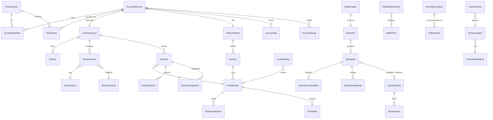

# Spec 001 · Mamoru v1

- Rama: `001-mamoru-v1`
- Fecha: 2026-09-26
- Estado: lista para planificar e implementar en otra sesión
- Ley: `inputs/mamoru-spec-v1.md`
- Constitución: `.specify/memory/constitution.md` v1.0.0

## Qué es Mamoru v1

Mamoru es ahorro autónomo y no custodio. El usuario tiene una smart account (un Safe) en Base, con su passkey como owner y con un owner de respaldo suyo. Mamoru observa la cuenta y decide con una función pura. Con una sesión acotada gestiona posiciones de Uniswap V3 del preset Conservador y cosecha comisiones a USDC, que es el cajón de ahorro.

La superficie de producto de v1 es el dashboard de producción en Base (`dashboard.md`). Enseña cuánto vale lo que hay en la cuenta, lo que pide una decisión del usuario y la decisión que Mamoru tomará o ya tomó, con su código. También enseña analítica real de las posiciones de la cuenta y de los pools curados, con event queries de MultiBaas que el motor contrasta con la RPC. Es la entrega al premio de Curvegrid.

Producción corre en modo de seguridad hasta T-000025: observa, decide, prepara y simula, y se para antes de firmar. Los depósitos están cerrados. El dry-run es una salvaguarda, no una función del producto. El ciclo completo, con firma y envío, se verifica en un fork de Base con otro chain id. Ese fork es el plano de verificación, no el producto.

## Actores

- **Usuario.** Persona que ahorra. Es owner de su cuenta.
- **Operador (Ot).** Cura pools, marca incidencias, revisa el pack y mira Billing.
- **Revisor del premio de Curvegrid.** Entra como cualquier usuario, sin acceso especial. Ve su dashboard de producción y lee el README del premio.
- **Atacante.** Tiene la session key filtrada, un login robado, acceso a la red o una entrega de webhook falsa.

## Historias de usuario y pruebas

Las prioridades son P1 (sin esto no hay v1) y P2 (v1 queda coja sin esto). Cada historia se prueba sola con los escenarios que cita. Los escenarios están en `scenarios.md`.

### US1 · Onboarding con owner de respaldo (P1)

El usuario entra con Google, passkey o email y deja el login recuperable. Crea la passkey que será owner de su cuenta. Registra un owner de respaldo suyo y prueba que lo controla. Ve la dirección de su Safe antes de que exista en la chain. Descarga el kit de recuperación, elige Conservador y lee en lenguaje claro qué podrá hacer Mamoru.

En producción v1, el onboarding termina en "Account ready. Deposits are closed." En el laboratorio, el owner despliega la cuenta en el fork y activa las sesiones con una transacción suya.

**Por qué P1.** Sin una cuenta cuyo owner es el usuario no hay nada que proteger ni que gestionar.

**Prueba independiente.** ONB-01 a ONB-06 en el laboratorio, con un autenticador WebAuthn virtual. DEP-02 con configuración de producción. No hace falta el motor.

**Aceptación.**

1. Dado un usuario con un solo método de login y sin recuperación, cuando intenta terminar el onboarding, entonces la cuenta no pasa a `ready` y la API responde `ONB_RECOVERY_REQUIRED` (ONB-01).
2. Dado un owner de respaldo sin prueba de control, cuando se envía, entonces se rechaza con `ONB_BACKUP_UNPROVEN`. Con una firma válida de esa dirección sobre el reto, se acepta (ONB-02).
3. Dados los owners y los parámetros de setup, cuando la API calcula la dirección contrafactual, entonces coincide con la que produce el factory al desplegar con esos parámetros en el fork (`ONB_ADDRESS_MATCH`, ONB-03).
4. Dado un Safe sin desplegar, cuando el usuario firma `MamoruViewGrant` con su passkey, entonces la API verifica la firma por ERC-6492 y crea un `ViewGrant`. Tras desplegar, la misma vista se verifica por ERC-1271 (ONB-04).
5. Dado el resumen de permisos que ve el usuario, cuando se compara con los datos de activación que codifica el adaptador de cuenta, entonces los dos salen del mismo `SessionPolicy` y sus hashes coinciden (`ONB_POLICY_HASH_MATCH`, ONB-05).
6. Dada una sesión de producto válida y ningún owner firmando, cuando se llama a cualquier ruta de la API, entonces ninguna produce una firma, una activación de sesión ni un movimiento de fondos (ONB-06).
7. Dada la configuración de producción v1, cuando termina el onboarding, entonces no hay botón de depósito, la firma de activación de sesiones está deshabilitada y la vista dice que los depósitos están cerrados (`FUNDS_GATE_CLOSED`, DEP-02).

### US2 · Walkaway con el owner (P1)

El usuario decide irse, o Mamoru desaparece. Con su passkey o con su owner de respaldo revoca las sesiones de Mamoru, cierra sus posiciones y se lleva los tokens. No usa Mamoru, ni el login, ni MultiBaas. Solo necesita un nodo RPC de Base, su owner y el kit de recuperación.

**Por qué P1.** Es la prueba que tumba la elección de cuenta. T-000025 depende de ella.

**Prueba independiente.** WALK-01 y WALK-02 en fork, con el motor, la app y MultiBaas parados. WALK-04 para una cuenta contrafactual con fondos.

**Aceptación.**

1. Dada una cuenta con sesiones activas y una posición V3, con el motor, la app y MultiBaas parados, cuando el owner de respaldo firma y envía `execTransaction` directamente al nodo:
   - las sesiones quedan revocadas;
   - la posición queda cerrada;
   - los tokens quedan en la dirección que el owner elige;
   - una userOp posterior firmada con la session key es rechazada en validación (`CHAIN_REJECTED_VALIDATION`).

   Lo prueba WALK-01.
2. Dado el mismo estado, cuando firma la passkey con el autenticador de software y cualquier EOA paga el gas, entonces el resultado es el mismo (WALK-02).
3. Dado un walkaway ya hecho, cuando el motor vuelve, entonces observa `SESSION_REVOKED` y `OBS_EXTERNAL_CHANGE`, no propone operaciones y la vista lo cuenta (WALK-03).
4. Dada una cuenta contrafactual con fondos, cuando el owner despliega el Safe con los parámetros del kit, entonces la dirección coincide y retira los fondos sin Mamoru (WALK-04).
5. Dada una operación de Mamoru ya enviada, cuando el owner revoca antes de su inclusión, entonces la operación no se incluye. El diario la cierra como `failed` con `RECON_UNINCLUDABLE`, sin abrir otro nonce (WALK-05).

### US3 · Tick en dry-run (P1)

Cada pocos minutos el cron pide una revisión. El motor hace cinco cosas y se para antes de firmar:

1. Lee la cuenta y el mercado a un bloque fijo.
2. Decide.
3. Arma la operación con una cotización fresca.
4. Simula la operación desde la cuenta.
5. Registra el resultado.

La vista enseña qué habría hecho y por qué.

**Por qué P1.** Es todo lo que hace producción en v1. Es la prueba de que el motor está listo antes de que se mueva un wei.

**Prueba independiente.** M13 en fork, con parada antes de firmar. DRY-01 y DRY-02 con configuración de producción. DRY-03 en Base, solo lectura.

**Aceptación.**

1. Dada una cuenta en fork con capital y una propuesta, cuando corre la revisión con parada antes de firmar, entonces la operación pasa por `proposed`, `prepared` y `simulated` y termina `discarded` con `DRY_RUN_STOP`. El nonce, los saldos, las posiciones y los approvals de la cuenta no cambian (M13).
2. Dada la configuración de producción, cuando algo llama a `sign` o al envío 4337, entonces los dos se niegan con `DRY_RUN_STOP`. Una configuración con `CORE_DRY_RUN=false` no arranca (`CONFIG_DRY_RUN_REQUIRED`, DRY-01).
3. Dada una configuración de laboratorio contra una RPC que responde chain id 8453, cuando el motor arranca o intenta firmar, entonces se niega con `SIGN_CHAIN_NOT_ALLOWED` (DRY-02).
4. Dada la configuración de producción sobre Base en solo lectura y una cuenta contrafactual vacía, cuando corre la revisión, entonces la decisión es `DECIDE_HOLD` con `DECIDE_NO_CAPITAL` y `FUNDS_GATE_CLOSED`, y no se crea operación (DRY-03).

### US4 · Harvest a stable (P1)

La posición V3 del bucket `btc-usdc` cobra comisiones. Cuando las comisiones no cobradas superan el coste de cobrarlas, Mamoru cobra sin tocar la liquidez. Después convierte la parte en cbBTC a USDC con un swap de un salto y acredita al cajón solo las comisiones. El Savings Log cuenta cada cosecha y de dónde sale cada cifra.

**Por qué P1.** Es el ahorro: el núcleo del producto.

**Prueba independiente.** M04 en fork, en el bloque del catálogo, con DASH-01 para la fila del Savings Log y M10 para el slot ocupado.

**Aceptación.**

1. Dada una posición en rango sin comisiones, cuando corre la revisión, entonces la decisión es `DECIDE_HOLD` con `DECIDE_HARVEST_BELOW_COST` y no hay operación (M04, paso A).
2. Dadas comisiones generadas con swaps reales en el pool del fork, cuando corre la revisión, entonces:
   - la decisión es `DECIDE_HARVEST`;
   - la operación `harvest` llega a `confirmed` con `EXEC_OK`;
   - la liquidez de la posición no cambia;
   - el USDC de la cuenta sube.

   Lo prueba M04, paso B.
3. Dada la cosecha confirmada, cuando el proyector la procesa, entonces la fila del Savings Log tiene:
   - principal cero;
   - comisiones iguales a lo cobrado;
   - conversión con los importes del evento `Swap`;
   - estado `confirmed`;
   - procedencia `journal` y `fork_rpc`.

   Lo prueba DASH-01.
4. Dada una operación que ocupa el slot, cuando toca cosechar, entonces:
   - la decisión es `DECIDE_SLOT_BUSY`;
   - no se abre una segunda operación;
   - el crédito al cajón aparece solo cuando la cosecha llega a `confirmed`.

   Lo prueba M10.

### US5 · Salida de emergencia (P1)

El usuario pulsa salir, o Risk Monitor ve una incidencia en un pool o token que la cuenta tiene. Mamoru cierra las posiciones una a una dentro de la propia cuenta. Convierte a USDC solo cuando el mercado está sano, y deja la cuenta en pausa. Si no puede enviar, la salida queda pendiente con la causa a la vista y la vista ofrece irse sin Mamoru.

**Por qué P1.** Salir es la operación que más importa cuando algo va mal. Una salida que se pierde en silencio rompe la promesa del producto.

**Prueba independiente.** EXIT-01 a EXIT-03, GATE-01 a GATE-04, GATE-08, GATE-09, M08 y M09.

**Aceptación.**

1. Dada una salida pedida por el usuario y un pool con el precio manipulado (Execution Health Gate en NO GO), cuando corre la revisión, entonces:
   - `close_position` se firma y se confirma con `EHG_NO_GO_OVERRIDDEN_BY_EXIT` en el rastro;
   - la conversión espera con `DECIDE_CONVERT_HELD` y `EHG_PRICE_DIVERGENCE`.

   Lo prueba GATE-02.
2. Dada una salida con la sesión caducada, cuando corre la revisión, entonces:
   - no se firma nada;
   - la salida queda en `EXIT_PENDING` con causa `SESSION_EXPIRED`;
   - la vista enseña cómo renovar o irse sin Mamoru.

   Lo prueba GATE-03.
3. Dada una incidencia de operador en cbBTC con la posición dentro, cuando corre la revisión, entonces la decisión es `DECIDE_EXIT` con `EXIT_RISK_INCIDENT`. ENY y Strategy solo anotan (GATE-01).
4. Dada una cosecha en `simulated`, cuando llega la salida, entonces la cosecha termina `discarded` con `OP_PREEMPTED_BY_EXIT` y la siguiente operación es el cierre (GATE-08).
5. Dadas dos posiciones, cuando termina la salida, entonces no queda ninguna posición, la cuenta queda en pausa y la salida termina con `EXIT_COMPLETED` (EXIT-01).
6. Dada una salida con el bundler reteniendo la inclusión y un reinicio del Durable Object, cuando el bundler vuelve, entonces la misma operación se incluye y se confirma sin nuevo nonce. La pausa llega solo al completar (M09).

### US6 · Pausa (P2)

El usuario pausa. Mamoru deja de entrar, de cosechar y de reajustar rangos. Sigue observando, y las salidas siguen activas. Para parar todo, la vista explica cómo revocar la sesión.

**Por qué P2.** Da control sin salir. El walkaway y la salida ya cubren el caso grave.

**Prueba independiente.** PAUSE-01 a PAUSE-03 y GATE-07.

**Aceptación.**

1. Dada una cuenta en pausa con comisiones altas, cuando corre la revisión, entonces la decisión es `DECIDE_HOLD` con `DECIDE_PAUSED` (PAUSE-01).
2. Dada una operación firmada en vuelo, cuando llega la pausa, entonces esa operación se reconcilia hasta un estado terminal y no se abre otra (PAUSE-02).
3. Dada una cuenta en pausa, cuando el usuario reanuda, entonces la siguiente revisión decide con normalidad (PAUSE-03).
4. Dada una incidencia con la cuenta en pausa, cuando corre la revisión, entonces la salida por riesgo sigue adelante con `EXIT_RISK_INCIDENT` (GATE-07).

### US7 · Espera de depósito (P2)

Con la cuenta lista, la vista espera el depósito. En el laboratorio, una fixture deposita USDC y ETH de gas. Mamoru los ve cuando el bloque ya es `safe` y propone la primera asignación. En producción v1 la pantalla dice que los depósitos están cerrados y no enseña cómo depositar.

**Por qué P2.** En v1 solo existe en el laboratorio. En producción su única obligación es no invitar a depositar.

**Prueba independiente.** DEP-01 a DEP-04 y M02.

**Aceptación.**

1. Dado un depósito de USDC por encima del bloque `safe`, cuando corre la revisión, entonces el código es `OBS_DEPOSIT_UNSAFE` y no hay operación. Cuando ese bloque queda `safe`, los códigos son `OBS_DEPOSIT_DETECTED` y `DECIDE_ENTER` (DEP-01).
2. Dada la primera asignación, entonces:
   - `enter_swap` y `enter_mint` se confirman en revisiones sucesivas;
   - los buckets `stables` y `risk` quedan registrados con `PLAN_BUCKET_NO_EXECUTABLE_POOL`.

   Lo prueba M02.
3. Dado un token del registro que la política no gestiona, entonces se lista con `OBS_UNMANAGED_ASSET` y nunca se opera (DEP-04).
4. Dados fondos en una cuenta contrafactual con la puerta cerrada, entonces:
   - el código es `ACCT_FUNDS_WHILE_CLOSED`;
   - el motor no actúa;
   - la vista enlaza el procedimiento de WALK-04.

   Lo prueba DEP-03.

### US8 · Dashboard de producción en Base (P1)

El usuario abre `/dashboard` y entiende su cuenta sin leer código:

- la cabecera dice qué cuenta es, en qué chain y cuánto vale;
- Actions lista lo que tiene que decidir o entender;
- Current Action dice qué va a hacer Mamoru, qué hace o qué hizo, con el código;
- Portfolio y Treasury reparten el valor entre idle, LP y cajón de ahorro, con el camino de conversión a USDC por Uniswap V3;
- Pools and positions enseña swaps, liquidez, comisiones y rango, de sus posiciones y de los pools de su plan, con event queries de MultiBaas que el motor contrasta con la RPC.

Cada cifra lleva su fuente y su chain. En v1 solo hay Base.

**Por qué P1.** Es la superficie de producto de v1 y la entrega al premio de Curvegrid. Con los depósitos cerrados, es todo lo que el usuario ve de Mamoru.

**Prueba independiente.** DASH-09 a DASH-19 y UI-06 a UI-08 en fork, con el lector del fork como índice. TEN-08 para el historial. BASE-01 y BASE-02 en Base, solo lectura. MB-02 a MB-04 contra el deployment de MultiBaas.

**Aceptación.**

1. Dada una posición del owner fuera de la sesión y una posición gestionada que sale de rango, cuando corre la revisión, entonces Actions tiene `OBS_UNMANAGED_ASSET` y `OBS_POSITION_OUT_OF_RANGE` con el tipo que fija `dashboard.md` §7.2, y Current Action no repite ninguna de las dos (DASH-09).
2. Dadas comisiones por encima del coste en una posición no gestionada, cuando corre la revisión, entonces Actions tiene `OBS_FEES_ABOVE_COST` como decisión del usuario, sin botón, y ninguna operación toca ese `tokenId` (DASH-10).
3. Dada una operación en vuelo, cuando se lee el payload, entonces Current Action la enseña y Actions no tiene ningún código de estado de operación (DASH-13).
4. Dados swaps y cambios de liquidez en el pool curado, cuando sincroniza el modelo de lectura, entonces las filas y las estadísticas de 24 horas coinciden con los logs RPC del mismo rango, y cada fila lleva `check = reconciled` (DASH-14).
5. Dado el índice apagado, por detrás o de otra chain, cuando se lee el payload, entonces ninguna vista queda vacía: la historia sale de logs RPC rotulados con su causa (DASH-17, BASE-02).
6. Dada la app en producción, entonces cada cifra lleva `chainId` 8453, `chains` tiene una sola entrada y la vista dice "Other chains: not observed in v1." (DASH-18, BASE-01).
7. Dado el navegador en `/dashboard`, entonces todas sus peticiones van a `/api/*` del mismo origen y ninguna a MultiBaas, a la RPC o al bundler (UI-08).
8. Dado un usuario que pide el historial de una posición de otra cuenta, entonces la API devuelve una lista vacía y ninguna fila ajena (TEN-08).

### US9 · Plano de verificación en fork (P2)

En la máquina de trabajo, en CI o en un portátil local, el runner levanta cuatro cosas: anvil sobre el bloque del catálogo, el bundler de laboratorio, el motor y la app. El panel es el mismo dashboard con una banda fija que dice simulación, fork de Base, bloque y no es capital. Con la cuenta de prueba, Conservador y el pool curado, el ciclo completo llega hasta la cosecha a USDC y la fila del Savings Log. No hay enlaces a Basescan. Nada de esto llega a producción.

**Por qué P2.** Verifica el ciclo completo mientras producción está en modo de seguridad. No es el producto ni la entrega del premio: el README lo cita como evidencia.

**Prueba independiente.** CYCLE-01, UI-02, TEN-06 y LAB-10.

**Aceptación.**

1. Dado el catálogo `cycle-conservador`, cuando corre, entonces produce la secuencia de códigos esperada y termina con una fila del Savings Log en `confirmed` con fuente `fork_rpc` (CYCLE-01).
2. Dado el panel en modo laboratorio, entonces la banda aparece en todas las rutas con el bloque de la última observación, y ninguna respuesta de la API contiene enlaces a Basescan (UI-02).
3. Dada una fila con el chain id del fork en una D1 de producción, cuando la API de producción lee, entonces no la devuelve y registra `PROJ_FOREIGN_CHAIN_ROW` (TEN-06).
4. Dado el artefacto de una ejecución, cuando se carga en la versión fijada de anvil, entonces la observación reproduce el mismo hash (`LAB_REPRO_OK`, LAB-10).

## Casos límite

| Caso | Comportamiento | Código | Escenario |
|---|---|---|---|
| Fondos enviados a la cuenta contrafactual con la puerta cerrada | El motor no actúa. La vista explica cómo desplegar y retirar con el owner | `ACCT_FUNDS_WHILE_CLOSED` | DEP-03, WALK-04 |
| Depósito visto por encima de `safe` | Se espera a `safe` antes de asignar | `OBS_DEPOSIT_UNSAFE` | DEP-01 |
| Token del registro fuera de la política, o ETH por encima de la reserva de gas | Se lista y no se opera | `OBS_UNMANAGED_ASSET`, `OBS_ETH_NOT_INVESTED` | DEP-04, M11 |
| Posición de la cuenta que Mamoru no abrió | Se marca como no gestionada. `decide` no la toca | `OBS_UNMANAGED_ASSET` | SESS-09, WALK-03 |
| El owner mueve fondos o posiciones mientras Mamoru corre | Se relee, se registra el cambio y se decide con la nueva observación | `OBS_EXTERNAL_CHANGE`, `OBS_OWNER_ACTION` | WALK-03 |
| Reserva de gas insuficiente | No se firma. Una salida queda pendiente con esa causa | `ACCT_GAS_RESERVE_LOW` | GATE-04 |
| La sesión caduca con una operación en vuelo | La operación se reconcilia. Solo es `failed` si el nonce sigue libre tras la caducidad | `SESSION_EXPIRED`, `RECON_UNINCLUDABLE` | JRNL-05 |
| El owner revoca con una operación en vuelo | Igual que la caducidad | `SESSION_REVOKED`, `RECON_UNINCLUDABLE` | WALK-05 |
| El nonce del carril de Mamoru lo consume una userOp ajena | Operación `failed`, pausa y alarma | `RECON_NONCE_CONSUMED_BY_OTHER`, `SESSION_FOREIGN_USE` | JRNL-06, SESS-24 |
| La inclusión desaparece por reorg antes de `safe` | La operación vuelve a reconciliación | `RECON_REORGED` | REORG-01 |
| El precio vuelve al rango entre la decisión y la simulación | La operación se descarta sin firmar | `OP_DECISION_STALE` | M14 (variante b) |
| La RPC responde otro chain id | No hay decisión | `OBS_CHAIN_MISMATCH` | M06 |
| Las lecturas no se pueden fijar a un bloque | No hay decisión | `OBS_BLOCK_INCONSISTENT` | RETRY-01 (variante b) |
| El webhook llega antes de que la RPC vea el bloque | La revisión relee y, si el bloque no llegó, reprograma | `HOOK_ACCEPTED`, `OBS_OK` | HOOK-01 |
| Muchas entregas del mismo pool | Se coalescen en una revisión por ventana | `HOOK_COALESCED` | HOOK-06 |
| MultiBaas caído o sin el evento | El dashboard usa logs RPC y lo rotula. La cosecha se acredita con diario y RPC | `PROJ_SOURCE_FALLBACK_RPC`, `PROJ_INDEXER_PENDING` | DASH-03 |
| MultiBaas y la RPC discrepan | Manda la RPC. La fila se marca | `PROJ_INDEXER_MISMATCH` | DASH-04 |
| El deployment de MultiBaas no es de Base o no enlaza un contrato | Las vistas salen de logs RPC, rotuladas. El README lo cuenta | `MB_BASE_INDEXING_ABSENT`, `PROJ_SOURCE_FALLBACK_RPC` | DASH-17, BASE-02 |
| MultiBaas indexa con retraso | Hasta su bloque, MultiBaas contrastado. Después, logs RPC | `MB_INDEX_LAGGING` | DASH-17 |
| Una query de MultiBaas falla | Ese rango sale de logs RPC | `MB_QUERY_FAILED` | DASH-17, MB-02 |
| Evento anterior al bloque de inicio del índice | Ese tramo de la historia sale de logs RPC | `MB_BEFORE_START_BLOCK` | DASH-19 |
| El agregado o el ancla de MultiBaas no cuadran | Las estadísticas salen de filas contrastadas y el estado del pool de la RPC | `MB_QUERY_MISMATCH` | DASH-14, MB-02 |
| La liquidez según eventos no cuadra con `positions()` | Historia marcada incompleta, liquidez de la RPC y entrada en Actions | `PROJ_INDEXER_MISMATCH` | DASH-15 |
| Posición no gestionada fuera de rango, o con comisiones por encima del coste | Entrada de decisión en Actions. Ninguna propuesta | `OBS_POSITION_OUT_OF_RANGE`, `OBS_FEES_ABOVE_COST` | DASH-09, DASH-10 |
| Principal residual en `tokensOwed` por un `decreaseLiquidity` externo | El principal se excluye del crédito | `PROJ_PRINCIPAL_EXCLUDED` | DASH-07 |
| El owner retira USDC del cajón | Disponible es el saldo real. Se muestran los dos | `PROJ_SAVINGS_EXCEEDS_BALANCE` | DASH-06 |
| El bloque del fork no está en el proveedor de archivo | El runner no arranca | `LAB_BLOCK_HASH_MISMATCH` | LAB-03 |
| P-256 no verifica en el fork | Los escenarios con passkey no corren | `LAB_P256_UNAVAILABLE` | LAB-08 (variante a) |
| La RPC no soporta `eth_simulateV1` | No se simula y no hay operación | `EHG_SIM_UNAVAILABLE`, `LAB_SIMULATE_UNAVAILABLE` | LAB-08 (variante b) |
| USDC en pausa, o la cuenta en la lista negra de USDC | No se opera. Se avisa | `RISK_TOKEN_PAUSED`, `RISK_ACCOUNT_BLOCKLISTED` | GATE-06 (variante b) |

## Requisitos funcionales

La palabra DEBE marca una obligación comprobable. Cada requisito lo cubre al menos un escenario.

### Onboarding (FR-ONB)

- **FR-ONB-001.** El login de producto DEBE aceptar Google, passkey o email. La sesión de producto NO DEBE autorizar fondos, firmas ni activaciones de sesión.
- **FR-ONB-002.** El login DEBE ser recuperable antes del depósito: dos métodos vinculados, o un método más un email de recuperación verificado. Sin eso la cuenta no pasa a `ready` (`ONB_RECOVERY_REQUIRED`).
- **FR-ONB-003.** La cuenta DEBE tener como owner una passkey WebAuthn P-256 creada para ella. Esa credencial es distinta de cualquier credencial del login.
- **FR-ONB-004.** El owner de respaldo DEBE ser del usuario: otra passkey en otra plataforma o una dirección Ethereum. Se acepta solo tras una firma válida de ese owner sobre un reto de la API (`ONB_BACKUP_UNPROVEN` si falta).
- **FR-ONB-005.** La API DEBE calcular la dirección contrafactual del Safe a partir de los owners, el threshold 1, el adaptador Safe7579, Smart Sessions instalado sin sesiones y un `saltNonce`. Esa dirección DEBE coincidir con la del factory (`ONB_ADDRESS_MATCH`).
- **FR-ONB-006.** El usuario DEBE descargar y confirmar un kit de recuperación antes del depósito. El kit lleva la chain, la dirección, los parámetros de setup, los módulos, los owners, los `permissionId`, los `tokenId` y un enlace a `docs/walkaway.md`. No lleva secretos.
- **FR-ONB-007.** Conservador DEBE ser el único preset de v1. La elección es la intención `preset`.
- **FR-ONB-008.** El resumen de permisos que ve el usuario DEBE salir del mismo objeto `SessionPolicy` que codifica el adaptador de cuenta, con hash igual (`ONB_POLICY_HASH_MATCH`).
- **FR-ONB-009.** Con `FUNDS_GATE=closed`, que es el valor de producción en v1, hay tres consecuencias:
   - la vista NO DEBE ofrecer depósito;
   - la firma de activación de sesiones DEBE estar deshabilitada;
   - la cuenta DEBE quedar contrafactual.

### Vista y aislamiento (FR-VIEW)

- **FR-VIEW-001.** Abrir la vista de una cuenta DEBE exigir un `ViewGrant`. El grant se apoya en una firma de la cuenta sobre el mensaje EIP-712 `MamoruViewGrant`: verificada por ERC-1271 si el Safe está desplegado, o por ERC-6492 si no.
- **FR-VIEW-002.** Un `ViewGrant` NO DEBE autorizar firmas, sesiones ni movimientos de fondos.
- **FR-VIEW-003.** Toda lectura y toda intención sobre una cuenta DEBE exigir un grant vigente para el par (`userId`, `accountKey`). Sin grant, la respuesta es `GRANT_REQUIRED`.
- **FR-VIEW-004.** La API DEBE re-verificar el grant contra el estado actual de la cuenta con una caché acotada. Si el owner que firmó ya no lo es, la respuesta es `GRANT_INVALID_PROOF`.
- **FR-VIEW-005.** El aislamiento DEBE apoyarse en cuatro reglas:
   - un Durable Object por cuenta y chain;
   - filas de D1 con `chain_id` y `account_key`;
   - la dirección del Durable Object sale solo de cuentas registradas;
   - un webhook despierta solo a las cuentas mapeadas.
- **FR-VIEW-006.** La sesión de producto DEBE ir en cookies `HttpOnly` y `Secure` con `SameSite`. Las intenciones DEBEN comprobar el `Origin` y rechazar uno ajeno con `AUTH_ORIGIN_REJECTED`.

### Cuenta y sesión (FR-ACC)

- **FR-ACC-001.** La cuenta DEBE ser un Safe 1.4.1 con el adaptador Safe7579 y el validador Smart Sessions. Los owners son la passkey y el respaldo, con threshold 1.
- **FR-ACC-002.** La cuenta NO DEBE usar paymaster. Paga el gas con ETH nativo. El ETH es solo reserva de gas y nunca se invierte.
- **FR-ACC-003.** Cada sesión DEBE decir de forma explícita:
   - contratos y selectores;
   - reglas sobre argumentos;
   - tokens;
   - importe por llamada y acumulado;
   - destinatario igual a la propia cuenta;
   - alcance de posición;
   - caducidad;
   - límite de uso.

   La revocación la hace el owner.
- **FR-ACC-004.** Una sesión NO DEBE poder hacer nada de esto:
   - instalar ni desinstalar módulos;
   - cambiar owners, threshold, guard o fallback handler;
   - ampliarse;
   - usar una acción fallback;
   - firmar ERC-1271 o ERC-7739 por la cuenta;
   - usar paymaster;
   - mover valor nativo;
   - usar `delegatecall`;
   - llamar a la propia cuenta o a un módulo;
   - hablar con un executor de intents o con el Orchestrator.
- **FR-ACC-005.** Si una regla no se puede expresar con las primitivas de Smart Sessions, DEBE partirse en sesiones más estrechas. Nunca se relaja una regla.
- **FR-ACC-006.** Las sesiones DEBEN activarse solo con una transacción u operación del owner protegida por nonce, nunca con una firma de activación embebida y reutilizable. Un `permissionId` revocado NO DEBE reactivarse (`SESSION_PERMISSION_ID_REUSED`). Renovar usa un salt nuevo.
- **FR-ACC-007.** La session key DEBE:
   - generarse dentro del motor;
   - guardarse cifrada en el Durable Object con una clave de cifrado que es un secreto del Worker;
   - usarse solo dentro del método `sign` del Durable Object.
- **FR-ACC-008.** El alcance de posición DEBE ser una lista `allowedTokenIds` comprobada en cadena. Solo entra un `tokenId` si la misma transacción de la sesión acuñó esa posición con `mintAndNote` y la cuenta es su dueña. La session key NO DEBE poder añadir un `tokenId` que no haya acuñado en esa transacción. Una posición que el owner abra por su cuenta, antes o después de activar la sesión, queda fuera de la lista y la validación la rechaza (`POLICY_DENIED_POSITION`). `tokenIdMin` no basta: un suelo numérico también cubriría acuñaciones posteriores del owner.
- **FR-ACC-009.** El owner DEBE poder revocar, cerrar y retirar con el motor, el login y MultiBaas apagados.
- **FR-ACC-010.** El motor DEBE pre-chequear cada lote contra la misma política antes de firmar (`POLICY_DENIED_*`). El pre-chequeo es defensa en profundidad y no sustituye a la validación en cadena.
- **FR-ACC-011.** Si aparece una userOp de la cuenta que usa la sesión de Mamoru y no está en el diario, el motor DEBE registrar `SESSION_FOREIGN_USE`, pausar la cuenta y avisar en la vista.

### Motor y diario (FR-ENG)

- **FR-ENG-001.** El cron DEBE pedir revisión a cada cuenta activa. El cron no firma.
- **FR-ENG-002.** DEBE haber un Durable Object por cuenta y chain, direccionado por `accountKey` con `getByName`. Es el único escritor de su diario, usa SQLite, persiste antes de cualquier efecto y usa una sola alarma.
- **FR-ENG-003.** Como mucho DEBE haber una operación no terminal por cuenta y chain.
- **FR-ENG-004.** Cada transición de operación DEBE seguir la máquina de estados del plan y llevar un código de razón del catálogo. El historial de transiciones es solo de añadir.
- **FR-ENG-005.** Una operación DEBE firmarse solo desde `simulated`. El nonce reservado, la userOp, su hash y los bytes firmados se persisten en una sola transacción antes de cualquier envío.
- **FR-ENG-006.** Un timeout NO DEBE abrir otro nonce. La reconciliación reenvía los mismos bytes. Un reemplazo por fee usa el mismo nonce y las mismas llamadas, dentro del tope de la política.
- **FR-ENG-007.** Una operación DEBE pasar a `failed` solo con una de tres pruebas:
   - inclusión con `success=false` (`EXEC_INNER_REVERT`);
   - nonce consumido por otro hash (`RECON_NONCE_CONSUMED_BY_OTHER`);
   - sesión caducada o revocada con el nonce libre confirmado en `safe` (`RECON_UNINCLUDABLE`).
- **FR-ENG-008.** Una operación DEBE pasar a `confirmed` solo con el evento `UserOperationEvent` y `success=true`, leído por RPC en un bloque que ya es `safe` y cuyo hash es canónico.
- **FR-ENG-009.** Los pasos de Workflow DEBEN ser idempotentes, tener nombres deterministas y devolver resultados pequeños. Ningún paso con efecto corre sin que el diario lo haya registrado antes.
- **FR-ENG-010.** La alarma del Durable Object DEBE actuar como vigilante. Si hay una operación no terminal sin instancia de Workflow viva, arranca su reconciliación.
- **FR-ENG-011.** Un aviso de despertar (wake hint) DEBE coalescerse y NO DEBE ser un GO: la revisión relee por RPC.
- **FR-ENG-012.** En pausa, el motor NO DEBE entrar, cosechar ni reajustar rangos. Las salidas y la conversión posterior a una salida siguen. Una operación ya firmada se reconcilia hasta un estado terminal.
- **FR-ENG-013.** Una salida DEBE seguir estas reglas:
   - es una petición persistente con causa;
   - se adelanta a las operaciones sin firmar (`OP_PREEMPTED_BY_EXIT`);
   - espera a que la operación firmada termine;
   - cierra las posiciones de una en una;
   - convierte aparte, con la Execution Health Gate en GO;
   - al terminar, pone la cuenta en pausa (`EXIT_COMPLETED`).
- **FR-ENG-014.** El dry-run DEBE llevar `simulated` a `discarded` con `DRY_RUN_STOP`. Lo guardan dos sitios: el método `sign` del Durable Object y el envío del adaptador 4337. En producción, la lista de chains de firma está vacía.
- **FR-ENG-015.** Una decisión DEBE producir como mucho una operación. Tras `confirmed` o `failed`, el Durable Object programa una revisión inmediata con observación nueva. Tras `discarded`, NO DEBE programar otra revisión hasta el siguiente cron si la premisa no cambió. Si el hash de la decisión es el de la última operación descartada, la revisión termina en `REVIEW_DEDUPED` y no abre otra operación. Así un `DRY_RUN_STOP` no se repite en bucle.
- **FR-ENG-016.** Las intenciones DEBEN ser `preset`, `pause` (con `paused` a `true` o `false`), `exit` y `renew_session`. Cada una queda auditada con su código (`INTENT_ACCEPTED` o `INTENT_REJECTED_STATE`).
- **FR-ENG-017.** Al arrancar, el motor DEBE validar su modo (`production` o `lab`), el chain id de la RPC y el bundler (`CONFIG_MODE_INVALID`, `SIGN_CHAIN_NOT_ALLOWED`, `LAB_BUNDLER_NOT_LOCAL`).

### Decisión y puertas (FR-DEC)

- **FR-DEC-001.** `decide(observation, policy)` DEBE ser pura y determinista. Con la misma entrada, produce la misma decisión, el mismo código y el mismo rastro.
- **FR-DEC-002.** La política DEBE ir versionada, con versión y hash de contenido, y quedar fijada por cuenta. Cambiarla es la intención `preset`.
- **FR-DEC-003.** Las puertas DEBEN aplicarse con este significado:
   - Purga, solo en entrada y reentrada (`PURGA_NOT_APPLICABLE` en lo demás);
   - Risk Monitor, sobre el capital dentro;
   - Execution Health Gate, por operación;
   - ENY;
   - Strategy.
- **FR-DEC-004.** Una salida pedida por el usuario o por Risk Monitor NO DEBE cancelarla ni la Execution Health Gate, ni ENY, ni Strategy.
- **FR-DEC-005.** En una salida, un NO GO de la Execution Health Gate DEBE saltarse (`EHG_NO_GO_OVERRIDDEN_BY_EXIT`) si la sesión es válida y la simulación no revierte. Si no se puede enviar, la salida queda en `EXIT_PENDING` con la causa.
- **FR-DEC-006.** Los números del Packaging y del Colab DEBEN evaluarse en shadow, con las anotaciones `ENY_SHADOW`, `RISK_SHADOW` y `EHG_SHADOW`. Nunca aprueban ni rechazan.
- **FR-DEC-007.** 50/40/10 DEBE usarse como preferencia. Un bucket sin pool ejecutable DEBE registrarse con `PLAN_BUCKET_NO_EXECUTABLE_POOL`, y su parte queda en USDC a la vista.
- **FR-DEC-008.** Con evidencia desconocida, las entradas DEBEN bloquearse (`PURGA_EVIDENCE_UNKNOWN`, `RISK_EVIDENCE_UNKNOWN`). La evidencia desconocida NO DEBE forzar salidas.
- **FR-DEC-009.** El harvest DEBE proponerse solo cuando se cumplen dos condiciones:
   - el valor estimado de las comisiones no cobradas supera el coste estimado de la operación por el factor de la política;
   - la posición es gestionada.

   Si no, la decisión es `DECIDE_HARVEST_BELOW_COST`.
- **FR-DEC-010.** Con `range.adjust = on_out_of_range`, una posición gestionada fuera de rango DEBE llevar a `close_position` con `DECIDE_RANGE_ADJUST`. La reentrada se decide en la revisión siguiente. `range.cooldown` evita reajustes seguidos (`DECIDE_RANGE_COOLDOWN`). La economía del reajuste va en shadow.
- **FR-DEC-011.** Si hay varias propuestas, se elige una en este orden: cierre por salida, conversión tras salida, cierre por rango, harvest y entrada.
- **FR-DEC-012.** Las incidencias DEBEN venir de dos fuentes. La lista del operador en D1 y las banderas en cadena (`paused()` e `isBlacklisted()` donde el registro dice que existen). Se identifican por la tupla del pool o del token, nunca por nombre.
- **FR-DEC-013.** Cada decisión DEBE registrar:
   - el bloque y el hash de la observación;
   - la versión de la política;
   - el tipo de decisión;
   - el código;
   - el rastro de puertas;
   - las anotaciones shadow;
   - un código por bucket;
   - los códigos de cada posición de la cuenta, gestionada o no (FR-DEC-015).
- **FR-DEC-014.** Los activos y las posiciones fuera de la política DEBEN listarse como no gestionados (`OBS_UNMANAGED_ASSET`) y no operarse.
- **FR-DEC-015.** `decide` DEBE anotar por posición, gestionada o no, `OBS_POSITION_OUT_OF_RANGE` si el tick del pool está fuera de [`tickLower`, `tickUpper`), y `OBS_FEES_ABOVE_COST` si las comisiones cobrables estimadas superan el coste estimado por el factor de la política de FR-DEC-009. En una posición no gestionada, esas anotaciones nunca producen propuesta. En una gestionada, la propuesta sigue saliendo de FR-DEC-009 y FR-DEC-010.

### Uniswap V3 (FR-UNI)

- **FR-UNI-001.** Las cotizaciones DEBEN salir de QuoterV2 `quoteExactInputSingle` en el bloque de la operación.
- **FR-UNI-002.** Los swaps DEBEN seguir estas reglas:
   - solo SwapRouter02 `exactInputSingle`;
   - `recipient` igual a la cuenta;
   - `amountOutMinimum > 0`, calculado desde la cotización fresca con la tolerancia de la política;
   - `sqrtPriceLimitX96 = 0`;
   - valor nativo 0;
   - nunca `multicall`, `exactInput`, `unwrapWETH9`, `sweepToken` ni `refundETH`.
- **FR-UNI-003.** El LP DEBE usar solo `mint`, `decreaseLiquidity`, `collect` y `burn` del NonfungiblePositionManager, con estas reglas:
   - `recipient` igual a la cuenta;
   - ticks múltiplos del tick spacing del pool;
   - `amount0Min` y `amount1Min` mayores que cero en `mint`;
   - `deadline` fijado en las llamadas que lo tienen;
   - nunca `multicall`, transferencias del NFT ni approvals del NFT.
- **FR-UNI-004.** Cerrar una posición DEBE ser un solo lote con `decreaseLiquidity` de toda la liquidez, `collect` al máximo y `burn`.
- **FR-UNI-005.** El harvest DEBE ser `collect` al máximo más, si hace falta, `approve` y `exactInputSingle` del token que no es de ahorro a USDC. Nunca incluye `decreaseLiquidity`. El swap convierte solo la parte de comisiones. El principal que salga en el cobro, por un `decreaseLiquidity` externo, queda como capital.
- **FR-UNI-006.** Los approvals DEBEN ser exactos por operación, no pasar el tope de la sesión y no dejar allowance residual al terminar el lote. Nunca son infinitos.
- **FR-UNI-007.** Todo target de calldata DEBE estar en el registro de Base: tokens de la política, NonfungiblePositionManager y SwapRouter02. Cualquier otro se rechaza con `POLICY_TARGET_NOT_IN_REGISTRY`.
- **FR-UNI-008.** Trading API, LP API, UniswapX, hooks v4, CoW, Tenderly, Aqua y 1inch NO DEBEN aparecer en el camino del capital.
- **FR-UNI-009.** La Execution Health Gate DEBE comparar el tick actual con el TWAP del pool (`observe`) y dar NO GO si el desvío pasa la guarda de ingeniería (`EHG_PRICE_DIVERGENCE`), o si no hay TWAP (`EHG_TWAP_UNAVAILABLE`).

### RPC (FR-RPC)

- **FR-RPC-001.** Todas las lecturas de una observación DEBEN fijarse al mismo bloque, con número y hash (`OBS_BLOCK_INCONSISTENT` si no se puede).
- **FR-RPC-002.** La simulación DEBE ejecutar el lote desde el EntryPoint hacia la cuenta con `eth_simulateV1`. Lee los deltas de saldo y de posición y los compara con la intención (`EHG_SIM_REVERT`, `EHG_SIM_DELTA_MISMATCH`, `EHG_SIM_UNAVAILABLE`).
- **FR-RPC-003.** El proveedor RPC DEBE poder cambiarse por configuración. Alchemy es el primero. Las URL con clave son secretos.
- **FR-RPC-004.** Producción DEBE leer solo del chain id 8453. El laboratorio DEBE rechazar 8453 y 84532 (`OBS_CHAIN_MISMATCH`, `LAB_CHAIN_ID_FORBIDDEN`).
- **FR-RPC-005.** El valor DEBE expresarse en USDC, salir de `slot0` de los pools del registro marcados como fuente de precio (USDC/cbBTC 0.05% para cbBTC, WETH/USDC 0.3% para ETH y WETH) en el bloque de la cifra, y rotularse como estimación. La cotización del camino de conversión sale de QuoterV2 en el bloque de la revisión y también es estimación.

### ERC-4337 (FR-AA)

- **FR-AA-001.** Las userOps DEBEN usar EntryPoint v0.7, un único carril de nonce 2D para Mamoru por cuenta, y el `userOpHash` que da el EntryPoint.
- **FR-AA-002.** El camino crítico DEBE usar solo métodos estándar de ERC-4337: `eth_sendUserOperation`, `eth_estimateUserOperationGas`, `eth_getUserOperationReceipt`, `eth_getUserOperationByHash` y `eth_supportedEntryPoints`. Un método propio del proveedor solo se permite para el precio de gas, y con respaldo por RPC.
- **FR-AA-003.** Enviar DEBE ser idempotente: los mismos bytes producen el mismo hash, y cualquier bundler acepta la misma userOp.
- **FR-AA-004.** El recibo del bundler DEBE contrastarse con los logs `UserOperationEvent` leídos por RPC. Para el diario, la prueba es la RPC.
- **FR-AA-005.** El bundler de laboratorio DEBE escuchar en loopback y apuntar solo a anvil (`LAB_BUNDLER_NOT_LOCAL`).

### MultiBaas (FR-MB)

- **FR-MB-001.** En el deployment de Base DEBEN enlazarse los pools curados, el NonfungiblePositionManager y el EntryPoint v0.7, con el alias, la etiqueta y el bloque de inicio de `dashboard.md` §6.2.
- **FR-MB-002.** Las event queries DEBEN ser las del catálogo MBQ-01 a MBQ-08 de `dashboard.md` §6.4: swaps y cambios de liquidez de los pools curados, historia de las posiciones de la cuenta, transferencias de esas posiciones, operaciones de la cuenta en el EntryPoint, eventos decodificados de una transacción, agregados de pool como contraste y swaps de la cuenta. La clave API vive solo en el motor, con rol mínimo.
- **FR-MB-003.** El webhook `event.emitted` DEBE verificarse en la app antes de producir un wake hint. Se comprueban cuatro cosas:
   - firma HMAC;
   - antigüedad;
   - duplicado;
   - reorg.

   Códigos: `HOOK_BAD_SIGNATURE`, `HOOK_STALE`, `HOOK_DUPLICATE`, `HOOK_REORGED`, `HOOK_UNMAPPED`.
- **FR-MB-004.** MultiBaas NO DEBE hacer nada de esto:
   - usar Cloud Wallets ni claves de proveedor;
   - firmar, enviar o acelerar userOps;
   - decidir;
   - usar `transaction.included`;
   - ser la única prueba de liquidación;
   - recibir datos del fork.
- **FR-MB-005.** MB-01 es la aceptación del deployment: una query real sobre un pool conocido de Base, reconciliada con `eth_call`. Si falla (`MB_BASE_INDEXING_ABSENT`), los webhooks salen del motor y el README cuenta solo lo probado. MB-02 a MB-04 comprueban cada query del catálogo contra la RPC en Base y registran su resultado.
- **FR-MB-006.** Solo el Workflow `ReadModelSync` del motor DEBE llamar a MultiBaas con event queries. Ninguna petición del navegador ni de la API produce una llamada a MultiBaas. Los parámetros de cada query (direcciones, `tokenId`, cuenta y rango de bloques) salen del registro, de la política, del `AccountRecord` y de la proyección de la cuenta, nunca de la petición.
- **FR-MB-007.** Cada sincronización DEBE leer primero el estado del deployment (`chainID` igual a 8453) y el estado de indexación de cada contrato enlazado, y elegir con eso la fuente de cada rango según `dashboard.md` §6.6. `MB_BASE_INDEXING_ABSENT`, `MB_INDEX_LAGGING`, `MB_QUERY_FAILED` y `MB_BEFORE_START_BLOCK` llevan ese rango a logs RPC, con la causa en la procedencia.
- **FR-MB-008.** El deployment NO DEBE guardar direcciones de usuarios. Las queries con la dirección de una cuenta o con sus `tokenId` se ejecutan como queries arbitrarias, sin guardarlas, y no se crean alias, etiquetas ni webhooks por cuenta.

### Proyector (FR-PRJ)

- **FR-PRJ-001.** La proyección DEBE ser idempotente por (`opId`, `seq`) y por evento (`blockHash`, `txHash`, `logIndex`).
- **FR-PRJ-002.** Cada cifra proyectada DEBE llevar procedencia: fuente, chain id, bloque, hash, momento y estado.
- **FR-PRJ-003.** Un `Collect` DEBE separarse en principal y comisiones por `tokenId`. El principal pendiente sube con cada `DecreaseLiquidity` y baja con la parte de principal de cada `Collect`, sin pasar de cero. Un cobro parcial deja principal pendiente para el cobro siguiente. Las comisiones son lo cobrado por encima de ese pendiente. Solo las comisiones cuentan como rendimiento. Sumar los `DecreaseLiquidity` desde el último `Collect` no basta: un cobro parcial dejaría principal disfrazado de comisión.
- **FR-PRJ-004.** Solo el harvest DEBE acreditar al cajón. Un cierre devuelve principal y comisiones al capital y se muestra como fila `close` sin crédito.
- **FR-PRJ-005.** Las filas del Savings Log DEBEN tener uno de estos estados: `pending`, `confirmed`, `reconciled`, `indexer_mismatch` o `reorged`. Acreditan `confirmed`, `reconciled` e `indexer_mismatch`, este último con la RPC como fuente de los importes.
- **FR-PRJ-006.** Si MultiBaas no está, la proyección DEBE usar logs RPC y rotularlo (`PROJ_SOURCE_FALLBACK_RPC`).
- **FR-PRJ-007.** `decide` NO DEBE leer la proyección.
- **FR-PRJ-008.** La API de producción NO DEBE devolver filas cuyo chain id no sea 8453 (`PROJ_FOREIGN_CHAIN_ROW`).
- **FR-PRJ-009.** El ahorro disponible DEBE ser el mínimo entre el total del libro y el saldo de USDC en el bloque. Si difieren, se muestran los dos (`PROJ_SAVINGS_EXCEEDS_BALANCE`).
- **FR-PRJ-010.** Cada fila que viene de MultiBaas DEBE contrastarse con `eth_getLogs` sobre el mismo rango y el mismo filtro antes de guardarse como `reconciled`. El emparejamiento es de multiconjunto, por hash de bloque, hash de transacción, evento y argumentos. Una fila sin log en la RPC no se guarda (`MB_QUERY_MISMATCH`). Un log sin fila, o con argumentos distintos, se guarda desde la RPC con `PROJ_INDEXER_MISMATCH`.
- **FR-PRJ-011.** Cada rango sincronizado de un pool DEBE anclarse: el último `Swap` guardado tiene el `sqrtPriceX96` y el `tick` de `slot0()` en su bloque. Si no, se registra `MB_QUERY_MISMATCH` y ese rango se guarda desde la RPC.
- **FR-PRJ-012.** La liquidez de cada posición según sus eventos, la suma de `IncreaseLiquidity` menos la de `DecreaseLiquidity` hasta el bloque `H`, DEBE ser igual a `positions(tokenId).liquidity` en `H`. Si no, la historia de la posición se marca incompleta con `PROJ_INDEXER_MISMATCH` y la liquidez se enseña desde la RPC.
- **FR-PRJ-013.** El proyector DEBE guardar una instantánea por posición y revisión: bloque, hash, liquidez, tick, comisiones sin cobrar y principal pendiente. El movimiento de comisiones de una ventana es la diferencia de comisiones sin cobrar entre la última instantánea y la primera de la ventana, más las comisiones cobradas en la ventana.
- **FR-PRJ-014.** Las estadísticas de pool, el tiempo en rango y "out of range since" DEBEN calcularse en el motor con filas ya contrastadas y con el tick al inicio de la ventana leído por RPC. El agregado de MultiBaas (MBQ-07) solo las contrasta. Si difiere o falla, las cifras salen de las filas con `MB_QUERY_MISMATCH` o `MB_QUERY_FAILED` en `detail`.
- **FR-PRJ-015.** Las filas de pool y las instantáneas de posición DEBEN guardarse durante la retención configurada (`READ_MODEL_RETENTION_BLOCKS`). La historia de las posiciones, de las operaciones y de los swaps de la cuenta se guarda entera. Toda fila por cuenta lleva `account_key`. Las filas de pool no lo llevan porque son públicas.

### Dashboard (FR-DSH)

- **FR-DSH-001.** El panel DEBE ser una SPA sin SSR con las rutas `/`, `/onboarding` y `/dashboard`, y hablar solo con la API.
- **FR-DSH-002.** El dashboard DEBE ser la superficie de producto de v1 y tener en `/dashboard`, en este orden, las vistas de `dashboard.md` §7: cabecera de cuenta, Actions, Current Action, Portfolio, Treasury, Pools and positions, Savings, Savings Log y "Leave without Mamoru". Portfolio, Savings, Current Action y Savings Log son los cuatro paneles de la ley y conservan su nombre. Ninguna vista abre una ruta nueva.
- **FR-DSH-003.** Cada cifra DEBE enseñar su procedencia.
- **FR-DSH-004.** Producción DEBE mostrar el banner del modo de seguridad mientras dure el dry-run, hasta T-000025. El plano de verificación DEBE mostrar una banda fija con simulación, fork de Base, bloque y no es capital.
- **FR-DSH-005.** Cada vista DEBE tener estados de carga, vacío, error, dato viejo y no observado, con la copia de `dashboard.md` §7 y §8. Nunca muestra un cero inventado. Un cero leído en un bloque se muestra con su procedencia.
- **FR-DSH-006.** Cada botón de intención DEBE tener su propio estado pendiente. La salida pide confirmación explícita. Ningún botón de intención aparece dos veces en la página.
- **FR-DSH-007.** El plano de verificación NO DEBE enlazar a Basescan. En producción solo se enlazan transacciones y direcciones de Base.
- **FR-DSH-008.** El dashboard DEBE incluir la sección "Leave without Mamoru", que remite a `docs/walkaway.md`, y el kit de recuperación.
- **FR-DSH-009.** La interfaz de v1 DEBE estar en inglés y mostrar el código de razón junto al texto.
- **FR-DSH-010.** La cabecera DEBE enseñar la dirección de la cuenta, la chain con nombre e id, el estado de despliegue, el preset, la versión de la política, el valor total estimado en USDC y el estado de las fuentes: el último bloque de la RPC de Base y el estado del índice con su bloque. La lista de chains de v1 tiene una sola entrada, Base (8453). Las demás chains se nombran como no observadas y no llevan cifras.
- **FR-DSH-011.** Toda cifra del payload DEBE llevar en su procedencia el `chainId` de la chain de la que sale, y el chip enseña el nombre de esa chain. En producción, todas las cifras son de 8453. Ninguna cifra, ni un cero, se atribuye a otra chain, y la API no suma cifras de chains distintas.
- **FR-DSH-012.** Actions DEBE listar lo que el usuario tiene que decidir o entender, con el catálogo de `dashboard.md` §7.2 y nada más: sesión que caduca, caducada o revocada; uso ajeno de la sesión; activo o posición no gestionados; posición fuera de rango; comisiones por encima del coste; discrepancia de reconciliación; libro por encima del saldo; salida pendiente; pausa; fondos con los depósitos cerrados; reserva de gas baja; restricciones de USDC; conversión retenida; y salida por incidencia. Cada entrada lleva código, tipo (`critical`, `decide` o `understand`), sujeto, procedencia y como mucho una acción: una intención existente o un enlace.
- **FR-DSH-013.** Current Action DEBE enseñar la operación viva o la siguiente del motor, la última decisión con su código y su rastro de puertas, las decisiones recientes, las operaciones de la cuenta en Base, la sesión, la pausa, la salida y la próxima revisión. Actions NO DEBE repetir estados de operación (`BUNDLER_*`, `RECON_*`, `OP_*`, `EXEC_*` ni `DRY_RUN_STOP`). La API deriva Actions con una función pura de `@mamoru/projector` sobre el mismo payload. La SPA no la deriva y no se guarda.
- **FR-DSH-014.** Portfolio DEBE enseñar lo que hay en la cuenta en Base y cuánto vale: cada token del registro con saldo, valor y papel (del plan, solo gas o fuera del plan), el resumen de posiciones, el total, la asignación frente a la preferencia y los activos no gestionados. Saldos, posiciones y precios salen de la RPC en un mismo bloque. El valor de una posición incluye el principal que sigue en liquidez, el principal retirado y todavía no cobrado (`principalOwed`) y las comisiones sin cobrar. `principalOwed` es capital: entra en Portfolio y en el LP de Treasury, y no entra en el cajón ni en el crédito. El total existe solo si todas sus partes están observadas.
- **FR-DSH-015.** Treasury DEBE separar el valor en idle, LP y cajón de ahorro, con la reserva de gas y lo que está fuera del plan aparte. También DEBE enseñar el camino de conversión a USDC: Uniswap V3, USDC/cbBTC 0.05%, SwapRouter02 `exactInputSingle` y la cotización de QuoterV2 en el bloque como estimación. Enseña el estado de la conversión (`nothing_to_convert`, `held_for_entry`, `converting` o `held` con su causa) y los swaps de la cuenta. Sus únicas acciones son "Exit" y el enlace "Leave without Mamoru".
- **FR-DSH-016.** Pools and positions DEBE enseñar, para cada posición de la cuenta, gestionada o no: rango, estado de rango, desde cuándo está fuera de rango, tiempo en rango en la ventana, liquidez ahora y según sus eventos, principal, comisiones sin cobrar, comisiones cobradas separadas del principal, movimiento de comisiones en la ventana y los eventos de la posición con su origen (Mamoru o no).
- **FR-DSH-017.** Pools and positions DEBE enseñar, para cada pool curado de la política fijada, precio, tick, desvío frente al TWAP, liquidez en rango y saldos del pool. En la ventana de 24 horas enseña número de swaps, volumen por token, comisiones pagadas por los swaps como estimación, rango de ticks recorrido, y liquidez añadida y retirada. También enseña los últimos swaps, los últimos cambios de liquidez y el estado de rango de las posiciones de la cuenta en ese pool.
- **FR-DSH-018.** La caída de una fuente NO DEBE dejar en blanco una vista cuyos datos puedan salir de otra. Sin MultiBaas, las vistas de historia salen de logs RPC, rotuladas con su causa. Sin RPC, las cifras de estado dicen "Not observed" y la historia guardada se enseña como vieja.
- **FR-DSH-019.** La SPA DEBE hablar solo con `/api/*` de su mismo origen. El bundle no contiene hosts ni claves de MultiBaas, de la RPC ni del bundler, y el navegador no les hace ninguna petición. Las vistas del dashboard se sirven solo desde D1.
- **FR-DSH-020.** Las listas largas DEBEN paginarse con `GET /api/accounts/:accountKey/history`, que lee D1 filtrando por el `account_key` del grant. Una referencia (`tokenId` o pool) que no es de la cuenta del grant, o de su política, devuelve una lista vacía.

### Premio de Curvegrid (FR-PRZ)

- **FR-PRZ-001.** La entrega al track Best Digital Asset Dashboard DEBE ser el dashboard de producción en Base. El revisor entra como cualquier usuario, sin acceso especial ni datos preparados. El plano de verificación no es la entrega: el README lo cita como evidencia.
- **FR-PRZ-002.** Cada punto del brief DEBE tener su vista, sus requisitos y sus escenarios en la tabla de `dashboard.md` §1, y cada criterio que se juzga, su evidencia en `dashboard.md` §11.
- **FR-PRZ-003.** Votos de DAO, calendarios de vesting y analítica de propiedad de RWA DEBEN quedar fuera de alcance, nombrados así en el README. El dashboard no los construye ni los simula.
- **FR-PRZ-004.** El README del premio DEBE ser el `README.md` público, en inglés, con estos cinco apartados, exactos y en este orden: "One sentence", "How MultiBaas was used", "Team handles", "Setup and tests" y "Experience with MultiBaas". El contenido de cada uno sigue `dashboard.md` §12.1. Los handles los da Ot.
- **FR-PRZ-005.** "How MultiBaas was used" DEBE nombrar solo las queries con `PROJ_RECONCILED` en MB-02 a MB-04 y las vistas que alimentan. "Experience with MultiBaas" DEBE contar todos los resultados de MB-01 a MB-04, incluidos los fallos.

### Laboratorio (FR-LAB)

- **FR-LAB-001.** Anvil DEBE correr en la máquina de trabajo, en CI o en un portátil local, nunca en Cloudflare.
- **FR-LAB-002.** Todo escenario DEBE declarar su bloque de fork, y el runner comprueba su hash (`LAB_BLOCK_REQUIRED`, `LAB_BLOCK_HASH_MISMATCH`).
- **FR-LAB-003.** El chain id del fork NO DEBE ser 8453 ni 84532, y se comprueba tras arrancar (`LAB_CHAIN_ID_FORBIDDEN`).
- **FR-LAB-004.** Cada ejecución DEBE dejar un artefacto con:
   - el estado volcado y su sha256;
   - la versión de anvil;
   - el bloque y su hash;
   - las fixtures;
   - un informe con estados y códigos.
- **FR-LAB-005.** Los ids de `evm_snapshot` DEBEN usarse solo dentro de la ejecución que los creó (`LAB_SNAPSHOT_FOREIGN`).
- **FR-LAB-006.** El runner DEBE usar el mismo `decide` y los mismos adaptadores que producción. Solo cambia la configuración.
- **FR-LAB-007.** Las URL con clave NO DEBEN aparecer en argv. Anvil hace fork desde un proxy en loopback (`LAB_KEY_IN_ARGV`).
- **FR-LAB-008.** Los resultados esperados DEBEN ser códigos de razón, estados e invariantes, nunca umbrales del Packaging.
- **FR-LAB-009.** El registro DEBE verificarse por code hash en el bloque antes de cada escenario (`LAB_REGISTRY_CODE_MISMATCH`).
- **FR-LAB-010.** La verificación P-256 DEBE comprobarse en el fork antes de los escenarios con passkey (`LAB_P256_UNAVAILABLE`).
- **FR-LAB-011.** Los puntos de fallo inyectado DEBEN existir solo en el modo `lab`.
- **FR-LAB-012.** Los métodos `anvil_*`, `evm_*` y `hardhat_*` DEBEN usarse solo en fixtures y perturbaciones, nunca en los adaptadores del motor.
- **FR-LAB-013.** Los datos del laboratorio DEBEN vivir en una D1 local y llevar el chain id del fork. Nunca llegan a producción.
- **FR-LAB-014.** El lector de índice del fork DEBE interpretar las mismas queries MBQ sobre los logs de anvil, decodificados con las mismas ABIs, y declarar un estado de indexación como el de MultiBaas. Sus filas se rotulan `fork_rpc`. Admite las perturbaciones `index-lag`, `index-wrong`, `index-behind`, `index-absent`, `index-start` e `index-fail`.

### Operación en Cloudflare (FR-OPS)

- **FR-OPS-001.** Todo DEBE correr en Workers Paid en la cuenta existente, sin plan Pro de zona y sin segunda suscripción.
- **FR-OPS-002.** DEBE haber dos Workers:
   - `mamoru-app`, con Static Assets y la API Hono;
   - `mamoru-engine`, con cron, Durable Object y Workflows, y sin rutas públicas.

   Se unen por Service Binding RPC.
- **FR-OPS-003.** La configuración DEBE ir en `wrangler.jsonc`, con tipos de `wrangler types`, observabilidad activa y `limits.cpu_ms` declarado.
- **FR-OPS-004.** Los secretos DEBEN ir solo como secretos de Workers o en `.dev.vars` local ignorado por git.
- **FR-OPS-005.** Las dependencias DEBEN ir con versiones exactas y lockfile. Nada en `latest`.
- **FR-OPS-006.** Los logs DEBEN llevar ids de operación y de cuenta, y nunca secretos ni datos personales.

## Entidades

| Entidad | Dónde vive | Campos clave | Reglas |
|---|---|---|---|
| `ProductUser` | D1 (tablas del login) | `userId`, métodos de login, recuperación verificada | No tiene autoridad sobre fondos |
| `AccountRecord` | D1 | `accountKey` = `chainId:address`, owners, parámetros de setup, `saltNonce`, estado (`counterfactual`, `deployed`), `presetId`, `policyVersion` | Lo escribe la app en el onboarding |
| `AccountMember` | D1 | `userId`, `accountKey`, `role` (`owner_viewer`) | Une usuario y cuenta |
| `ViewGrant` | D1 | tipo de prueba (`erc1271`, `erc6492`), hash del mensaje, firma, `issuedAt`, `expiresAt`, `lastVerifiedBlock` | No sustituye al owner |
| `SmartAccount` | Chain | Safe, owners, módulos, sesiones, nonces | Fuente de verdad de los fondos |
| `Owner` | Chain | passkey (SafeWebAuthnSharedSigner con `x`, `y` y verificadores) o respaldo (dirección o segunda passkey) | Threshold 1 |
| `SessionPolicy` | Datos versionados en `packages/policy` | `policyId`, versión, hash, grants | Un solo objeto para la vista y para la codificación |
| `SessionGrant` | Chain (Smart Sessions) y Durable Object | nombre, salt, `permissionId`, validador, reglas, marco temporal, límite de uso, `allowedTokenIds` | Revocado significa que no se reactiva |
| `SessionKey` | Durable Object, cifrada | `keyId`, dirección, texto cifrado, iv, versión de la clave de cifrado, estado | La toca solo `sign` |
| `PolicyVersion` | `packages/policy` | preset, buckets, pools curados, activo de ahorro, reserva de gas, reglas y parámetros de ingeniería, referencias shadow | Fijada por cuenta |
| `Bucket` | En la política | `id` (`stables`, `btc-usdc`, `risk`), preferencia, pools curados | 50/40/10 es preferencia |
| `PoolIdentity` | En la política, verificada en cadena | `chainId`, `protocol`, `address`, `token0`, `token1`, `fee` | Se verifica con `factory.getPool` y lecturas del pool |
| `Position` | Chain (NFT del NonfungiblePositionManager) | `tokenId`, pool, ticks, liquidez, `managed` | Gestionada solo si el id está en `allowedTokenIds` |
| `IncidentFlag` | D1 y cadena | identidad, banderas, nota, autor, fechas | Fallo cerrado para entradas |
| `Observation` | Durable Object (referencia) y Workflow (paso) | bloque, hash, cuenta, saldos, posiciones, pools, incidencias, intenciones, slot | Todas las lecturas en un bloque |
| `Decision` | Durable Object (registro) y D1 (auditoría) | `decisionId`, observación, política, tipo, código, rastro, shadow, buckets | Produce como mucho una operación |
| `Operation` | Durable Object | `opId`, tipo, causa, intención, estado, nonce, llamadas, simulación, inclusión | Máquina de estados del plan |
| `OperationAttempt` | Durable Object | número, `userOpHash`, userOp firmada, fees, bundler, respuesta | Mismo nonce y mismas llamadas |
| `OperationTransition` | Durable Object y D1 (proyección) | `opId`, `seq`, desde, hacia, código, actor, momento | Solo de añadir |
| `ExitRequest` | Durable Object | causa, quién, cuándo, estado, causa pendiente | Persiste hasta `EXIT_COMPLETED` |
| `PauseState` | Durable Object (fuente) y D1 (espejo) | `paused`, motivo, desde | Las salidas siguen |
| `SavingsEntry` | D1 (proyección) | `opId`, `tokenId`, cobrado, principal, comisiones, conversión, crédito, estado, fuentes | Solo el harvest acredita |
| `Provenance` | Con cada cifra | fuente, chain id, bloque, hash, momento, estado, detalle | Obligatoria |
| `WebhookDelivery` | D1 | clave de dedupe, verificada, antigüedad, evento, cuentas mapeadas, código | Nunca es un GO |
| `WakeHint` | Durable Object | clave, recibido, coalescido en | Solo adelanta una revisión |
| `RecoveryKit` | Descarga del usuario | ver FR-ONB-006 | Sin secretos |
| `EventQuerySpec` | `packages/multibaas/queries` | id MBQ, eventos, selección, filtro, orden | Los parámetros los pone solo el servidor |
| `IndexSyncState` | D1 | alcance, contrato, chain del deployment, bloque indexado, bloque de inicio, cursor, estado, código | Uno por contrato y alcance |
| `IndexCheck` | D1 | alcance, query, rango, filas de cada fuente, resultado, estado HTTP | Solo de añadir. Evidencia operativa |
| `PoolActivityRow` | D1 | pool, tipo, bloque, hash de bloque, tx, `logIndex`, argumentos, fuente, `check`, causa | Pública y compartida. Se guarda durante la retención |
| `PoolStats` | D1 | pool, ventana, swaps, volumen, comisiones estimadas, ticks mínimo y máximo, liquidez añadida y retirada, contraste del agregado | Se calcula con filas contrastadas |
| `PositionEvent` | D1 | `account_key`, `tokenId`, tipo, bloque, tx, `logIndex`, importes, principal y comisiones, `opId`, fuente, `check` | Historia entera |
| `PositionSnapshot` | D1 | `account_key`, `tokenId`, revisión, bloque, hash, liquidez, tick, comisiones sin cobrar, principal pendiente | Una por revisión. Se guarda durante la retención |
| `AccountOp` | D1 | `account_key`, `userOpHash`, bloque, tx, `nonce`, `success`, coste de gas, `opId`, fuente, `check` | Historia entera |
| `AccountSwap` | D1 | `account_key`, pool, bloque, tx, importes, `opId`, tipo de operación, fuente, `check` | Historia entera |
| `ActionItem` | Derivada en la API | código, tipo, sujeto, título, texto, acción, desde, procedencia | No se guarda |
| `ScenarioSpec` | `scenarios/catalog/*.yaml` | id, requisitos, fork, fixtures, pasos, esperado | Bloque obligatorio |
| `ScenarioManifest` | `scenarios/manifest.json` | bloque, hash, chain ids, versiones, code hashes | Se congela con los pines |
| `ScenarioRun` | `scenarios/.artifacts/` | manifiesto, sha256 del estado volcado, informe | Reproducible |

## Catálogo de códigos de razón

El tipo es `ReasonCode` en `packages/domain`. Todo código que aparece en una transición, una decisión, una respuesta de la API o un escenario sale de esta lista.

### Observación

| Código | Significado |
|---|---|
| `OBS_OK` | Observación completa en un bloque fijo |
| `OBS_RPC_UNAVAILABLE` | La RPC no respondió tras los reintentos. No hay decisión |
| `OBS_CHAIN_MISMATCH` | La RPC responde un chain id distinto del configurado |
| `OBS_BLOCK_INCONSISTENT` | Las lecturas no se pudieron fijar al mismo bloque |
| `OBS_DEPOSIT_DETECTED` | Entrada de un token gestionado en un bloque `safe` |
| `OBS_DEPOSIT_UNSAFE` | Entrada vista por encima de `safe`. Se espera |
| `OBS_UNMANAGED_ASSET` | Activo o posición fuera de la política. No se opera |
| `OBS_ETH_NOT_INVESTED` | ETH por encima de la reserva de gas. No se invierte |
| `OBS_EXTERNAL_CHANGE` | Cambio en la cuenta que no viene del diario |
| `OBS_OWNER_ACTION` | Operación del owner detectada |
| `OBS_POSITION_OUT_OF_RANGE` | El tick del pool está fuera del rango de la posición. Anotación por posición |
| `OBS_FEES_ABOVE_COST` | Las comisiones cobrables estimadas de la posición superan el coste estimado por el factor de la política. Anotación por posición |

### Cuenta y fondos

| Código | Significado |
|---|---|
| `ACCT_COUNTERFACTUAL` | Cuenta aún no desplegada |
| `ACCT_GAS_RESERVE_LOW` | La reserva de gas está por debajo del mínimo de la política |
| `ACCT_FUNDS_WHILE_CLOSED` | Hay fondos en la cuenta con la puerta de fondos cerrada |
| `FUNDS_GATE_CLOSED` | Depósitos cerrados hasta T-000025 |

### Sesión

| Código | Significado |
|---|---|
| `SESSION_ACTIVE` | La sesión cubre la operación |
| `SESSION_MISSING` | Ninguna sesión activa cubre la operación |
| `SESSION_EXPIRED` | La sesión ha caducado |
| `SESSION_REVOKED` | El owner revocó la sesión |
| `SESSION_RENEWAL_DUE` | La caducidad está dentro de la ventana de renovación |
| `SESSION_POSITION_OUT_OF_SCOPE` | `tokenId` fuera de `allowedTokenIds` |
| `SESSION_FOREIGN_USE` | Hay una userOp con la sesión de Mamoru que no está en el diario |
| `SESSION_PERMISSION_ID_REUSED` | Intento de reactivar un `permissionId` revocado |

### Pre-chequeo de política en el motor

| Código | Significado |
|---|---|
| `POLICY_DENIED_TARGET` | El par (target, selector) no está en la sesión |
| `POLICY_DENIED_RECIPIENT` | El destinatario no es la cuenta |
| `POLICY_DENIED_AMOUNT` | Pasa el tope por llamada |
| `POLICY_DENIED_CUMULATIVE` | Pasa el tope acumulado |
| `POLICY_DENIED_APPROVAL` | El spender o el importe del approve están fuera de la regla |
| `POLICY_DENIED_VALUE` | Valor nativo mayor que cero |
| `POLICY_DENIED_CALLTYPE` | Modo de ejecución distinto de call simple o lote |
| `POLICY_DENIED_POSITION` | Posición fuera del alcance de la sesión |
| `POLICY_TARGET_NOT_IN_REGISTRY` | El target no está en el registro |

### Puertas

| Código | Puerta | Significado |
|---|---|---|
| `PURGA_OK` | Purga | Pool elegible para entrar |
| `PURGA_NOT_APPLICABLE` | Purga | No es entrada ni reentrada |
| `PURGA_NOT_CURATED` | Purga | El pool no está en la lista curada de la política |
| `PURGA_IDENTITY_INCOMPLETE` | Purga | Falta un campo de la identidad |
| `PURGA_IDENTITY_MISMATCH` | Purga | La identidad no coincide con la cadena |
| `PURGA_INCIDENT` | Purga | Incidencia en el pool o en un token del pool |
| `PURGA_EVIDENCE_UNKNOWN` | Purga | No se pudo leer la evidencia. Fallo cerrado |
| `RISK_OK` | Risk Monitor | Capital dentro sin incidencias |
| `RISK_INCIDENT_EXIT` | Risk Monitor | Incidencia en un pool o token con capital dentro. Pide salida |
| `RISK_EVIDENCE_UNKNOWN` | Risk Monitor | No se pudo leer la evidencia. Bloquea entradas |
| `RISK_TOKEN_PAUSED` | Risk Monitor | Un token de la política está en pausa |
| `RISK_ACCOUNT_BLOCKLISTED` | Risk Monitor | La cuenta está en la lista negra de un token |
| `RISK_SHADOW` | Risk Monitor | Anotación numérica, por ejemplo TVL o depeg. No controla |
| `EHG_OK` | Execution Health Gate | Se puede operar ahora |
| `EHG_QUOTE_UNAVAILABLE` | Execution Health Gate | QuoterV2 no cotizó |
| `EHG_TWAP_UNAVAILABLE` | Execution Health Gate | El pool no da TWAP para la ventana |
| `EHG_PRICE_DIVERGENCE` | Execution Health Gate | El tick actual se desvía del TWAP más que la guarda |
| `EHG_SIM_REVERT` | Execution Health Gate | La simulación revierte |
| `EHG_SIM_DELTA_MISMATCH` | Execution Health Gate | Los deltas simulados no cuadran con la intención |
| `EHG_SIM_UNAVAILABLE` | Execution Health Gate | La RPC no soporta `eth_simulateV1` |
| `EHG_OBSERVATION_STALE` | Execution Health Gate | La observación es vieja al llegar a la firma |
| `EHG_OBSERVATION_REORGED` | Execution Health Gate | El bloque de la observación ya no es canónico |
| `EHG_NO_GO_OVERRIDDEN_BY_EXIT` | Execution Health Gate | NO GO saltado por una salida con sesión y transacción válidas |
| `EHG_SHADOW` | Execution Health Gate | Anotación del Packaging (price impact, EEL). No controla |
| `ENY_SHADOW` | ENY | Estimación de rendimiento neto. No controla |
| `STRATEGY_PREFERENCE` | Strategy | Importe según la preferencia |
| `STRATEGY_PREFERENCE_DEVIATION` | Strategy | La asignación real se aparta de la preferencia. Solo informa |

### Decisión y salida

| Código | Significado |
|---|---|
| `DECIDE_HOLD` | No hay nada que hacer. Lleva un subcódigo |
| `DECIDE_NO_CAPITAL` | No hay capital gestionado |
| `DECIDE_PAUSED` | La cuenta está en pausa |
| `DECIDE_SLOT_BUSY` | Hay una operación no terminal |
| `DECIDE_IN_RANGE` | La posición está en rango |
| `DECIDE_HARVEST` | Se propone harvest |
| `DECIDE_HARVEST_BELOW_COST` | Las comisiones no cubren el coste |
| `DECIDE_ENTER` | Se propone entrada: swap o mint |
| `DECIDE_RANGE_ADJUST` | Se propone cerrar por rango |
| `DECIDE_RANGE_COOLDOWN` | Fuera de rango, pero dentro del cooldown |
| `DECIDE_EXIT` | Se propone cerrar por salida |
| `DECIDE_CONVERT` | Se propone convertir tras una salida |
| `DECIDE_CONVERT_HELD` | La conversión espera a que la Execution Health Gate dé GO |
| `PLAN_BUCKET_NO_EXECUTABLE_POOL` | El bucket no tiene pool ejecutable. Su parte queda en USDC |
| `EXIT_USER_EMERGENCY` | Salida pedida por el usuario |
| `EXIT_RISK_INCIDENT` | Salida pedida por Risk Monitor |
| `EXIT_PENDING` | La salida no se puede enviar. Lleva la causa |
| `EXIT_COMPLETED` | Ya no quedan posiciones. La cuenta queda en pausa |

### Operación, envío y reconciliación

| Código | Significado |
|---|---|
| `OP_SLOT_BUSY` | El slot está ocupado |
| `REVIEW_DEDUPED` | La decisión tiene el hash de la última operación descartada. La revisión no abre otra |
| `OP_PREEMPTED_BY_EXIT` | Una salida descarta una operación sin firmar |
| `OP_OWNER_MISMATCH` | Transición pedida por una instancia de Workflow que no es dueña |
| `OP_DECISION_STALE` | La premisa de la decisión ya no se cumple al simular |
| `OP_NONCE_MOVED` | El nonce cambió entre la preparación y la firma |
| `OP_SIGNED` | Firmada y persistida |
| `OP_INCLUDED` | Vista en cadena, con su `success` |
| `DRY_RUN_STOP` | Parada antes de firmar |
| `SIGN_CHAIN_NOT_ALLOWED` | El chain id no está en la lista de firma |
| `SIGN_STATE_INVALID` | Se pidió firmar fuera de `simulated` |
| `BUNDLER_ACCEPTED` | El bundler aceptó la userOp |
| `BUNDLER_REJECTED` | El bundler rechazó la userOp. Lleva el código AA |
| `BUNDLER_UNAVAILABLE` | El bundler no respondió |
| `EXEC_OK` | Inclusión con `success=true` en un bloque `safe` |
| `EXEC_INNER_REVERT` | Inclusión con `success=false` en un bloque `safe` |
| `RECON_SEND_UNKNOWN` | No se sabe si el envío llegó |
| `RECON_TIMEOUT` | Sin recibo dentro del plazo |
| `RECON_RESENT_SAME_BYTES` | Reenvío de los mismos bytes |
| `RECON_REPLACED_FEE` | Nuevo intento con el mismo nonce y las mismas llamadas |
| `RECON_REORGED` | La inclusión desapareció por reorg |
| `RECON_UNINCLUDABLE` | Sesión caducada o revocada, con el nonce libre en `safe` |
| `RECON_NONCE_CONSUMED_BY_OTHER` | El nonce lo consumió otro hash |

### Clasificación en cadena del runner

| Código | Significado |
|---|---|
| `CHAIN_REJECTED_VALIDATION` | La validación rechaza la userOp: error AA del bundler o `FailedOp` de `handleOps` |
| `CHAIN_REVERTED_EXECUTION` | Incluida con `success=false` |

### Webhook, proyección y MultiBaas

| Código | Significado |
|---|---|
| `HOOK_ACCEPTED` | Entrega válida. Produce un wake hint |
| `HOOK_BAD_SIGNATURE` | Firma inválida |
| `HOOK_STALE` | Timestamp fuera de ventana |
| `HOOK_DUPLICATE` | Entrega ya vista |
| `HOOK_UNMAPPED` | El evento no toca ninguna cuenta registrada |
| `HOOK_REORGED` | El bloque del evento ya no es canónico |
| `HOOK_COALESCED` | Absorbido por una revisión reciente o programada |
| `PROJ_CONFIRMED` | Fila con diario y RPC de acuerdo |
| `PROJ_RECONCILED` | Las fuentes que aplican están de acuerdo: MultiBaas y la RPC, y el diario si la fila es de una operación de Mamoru |
| `PROJ_INDEXER_PENDING` | MultiBaas aún no tiene el evento |
| `PROJ_INDEXER_MISMATCH` | MultiBaas discrepa. Manda la RPC |
| `PROJ_REORGED` | La fila salió de la cadena canónica |
| `PROJ_PRINCIPAL_EXCLUDED` | Principal excluido del crédito |
| `PROJ_SAVINGS_EXCEEDS_BALANCE` | El libro supera el saldo |
| `PROJ_SOURCE_FALLBACK_RPC` | Historia leída de logs RPC en lugar de MultiBaas |
| `PROJ_FOREIGN_CHAIN_ROW` | Fila de otra chain rechazada en producción |
| `PROJ_PROVENANCE_COMPLETE` | Todas las cifras del payload tienen procedencia |
| `MB_BASE_INDEXING_OK` | Query real en Base reconciliada |
| `MB_BASE_INDEXING_ABSENT` | El deployment no es de Base o no tiene enlazado un contrato que Mamoru usa |
| `MB_QUERY_MISMATCH` | Una query, su agregado o su ancla no cuadran con la RPC |
| `MB_INDEX_LAGGING` | El índice va por detrás del bloque `safe` más de lo aceptado, o está procesando logs pasados. El resto del rango sale de logs RPC |
| `MB_QUERY_FAILED` | La query respondió error o no respondió tras los reintentos. El rango sale de logs RPC |
| `MB_BEFORE_START_BLOCK` | El tramo es anterior al bloque de inicio del índice. Sale de logs RPC |

### Login, vista, intenciones y configuración

| Código | Significado |
|---|---|
| `AUTH_REQUIRED` | No hay sesión de producto |
| `AUTH_ORIGIN_REJECTED` | Intención con un `Origin` ajeno |
| `GRANT_REQUIRED` | No hay `ViewGrant` para la cuenta |
| `GRANT_INVALID_PROOF` | La prueba ya no verifica |
| `GRANT_EXPIRED` | El grant caducó |
| `INTENT_ACCEPTED` | Intención registrada |
| `INTENT_REJECTED_STATE` | La intención no cabe en el estado actual |
| `ONB_RECOVERY_REQUIRED` | Falta el login recuperable |
| `ONB_BACKUP_UNPROVEN` | Falta la prueba del owner de respaldo |
| `ONB_ADDRESS_MATCH` | La dirección contrafactual coincide con el factory |
| `ONB_POLICY_HASH_MATCH` | El resumen y la codificación salen de la misma política |
| `CONFIG_DRY_RUN_REQUIRED` | Producción sin `CORE_DRY_RUN=true` |
| `CONFIG_MODE_INVALID` | Modo, chain de firma o bundler incoherentes con la configuración |

### Laboratorio

| Código | Significado |
|---|---|
| `LAB_CHAIN_ID_FORBIDDEN` | El fork usaría 8453 u 84532 |
| `LAB_BLOCK_REQUIRED` | Falta el bloque de fork |
| `LAB_BLOCK_HASH_MISMATCH` | El hash del bloque no coincide con el manifiesto |
| `LAB_ANVIL_VERSION_MISMATCH` | La versión de anvil no es la fijada |
| `LAB_REGISTRY_CODE_MISMATCH` | Un code hash del registro no coincide |
| `LAB_KEY_IN_ARGV` | Una URL con clave aparecería en argv |
| `LAB_BUNDLER_NOT_LOCAL` | El bundler no está en loopback o no apunta a anvil |
| `LAB_P256_UNAVAILABLE` | La verificación P-256 no funciona en el fork |
| `LAB_SIMULATE_UNAVAILABLE` | Anvil no soporta `eth_simulateV1` |
| `LAB_SNAPSHOT_FOREIGN` | El id de snapshot no es de esta ejecución |
| `LAB_REPRO_OK` | El artefacto reproduce la observación |
| `LAB_FAULT_INJECTED` | Fallo inyectado en un punto con nombre |

## Criterios de éxito

| Id | Criterio | Lo prueba |
|---|---|---|
| SC-001 | Con la session key tratada como comprometida, ningún ataque de la lista mueve fondos fuera de la cuenta, amplía permisos ni toca otra posición, y el uso ajeno dentro de la política se detecta | SESS-01 a SESS-25 |
| SC-002 | El owner revoca y retira con Mamoru, el login y MultiBaas apagados | WALK-01, WALK-02, WALK-04 |
| SC-003 | Un harvest en el bloque del catálogo cobra comisiones reales, las convierte a USDC y acredita solo comisiones | M04, DASH-01 |
| SC-004 | Cada caída del diario, antes y después del envío, acaba en una sola inclusión y con el nonce avanzado en uno, salvo la caducidad sin inclusión | JRNL-01 a JRNL-04, JRNL-05 a, JRNL-06 a JRNL-09. JRNL-05 b caduca sin inclusión y sin nonce nuevo |
| SC-005 | El Savings Log separa principal y comisiones y enseña el estado de reconciliación de cada fila | DASH-01 a DASH-08 |
| SC-006 | En dry-run la cadena queda intacta y producción no puede firmar | M13, DRY-01 a DRY-03 |
| SC-007 | Una salida alta no la cancela una puerta baja, y una salida no enviable queda a la vista | GATE-01 a GATE-09 |
| SC-008 | Ningún usuario lee ni actúa sobre la cuenta de otro, y los datos del fork no llegan a producción | TEN-01 a TEN-08 |
| SC-009 | Ningún webhook falso, viejo, duplicado o reorganizado mueve una decisión | HOOK-01 a HOOK-09, REORG-01 a REORG-03 |
| SC-010 | Reintentar nunca abre un nonce nuevo ni duplica filas | RETRY-01 a RETRY-06 |
| SC-011 | El onboarding deja un login recuperable, un respaldo probado y una vista con prueba 6492 o 1271 | ONB-01 a ONB-06 |
| SC-012 | El depósito se ve en `safe` en el laboratorio, y producción no invita a depositar | M02, DEP-01 a DEP-04 |
| SC-013 | La salida cierra todo y pausa; la pausa para entradas y harvest y deja pasar salidas | EXIT-01 a EXIT-03, PAUSE-01 a PAUSE-03, M08, M09 |
| SC-014 | El plano de verificación lleva la banda, no enlaza a Basescan, es reproducible y no se presenta como producto | CYCLE-01, UI-02, LAB-10 |
| SC-015 | MultiBaas se acepta o se descarta con una query real en Base reconciliada | MB-01 |
| SC-016 | El laboratorio se niega a arrancar si se rompe una guarda | LAB-01 a LAB-11 |
| SC-017 | Todo lo que firma la sesión apunta al registro y paga a la cuenta | `INV-TARGETS` e `INV-RECIPIENT` en todos los escenarios de fork |
| SC-018 | La configuración de Cloudflare cumple el plan sin desplegar nada | OPS-01 a OPS-03 |
| SC-019 | El README del premio tiene los cinco apartados y no afirma nada sin evidencia | DOC-01 |
| SC-020 | El dashboard de producción responde al brief: cada punto tiene su vista y sus escenarios en verde | DASH-09 a DASH-19, UI-06, UI-07, BASE-01 |
| SC-021 | Toda fila de MultiBaas que enseña el dashboard está contrastada con la RPC o rotulada, y la caída o la ausencia de MultiBaas no deja vistas en blanco | DASH-14, DASH-15, DASH-17, DASH-19, BASE-02, MB-02 a MB-04 |
| SC-022 | El navegador nunca habla con MultiBaas, la clave no sale del motor y el historial no cruza cuentas | UI-08, TEN-08, BASE-01, OPS-01 |

## Decisiones tomadas en este pack

Todas caben dentro de la ley. Ninguna reabre una decisión cerrada.

1. La interfaz de v1 está en inglés, como el README público y el evento (ETHGlobal Tokyo). La spec está en español.
2. El activo de ahorro de Conservador v1 es USDC. EURC sería otra versión de la política y otra sesión.
3. El ETH nativo es solo reserva de gas. No hay paymaster.
4. La lista curada de Conservador v1 en Base tiene un pool ejecutable: USDC/cbBTC 0.05% para el bucket `btc-usdc`. `stables` y `risk` no tienen pool V3 ejecutable verificado y se registran con `PLAN_BUCKET_NO_EXECUTABLE_POOL`. WETH/USDC 0.3% solo se ejecuta en la política de escenario `lab-weth-usdc-v1`. En producción solo es fuente de precio (decisión 17).
5. Hay tres grants de sesión por cuenta: `enter-swap`, `enter-mint` y `manage`, porque Smart Sessions no expresa conjuntos con OR en una sola acción.
6. El alcance de posición es `allowedTokenIds`. Solo entra un id acuñado en la misma transacción por `mintAndNote`.
7. Las sesiones se activan solo con una operación del owner protegida por nonce.
8. Una decisión produce como mucho una operación. Los flujos de varios pasos se vuelven a decidir con observación nueva.
9. Un cierre devuelve todo al capital. Solo el harvest acredita al cajón.
10. La pausa deja pasar salidas. Una salida completa deja la cuenta en pausa.
11. `confirmed` exige un bloque `safe`.
12. El fork usa chain id 31337. El bloque del catálogo es el 51811000 de Base.
13. La codificación de cuenta y sesión usa viem y ABIs del registro, sin SDK de cuenta. Todo byte que firma la session key se audita contra una ABI fijada.
14. La simulación usa `eth_simulateV1`. Si el proveedor no la soporta, no hay operación.
15. El dashboard de producción en Base es la superficie de producto y la entrega al premio de Curvegrid. El dry-run de producción es un modo de seguridad hasta T-000025. El fork es el plano de verificación.
16. La sección de la ley "Uniswap en el demo" se cubre con CYCLE-01: una ejecución reproducible del plano de verificación, con la banda y el dashboard. Es evidencia, no producto.
17. El valor se expresa en USDC y como estimación. WETH/USDC 0.3% entra en el registro como fuente de precio de ETH y WETH, solo de lectura. Ninguna política de producción lo ejecuta.
18. Ninguna lectura del dashboard llama a MultiBaas ni a la RPC. Todo lo que enseña lo escribe el motor en D1, y solo el Workflow `ReadModelSync` llama a MultiBaas.
19. Actions se deriva en la API con una función pura y no se guarda. No hay intenciones nuevas: convertir fuera de una salida o de un harvest no es una acción del usuario en v1.
20. Las queries con direcciones de usuario se ejecutan sin guardar en el deployment. Solo se enlazan contratos públicos.
21. Ventanas del modelo de lectura: estadísticas y tiempo en rango de 24 horas, filas de pool e instantáneas de siete días, e historia de la cuenta entera. El rango de cada sincronización cierra en el bloque `safe`.

## Supuestos

- Los contratos del registro se comportan como están desplegados en el bloque del catálogo: EntryPoint v0.7, Safe 1.4.1, Safe7579, SmartSession, OwnableValidator, las piezas WebAuthn de Safe y los contratos V3.
- La verificación P-256 funciona en Base con el precompile RIP-7212 o con el verificador de respaldo configurado. En el fork se comprueba (LAB-08).
- El proveedor RPC da estado de archivo para el bloque del catálogo.
- Ot aporta un deployment de MultiBaas para Base y una clave de rol mínimo antes de T006.
- La clave de rol mínimo permite leer el estado de la chain y de indexación, ejecutar queries arbitrarias sin guardarlas y listar eventos. MB-02 lo comprueba. Si no, el README lo cuenta y las vistas salen de logs RPC.
- El proveedor RPC sirve `eth_getLogs` por rangos de `RPC_LOGS_MAX_RANGE` bloques y lecturas de archivo en bloques recientes.

## Fuera de alcance

- La landing Astro y `mamoru-lol`.
- Firmar o enviar en Base, depósitos reales y T-000025.
- Otras chains y otros presets. El dashboard no enseña saldos ni actividad de chains distintas de Base.
- Votos de DAO, calendarios de vesting y analítica de propiedad de RWA.
- Una intención de conversión, de venta o de cobro fuera de la salida y del harvest.
- Vaults ERC-4626 o ERC-7540 en el camino del capital.
- Paymasters, thirdweb y cualquier ruta de Uniswap que no sea V3 con QuoterV2, SwapRouter02 y NonfungiblePositionManager.
- Solidity propio y políticas propias de Smart Sessions.
- Notificaciones por email o push fuera del login.
- Promover números del Packaging (T-000056).
