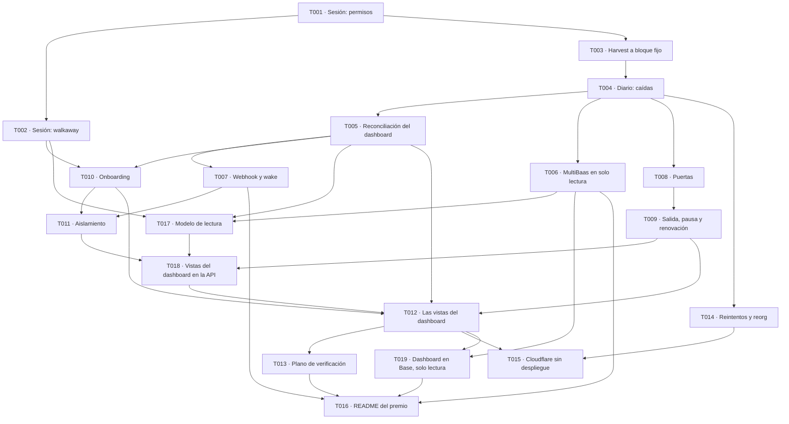

# Tareas 001 · Mamoru v1

- Spec: `specs/001-mamoru-v1/spec.md`
- Plan: `specs/001-mamoru-v1/plan.md`
- Escenarios: `specs/001-mamoru-v1/scenarios.md`
- Fecha: 2026-09-26

Estas tareas son para una sesión posterior. Este pack se detiene antes de ese paso: en esta sesión no se crea código de aplicación. El orden es obligatorio. Las cuatro primeras cubren, por este orden, la prueba adversarial de la sesión (T001 y T002), el harvest a bloque fijo (T003), los casos de caída del diario (T004) y la reconciliación del dashboard (T005).

T017 empieza cuando existen la reconciliación del diario (T005) y el cliente de MultiBaas (T006). T018 y los paneles (T012) esperan además al onboarding (T010) y al aislamiento (T011). El orden de trabajo de abajo manda si esta frase y el grafo discreparan.

## Reglas para todas las tareas

1. **Qué cita cada tarea.** Requisitos, archivos que puede crear, escenarios que la aceptan y lo que no debe hacer.
2. **Cuándo está hecha.** Cuando sus escenarios pasan en local con el runner, el informe queda guardado con su manifiesto, y los escenarios de tareas anteriores siguen en verde.
3. **Archivos de tareas anteriores.** Una tarea puede modificarlos si sus requisitos lo exigen, sin romper escenarios ya aceptados.
4. **Commits.** Cortos y revisados, sin el historial de Titan26. La tarea no hace push: publicar es decisión de Ot.
5. **Prohibido en todas las tareas:**
   - desplegar, subir versiones o crear recursos remotos en Cloudflare (`wrangler deploy`, `wrangler versions upload`, `wrangler secret put` contra la cuenta, D1 o colas remotas);
   - desactivar el dry-run o poner `CORE_DRY_RUN` distinto de `true` en la configuración de producción;
   - abrir la puerta de fondos;
   - firmar o enviar contra Base (8453) o Base Sepolia (84532);
   - escribir Solidity o políticas propias de Smart Sessions;
   - relajar una regla de la política para que pase una prueba: se parte el grant y se actualiza el plan;
   - poner claves o URL con clave en archivos del repo, argv, logs, D1 o artefactos;
   - añadir una dependencia que no esté en el plan sin actualizar antes el plan;
   - usar Trading API, LP API, UniswapX, hooks v4, CoW, Tenderly, Aqua o 1inch en el camino del capital;
   - tocar el repo de Titan26 o la bóveda Noema;
   - contratar un plan Pro de zona o una segunda suscripción de Workers, o tocar Billing;
   - crear `wrangler.toml`.
6. **Pruebas que tumban el plan.** Si una tarea las dispara (`threats.md` §3), se para y se avisa a Ot. No se parchea el escenario.

## Orden y dependencias

Orden de trabajo: T001, T002, T003, T004, T005, T006, T017, T007, T008, T009, T010, T011, T018, T012, T013, T014, T015, T019 y T016. Cada tarea va después de todas sus dependencias, así que el orden no tiene ciclos. Una tarea no empieza hasta que sus dependencias están aceptadas.

## T001 · Prueba adversarial de la sesión: permisos

Primera tarea y primer commit de implementación. Congela los pines (línea abierta 2 de la constitución).

- **Requisitos.** FR-ACC-001, FR-ACC-002, FR-ACC-003, FR-ACC-004, FR-ACC-005, FR-ACC-006, FR-ACC-008, FR-ACC-010, FR-UNI-002, FR-UNI-003, FR-UNI-006, FR-UNI-007, FR-UNI-008, FR-RPC-004, FR-LAB-001 a FR-LAB-009, FR-LAB-012, FR-OPS-005.
- **Depende de.** Nada.
- **Puede crear:**
  - `package.json`, `bun.lock`, `tsconfig.base.json` y `.gitignore`, que añade `.dev.vars` y `scenarios/.artifacts/`;
  - `packages/domain/`;
  - `packages/registry/`, con `base.json`: direcciones del plan §7 y code hashes en el bloque 51811000, más las políticas de Smart Sessions, MultiSendCallOnly y Multicall3;
  - `packages/policy/`, con `conservador-v1`, `conservador-lab-v1` y `lab-weth-usdc-v1`, sus grants y sus topes;
  - `packages/account/safe/`, `packages/account/sessions/` y `packages/account/precheck/`;
  - `packages/uniswap-v3/`, solo los constructores de calldata;
  - `packages/scenarios/runner/`, `fork/`, `proxy/`, `fixtures/`, `perturb/` y `report/`;
  - `scenarios/manifest.json` (`catalog-v1`, con las versiones de anvil y Alto y `--slots-in-an-epoch`);
  - `scenarios/catalog/` con SESS-01 a SESS-23, SESS-25, LAB-01 a LAB-06, LAB-09 y M05;
  - `scenarios/fixtures/`.
- **Aceptan.** SESS-01 a SESS-23, SESS-25 sobre los lotes de ataque, LAB-01 a LAB-06, LAB-09 y M05.
- **Prueba que tumba el plan.** KT-1. Si un ataque pasa, se para.
- **No debe:**
  - relajar una regla para que un ataque falle. Si una regla no se expresa, se parte el grant y se actualiza el plan §12;
  - añadir un SDK de cuenta;
  - usar claves que no sean las de desarrollo de anvil;
  - pasar una URL con clave por argv;
  - arrancar anvil con chain id 8453 u 84532;
  - crear nada bajo `apps/`.

## T002 · Prueba adversarial de la sesión: walkaway

- **Requisitos.** FR-ACC-009, FR-ONB-003, FR-ONB-005, FR-ONB-006, FR-LAB-010.
- **Depende de.** T001.
- **Puede crear:**
  - `packages/account/owner/` y `packages/account/recovery/`;
  - `packages/scenarios/webauthn/`;
  - `docs/walkaway.md`;
  - `scenarios/catalog/` con WALK-01, WALK-02, WALK-04 y LAB-08.
- **Aceptan.** WALK-01, WALK-02, WALK-04 y LAB-08.
- **Prueba que tumba el plan.** KT-2. Si falla, T-000025 sigue cerrado y se para.
- **No debe:**
  - depender del motor, de la app, del login ni de MultiBaas en el camino del walkaway;
  - usar paymaster;
  - usar claves de passkey que no sean del autenticador de software;
  - dar por pasado un escenario con passkey cuando LAB-08 falla: se marca no ejecutado con `LAB_P256_UNAVAILABLE`.

## T003 · Harvest a bloque fijo

- **Requisitos.** FR-DEC-001, FR-DEC-002, FR-DEC-007, FR-DEC-009, FR-DEC-013, FR-UNI-001 a FR-UNI-006, FR-RPC-001, FR-RPC-002, FR-RPC-005, FR-AA-001 a FR-AA-005, FR-ENG-004, FR-ENG-005, FR-ENG-008, FR-ENG-015, FR-PRJ-003, FR-PRJ-004, FR-LAB-006, FR-LAB-008.
- **Depende de.** T001.
- **Puede crear:**
  - `packages/journal/`, la máquina de estados pura;
  - `packages/decide/`, con `enter/`, `harvest/` y las partes de `gates/` que usan entrada y harvest: identidad de Purga y TWAP y simulación de la Execution Health Gate;
  - `packages/uniswap-v3/`, la parte de cotización;
  - `packages/rpc/` y `packages/erc4337/`;
  - `packages/projector/`, el constructor de filas sin D1;
  - `packages/scenarios/driver/`, que compone los paquetes en proceso con la máquina de `packages/journal`, y `packages/scenarios/bundler/`, para Alto;
  - `scenarios/catalog/` con M01, M02, M03, M04, el paso 1 de M07 y DEP-01.
- **Aceptan.** M01, M02, M03, M04, el paso 1 de M07 (entrada) y DEP-01. El paso 3 de M07, la salida y la conversión, lo acepta T009.
- **No debe:**
  - crear el Durable Object ni los Workflows, que son de T004;
  - guardar la session key fuera del proceso de prueba;
  - afirmar el valor de un parámetro de ingeniería;
  - cotizar o ejecutar por algo que no sea QuoterV2, SwapRouter02 y NonfungiblePositionManager;
  - firmar con chain id de Base.

## T004 · Diario: casos de caída

- **Requisitos.** FR-ENG-001 a FR-ENG-011, FR-ENG-014, FR-ENG-015, FR-ENG-017, FR-ACC-007, FR-ACC-011, FR-AA-003, FR-LAB-011.
- **Depende de.** T003.
- **Puede crear:**
  - `apps/mamoru-engine/wrangler.jsonc`, solo para correr en local;
  - `apps/mamoru-engine/src/entrypoint/`, `cron/`, `do/`, `workflows/` y `faults/`;
  - `apps/mamoru-engine/test/`;
  - `packages/runtime-config/`;
  - `scenarios/catalog/` con JRNL-01 a JRNL-09, DRY-01, DRY-02, M10, M13, SESS-24, WALK-03, WALK-05, LAB-07 y LAB-11.
- **Aceptan.** JRNL-01 a JRNL-09, DRY-01, DRY-02, M10, M13, SESS-24, WALK-03, WALK-05, LAB-06, LAB-07 y LAB-11. LAB-06 comprueba que el blob de la session key no es la clave en claro (FR-ACC-007) y que los logs no llevan datos personales (FR-OPS-006). Además, M01 a M04 vuelven a pasar, ahora a través de workerd.
- **Medición.** Deja en el informe CPU, subpeticiones y pasos por instancia (KT-4).
- **No debe:**
  - desplegar ni crear recursos remotos;
  - admitir en producción un `CORE_DRY_RUN` distinto de `true` o una lista de chains de firma con valores;
  - dejar un punto de fallo accesible fuera del modo `lab`;
  - abrir un nonce nuevo tras un timeout;
  - guardar la session key sin cifrar o escribirla en logs;
  - dar rutas públicas al motor.

## T005 · Reconciliación del dashboard

- **Requisitos.** FR-PRJ-001 a FR-PRJ-009, FR-DSH-003, FR-DSH-005, FR-MB-004, FR-LAB-013.
- **Depende de.** T004.
- **Puede crear:**
  - `packages/projector/`, con el escritor de D1 y la reconciliación;
  - `apps/mamoru-engine/src/projection/`;
  - el lector de índice del fork en `packages/scenarios/fork/`, con `index-lag` e `index-wrong` en `packages/scenarios/perturb/`;
  - `migrations/d1/`, con las tablas `proj_*` y `audit_log`;
  - `apps/mamoru-app/wrangler.jsonc`, solo para correr en local;
  - `apps/mamoru-app/src/api/accounts/`, el payload del dashboard, y `apps/mamoru-app/src/api/middleware/`, un grant mínimo sobre filas de prueba;
  - `scenarios/catalog/` con DASH-01 a DASH-08, REORG-02 y TEN-06.
- **Aceptan.** DASH-01 a DASH-04, DASH-06 a DASH-08, el payload de DASH-05, REORG-02 y TEN-06. El texto visible de DASH-05 lo acepta T012.
- **Después.** T017 añade las tablas del modelo de lectura, el resto de perturbaciones del índice y `ReadModelSync`. T018 amplía el payload a las vistas de `dashboard.md` §9.
- **No debe:**
  - dejar que `decide` lea D1;
  - acreditar un cierre, o una fila que no esté `confirmed` en `safe`;
  - usar MultiBaas contra el fork;
  - devolver un cero donde falta un dato;
  - construir las vistas de la SPA, que son de T012.

## T006 · MultiBaas en solo lectura

- **Requisitos.** FR-MB-001, FR-MB-002, FR-MB-005, FR-MB-008, FR-RPC-003, FR-ENG-001, FR-ONB-009.
- **Depende de.** T004. Además, requiere el deployment de MultiBaas para Base, con los contratos enlazados como dice `dashboard.md` §6.2, y una clave de rol mínimo. Los aporta Ot (supuesto de la spec).
- **Puede crear:**
  - `packages/multibaas/client/`, un cliente `fetch` de la API REST `/api/v0`: estado del deployment y de indexación, event queries arbitrarias paginadas y eventos de una transacción (plan §23.4);
  - `packages/multibaas/queries/`, los constructores de MBQ-01 a MBQ-08 con el formato que registre MB-02;
  - `packages/projector/read-model/`, solo la función pura de contraste de `dashboard.md` §6.5, que usan las comprobaciones y después `ReadModelSync`;
  - `scripts/multibaas/`, con las comprobaciones MB-01 a MB-04 y la lista de contratos a enlazar;
  - `evidence/multibaas/`;
  - `scenarios/catalog/` con MB-01 a MB-04 y DRY-03.
- **Aceptan.** MB-01 a MB-04 y DRY-03.
- **Prueba que tumba el plan.** KT-5. Si MB-01 falla, se deja `MULTIBAAS_ENGINE_ENABLED=false` y la evidencia del intento. Una query que no da `PROJ_RECONCILED` en MB-02 a MB-04 no tumba el plan: sus rangos salen de logs RPC y la evidencia lo registra para el README.
- **No debe:**
  - enlazar contratos ni crear webhooks: Ot enlaza los contratos antes de MB-01, y crea el webhook solo después de que MB-01 pase;
  - guardar queries, crear alias o etiquetas, o escribir de cualquier otra forma en el deployment;
  - poner la dirección de una cuenta de Mamoru en el deployment;
  - añadir el SDK de MultiBaas ni axios;
  - usar Cloud Wallets;
  - pedir una clave con más rol del necesario;
  - guardar la clave en archivos, argv, artefactos o evidencia;
  - firmar o enviar;
  - usar `transaction.included`;
  - apuntar MultiBaas al fork.

## T007 · Webhook y wake

- **Requisitos.** FR-MB-003, FR-MB-004, FR-ENG-011, FR-PRJ-007.
- **Depende de.** T005.
- **Puede crear:**
  - `apps/mamoru-app/src/api/hooks/`;
  - la verificación de entregas en `packages/multibaas/`;
  - `migrations/d1/`, con `webhook_deliveries`;
  - cambios en `apps/mamoru-engine/src/entrypoint/` y `src/do/` para `wake`;
  - `scenarios/fixtures/`, con entregas sintéticas rotuladas;
  - `scenarios/catalog/` con HOOK-01 a HOOK-09.
- **Aceptan.** HOOK-01 a HOOK-09.
- **No debe:**
  - dejar que el cuerpo del webhook entre en `decide` o en el Savings Log;
  - tratar un wake como GO;
  - escribir el secreto del webhook en logs;
  - dar de alta webhooks en el deployment real.

## T008 · Puertas

- **Requisitos.** FR-DEC-003, FR-DEC-006, FR-DEC-007, FR-DEC-008, FR-DEC-010, FR-DEC-012, FR-DEC-014, FR-UNI-009, FR-RPC-004.
- **Depende de.** T004.
- **Puede crear:**
  - `packages/decide/gates/` completo: Purga, Risk Monitor, Execution Health Gate, ENY y Strategy;
  - `packages/decide/range/`;
  - `migrations/d1/`, con `operator_incidents`;
  - `scenarios/catalog/` con GATE-05, GATE-06, M06, M11, M12, M14 y DEP-04.
- **Aceptan.** GATE-05, GATE-06, M06, M11, M12, M14 y DEP-04.
- **No debe:**
  - convertir un número del Packaging en umbral;
  - dejar que una anotación shadow cambie una decisión;
  - identificar pools o tokens por nombre;
  - forzar una salida por evidencia desconocida.

## T009 · Salida, pausa y renovación

- **Requisitos.** FR-DEC-004, FR-DEC-005, FR-DEC-011, FR-ENG-012, FR-ENG-013, FR-ENG-016, FR-ACC-006, FR-DSH-008.
- **Depende de.** T008.
- **Puede crear:**
  - `packages/decide/exit/`;
  - cambios en `apps/mamoru-engine/src/do/` para intenciones, `exit_request` y `relays`;
  - `apps/mamoru-app/src/api/intents/`;
  - `scenarios/catalog/` con GATE-01 a GATE-04, GATE-07 a GATE-09, EXIT-01 a EXIT-03, PAUSE-01 a PAUSE-03, M08, M09 y SESS-25.
- **Aceptan:**
  - GATE-01 a GATE-04 y GATE-07 a GATE-09;
  - EXIT-01 a EXIT-03 y PAUSE-01 a PAUSE-03;
  - M08, M09 y el paso 3 de M07;
  - SESS-25 completo, ya con los lotes que produce el motor en M02 a M14.
- **Medición.** Deja en el informe CPU, subpeticiones y pasos de una salida con dos posiciones (KT-4).
- **No debe:**
  - cancelar una operación firmada;
  - dejar que la pausa bloquee una salida;
  - convertir sin que la Execution Health Gate dé GO;
  - aceptar `renew_session` en modo `production` o sin firma del owner;
  - reactivar un `permissionId` revocado.

## T010 · Onboarding

- **Requisitos.** FR-ONB-001 a FR-ONB-009, FR-VIEW-001 a FR-VIEW-004.
- **Depende de.** T002 y T005.
- **Puede crear:**
  - `apps/mamoru-app/src/api/auth/`, con `ProductAuthPort` y el candidato;
  - `apps/mamoru-app/src/api/onboarding/`;
  - `apps/mamoru-app/src/web/routes/`, con las rutas `/` y `/onboarding`;
  - `packages/account/proofs/`, para ERC-1271 y ERC-6492;
  - `migrations/d1/`, con las tablas del login, `accounts`, `account_members`, `view_grants`, `recovery_acks` e `intents`;
  - `apps/mamoru-app/test/e2e/`;
  - `scenarios/catalog/` con ONB-01 a ONB-06, DEP-02, DEP-03, TEN-01 y TEN-02.
- **Aceptan.** ONB-01 a ONB-06, DEP-02, DEP-03, TEN-01 y TEN-02.
- **Línea abierta 1.** Esta tarea la resuelve.
  - Si ONB-01, ONB-06, TEN-01 y TEN-02 pasan con Better Auth, el candidato queda aceptado.
  - Si no, queda descartado y la tarea implementa `ProductAuthPort` con otra pieza que los pase.
  - En los dos casos propone a Ot la enmienda de parche que cierra la línea abierta.
- **No debe:**
  - dar al login autoridad sobre fondos;
  - reutilizar la credencial del login como owner;
  - activar sesiones en modo `production`;
  - enseñar un botón o una dirección de depósito con la puerta cerrada;
  - enviar emails fuera del canal del candidato;
  - guardar secretos del login en archivos.

## T011 · Aislamiento entre usuarios

- **Requisitos.** FR-VIEW-003, FR-VIEW-005, FR-VIEW-006, FR-PRJ-008.
- **Depende de.** T007 y T010.
- **Puede crear:**
  - `apps/mamoru-app/src/api/middleware/`, con grant y `Origin`;
  - cambios en las consultas de `apps/mamoru-app/src/api/`;
  - `scenarios/catalog/` con TEN-03, TEN-04, TEN-05 y TEN-07.
- **Aceptan.** TEN-03, TEN-04, TEN-05 y TEN-07. Además, TEN-01, TEN-02 y TEN-06 vuelven a pasar.
- **No debe:**
  - derivar el nombre de un Durable Object de una entrada libre;
  - consultar filas por cuenta de D1 sin el `account_key` del grant. Las filas de pool son públicas y se filtran por los pools de la política de la cuenta;
  - aceptar una intención sin comprobar `Origin`.

## T012 · Las vistas del dashboard

- **Requisitos.** FR-DSH-001 a FR-DSH-019, FR-RPC-005, FR-PRZ-003.
- **Depende de.** T005, T009, T010 y T018.
- **Puede crear:**
  - `apps/mamoru-app/index.html` y `apps/mamoru-app/vite.config.ts`;
  - en `apps/mamoru-app/src/web/`: la ruta `/dashboard`, `panels/` con las vistas de `dashboard.md` §7 (header, actions, current-action, portfolio, treasury, pools, savings, savings-log y leave), `components/` y `copy/`;
  - `apps/mamoru-app/test/e2e/`;
  - `scenarios/catalog/` con UI-01 a UI-08.
- **Aceptan.** UI-01 a UI-08, y el texto visible de DASH-05 y de DASH-09 a DASH-19.
- **Prueba que tumba el plan.** KT-3. Si una función de una vista exige SSR, se para y se avisa.
- **No debe:**
  - añadir SSR;
  - hablar desde el navegador con la RPC, el bundler o MultiBaas;
  - derivar Actions o recalcular cifras en la SPA: pinta el payload;
  - firmar en la vista, salvo en los flujos del owner;
  - mostrar ceros inventados o cifras de otras chains;
  - poner un botón de intención en dos sitios, o un botón de convertir, vender, cobrar o depositar;
  - añadir vistas de votos de DAO, vesting o RWA;
  - enlazar Basescan en el laboratorio;
  - usar raya larga o emoji en la copia.

## T013 · Plano de verificación: ciclo completo con el dashboard

- **Requisitos.** FR-DSH-004, FR-DSH-007, FR-LAB-004, FR-LAB-013.
- **Depende de.** T012.
- **Puede crear:**
  - `packages/scenarios/cycle/`;
  - `scenarios/catalog/` con `cycle-conservador`, CYCLE-01 y LAB-10;
  - `docs/fork-verification.md`, que describe el ciclo como verificación.
- **Aceptan.** CYCLE-01 y LAB-10.
- **No debe:**
  - presentar el plano de verificación como producto o como la entrega del premio;
  - publicar el plano de verificación en un despliegue;
  - llevar datos del laboratorio a producción;
  - presentar cifras del fork como capital.

## T014 · Reintentos y reorg

- **Requisitos.** FR-RPC-001, FR-AA-003, FR-ENG-006, FR-ENG-008, FR-PRJ-001, FR-UNI-001.
- **Depende de.** T004.
- **Puede crear:**
  - cambios en `packages/rpc/`, `packages/erc4337/` y `apps/mamoru-engine/src/workflows/`;
  - `rpc-flaky`, `bundler-down` y el segundo Alto en `packages/scenarios/perturb/`;
  - `scenarios/catalog/` con RETRY-01 a RETRY-06, REORG-01 y REORG-03.
- **Aceptan.** RETRY-01 a RETRY-06, REORG-01 y REORG-03.
- **Medición.** Deja en el informe CPU, subpeticiones y pasos de una reconciliación larga (KT-4).
- **No debe:**
  - abrir un nonce nuevo;
  - reemplazar por fee fuera del tope de la política;
  - confirmar antes de `safe`;
  - ocultar en la vista un fallo del proveedor.

## T015 · Configuración de Cloudflare sin despliegue

- **Requisitos.** FR-OPS-001 a FR-OPS-006, FR-DSH-001.
- **Depende de.** T012 y T014.
- **Puede crear o modificar:**
  - `apps/mamoru-app/wrangler.jsonc` y `apps/mamoru-engine/wrangler.jsonc`;
  - los tipos que genera `wrangler types`;
  - `scripts/audit/`, para OPS-01 a OPS-03;
  - `scenarios/catalog/` con OPS-01, OPS-02 y OPS-03.
- **Aceptan.** OPS-01, OPS-02 y OPS-03.
- **No debe:**
  - ejecutar `wrangler deploy`, `wrangler versions upload` ni `wrangler secret put`;
  - crear D1 o colas remotas;
  - tocar Billing;
  - configurar una zona o un plan Pro;
  - crear `wrangler.toml`.

## T016 · README del premio de Curvegrid

- **Requisitos.** FR-MB-005, FR-DSH-003, FR-PRZ-001 a FR-PRZ-005.
- **Depende de.** T006, T007, T013 y T019. Además, requiere los handles del equipo, que da Ot.
- **Puede crear o modificar:**
  - el `README.md` público, reescrito en inglés con estos cinco apartados, exactos y en este orden: "One sentence", "How MultiBaas was used", "Team handles", "Setup and tests" y "Experience with MultiBaas". El contenido de cada uno sigue `dashboard.md` §12.1;
  - `docs/multibaas.md`, el anexo con la evidencia detallada de MB-01 a MB-04, BASE-01 y BASE-02;
  - `scripts/audit/`, para DOC-01;
  - `scenarios/catalog/` con DOC-01.
- **Aceptan.** DOC-01.
- **Si MultiBaas no indexa Base.** El README sigue `dashboard.md` §12.4: lo cuenta en "Experience with MultiBaas", no afirma queries contrastadas y cita BASE-02 como evidencia del respaldo.
- **No debe:**
  - afirmar nada de la lista prohibida de `dashboard.md` §12.3;
  - afirmar algo sin enlace a su evidencia;
  - inventar handles o dejar un marcador en su lugar: sin los handles de Ot, la tarea se para;
  - presentar el plano de verificación como el producto;
  - publicar ni hacer push.

## T017 · Modelo de lectura: sincronización y contraste

Va después de T006 en el orden de trabajo. Construye lo que el dashboard enseña de MultiBaas y de la RPC, sin tocar el diario ni `decide`.

- **Requisitos.** FR-MB-006, FR-MB-007, FR-PRJ-006, FR-PRJ-010 a FR-PRJ-015, FR-DSH-016, FR-DSH-017, FR-DSH-018, FR-LAB-014.
- **Depende de.** T002, T005 y T006.
- **Puede crear:**
  - `apps/mamoru-engine/src/workflows/read-model-sync/`, con los pasos del plan §13.5 y §23.3;
  - cambios en `apps/mamoru-engine/src/cron/` y `src/do/` para crear las instancias de pools y de cuenta (plan §23.2) y guardar `read_model_instance`;
  - cambios en `apps/mamoru-engine/src/projection/` para las instantáneas de posición;
  - `packages/projector/read-model/`: fuente por tramo, ancla, invariante de liquidez, estadísticas, tiempo en rango, "out of range since" y movimiento de comisiones;
  - `migrations/d1/`, con `proj_pool_state`, `proj_pool_activity`, `proj_pool_stats`, `proj_position_events`, `proj_position_snapshots`, `proj_position_analytics`, `proj_account_ops`, `proj_account_swaps`, `proj_tx_events`, `mb_sync_state` y `mb_checks`;
  - en `packages/scenarios/fork/`, el lector que interpreta las MBQ y declara su estado, y en `packages/scenarios/perturb/`, `index-behind`, `index-absent`, `index-start`, `index-fail` y `liquidity-change`;
  - `scenarios/catalog/` con DASH-14, DASH-15, DASH-17 y DASH-19.
- **Aceptan.** DASH-14, DASH-15, DASH-17 y DASH-19 en las tablas de D1, en `mb_sync_state` y en `mb_checks`. El payload de esos escenarios lo acepta T018 y su texto visible, T012. Además, DASH-01 a DASH-04 vuelven a pasar.
- **Medición.** Deja en el informe CPU, subpeticiones y pasos por instancia de `ReadModelSync`, en régimen y en la carga inicial de la retención (KT-4).
- **No debe:**
  - llamar a MultiBaas desde la app, desde el fork o fuera de `ReadModelSync`;
  - dejar que `decide` o el diario lean el modelo de lectura. El Savings Log sí puede leerlo para el contraste y el detalle (MBQ-03 y MBQ-06). El importe que acredita lo deciden el diario y el recibo RPC, no MultiBaas;
  - guardar como `reconciled` una fila que no se contrastó con la RPC;
  - usar el agregado de MBQ-07 como fuente de una cifra;
  - poner en una query parámetros que vengan de una petición;
  - reescribir una fila guardada por respaldo cuando MultiBaas vuelve;
  - leer MultiBaas o la RPC en una lectura de la API.

## T018 · Vistas del dashboard en la API

- **Requisitos.** FR-DSH-002, FR-DSH-010 a FR-DSH-015, FR-DSH-018, FR-DSH-020, FR-DEC-013, FR-DEC-015, FR-RPC-005, FR-PRJ-008, FR-PRJ-009, FR-PRZ-002.
- **Depende de.** T009, T011 y T017.
- **Puede crear:**
  - `packages/projector/actions/`, la derivación pura de Actions con el catálogo de `dashboard.md` §7.2;
  - `packages/projector/portfolio/` y `packages/projector/treasury/`: valoración en USDC, reparto de Treasury y estado de la conversión, que el motor escribe en `proj_treasury` al proyectar cada revisión;
  - `migrations/d1/`, con `proj_treasury`;
  - cambios en `packages/decide/` para las anotaciones por posición del plan §9, paso 10, sin cambiar la elección;
  - cambios en `packages/registry/` para marcar WETH/USDC 0.3% como fuente de precio, solo de lectura;
  - en `apps/mamoru-app/src/api/accounts/`, el payload de `dashboard.md` §9 y la ruta `history` (plan §6.4);
  - `scenarios/catalog/` con DASH-09 a DASH-13, DASH-16, DASH-18 y TEN-08.
- **Aceptan.** DASH-09 a DASH-13, DASH-16, DASH-18 y TEN-08, y el payload de DASH-14, DASH-15, DASH-17 y DASH-19. El texto visible lo acepta T012. También la revisión de `dashboard.md` §1 y §11: cada punto del brief tiene sus escenarios en verde o asignados a una tarea posterior. Además, DASH-01 a DASH-08 y TEN-01 a TEN-07 vuelven a pasar.
- **No debe:**
  - leer MultiBaas o la RPC en una petición del dashboard;
  - guardar Actions o derivarla fuera de `@mamoru/projector`;
  - crear intenciones nuevas u ofrecer convertir, vender, cobrar o depositar;
  - devolver filas de otra cuenta o de otra chain;
  - sumar cifras de chains distintas;
  - dejar que una anotación por posición cambie la elección de `decide`;
  - ejecutar el pool WETH/USDC 0.3% en una política de producción.

## T019 · Dashboard de producción en Base, solo lectura

- **Requisitos.** FR-PRZ-001, FR-DSH-010, FR-DSH-011, FR-DSH-014, FR-DSH-017, FR-DSH-018, FR-DSH-019, FR-MB-007, FR-ONB-009.
- **Depende de.** T006 y T012.
- **Puede crear:**
  - `scripts/base-readonly/`, que arranca app y motor en modo `production` sobre workerd local, con la RPC de Base y el deployment de MultiBaas por entorno, un bundler stub que falla ante cualquier llamada y el stub local de MultiBaas de BASE-02;
  - `evidence/dashboard/`;
  - `scenarios/catalog/` con BASE-01 y BASE-02.
- **Aceptan.** BASE-01 y BASE-02.
- **No debe:**
  - firmar o enviar, ni llamar al bundler;
  - desplegar o crear recursos remotos;
  - abrir la puerta de fondos o activar sesiones;
  - escribir en el deployment de MultiBaas;
  - guardar claves, URL con clave o direcciones de usuarios reales en la evidencia.

## Fuera de las tareas: acciones de Ot

Estas acciones no las hace ninguna tarea. Son de Ot, cuando él decida:

- Mirar Billing una vez.
- Crear la D1 remota y poner los secretos remotos.
- Enlazar los contratos en MultiBaas antes de T006, con el alias, la etiqueta y el bloque de inicio de `dashboard.md` §6.2, como prerrequisito de MB-01.
- Crear el webhook real después de que MB-01 pase.
- Dar los handles del equipo antes de T016.
- Desplegar los Workers y subir el motor con `limits.cpu_ms`.
- Registrar una entrega real de `event.emitted`, que habilita la afirmación sobre webhooks del README del premio.
- Abrir T-000025.
- Publicar o no este pack.
